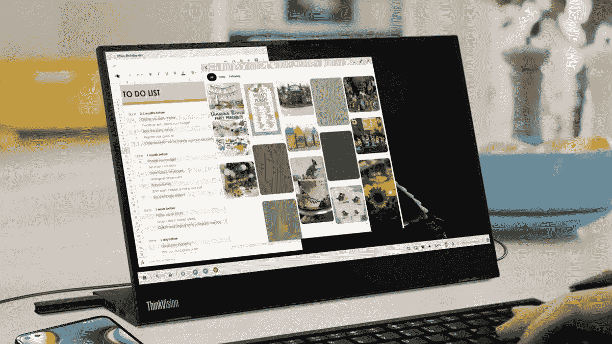
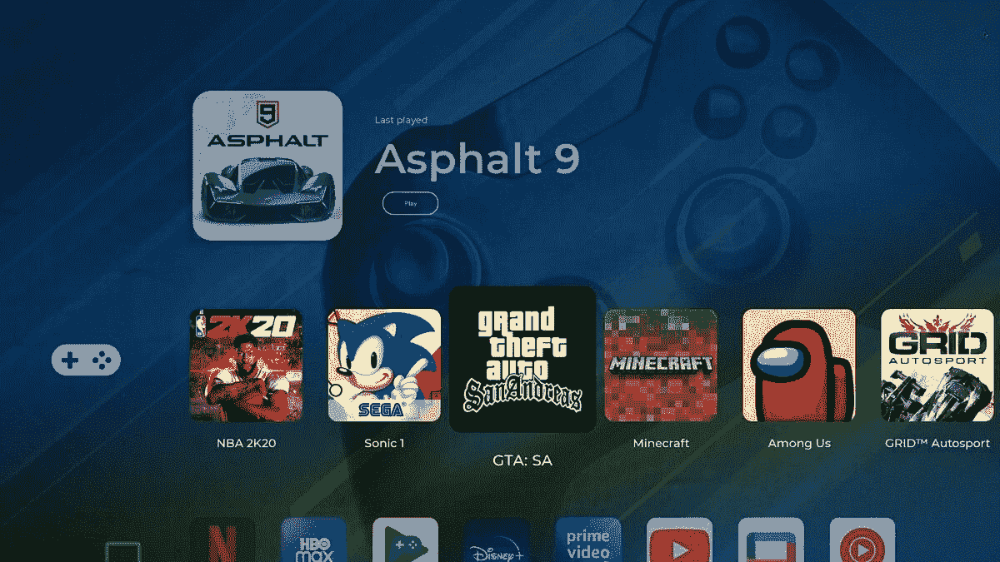

# 摩托罗拉 Android 11 更新为桌面模式

> 原文：<https://www.xda-developers.com/motorola-android-11-update-desktop-mode-pc-integration/>

今天早些时候，高通发布了其下一代 Snapdragon 800 系列芯片组，[骁龙 888](https://www.xda-developers.com/qualcomm-teases-snapdragon-888-confirms-14-oems-smartphones/) 。确认将推出基于新平台的产品的合作伙伴之一是摩托罗拉，在一段视频中，摩托罗拉移动总裁塞尔吉奥·布尼亚克强调了该公司如何计划将“800 系列体验”纳入其流行的预算/中端 Moto G 系列。不过，视频中特别有趣的是一部运行类似三星 DeX 桌面模式的摩托罗拉手机的预告。XDA 可以证实，摩托罗拉确实在致力于桌面模式体验，我们可以透露，该公司正在为其即将推出的基于 Android 11 的软件准备这一功能。

 <picture></picture> 

Source: Motorola

在发布到[高通 2020 年科技峰会数字活动页面](https://www.qualcomm.com/company/events/snapdragon-tech-summit) (via [*PCMag*](https://www.pcmag.com/news/motorola-shows-phone-with-tv-desktop-modes) )的视频中，摩托罗拉展示了一款看起来像 Moto G 5G Plus 的手机，连接到联想 ThinkVision 显示器。很难判断，但这款手机也可能是摩托罗拉即将在骁龙 865 推出的“nio”设备，我们可以确认，从正面看，它与 Moto G 5G Plus 非常相似。摩托罗拉的“nio”设备将与开箱即用的 Android 11 一起推出，该手机支持通过 USB-C 电缆进行视频输出的 DisplayPort 备用模式。鉴于布尼亚克先生今天的评论，摩托罗拉的桌面模式很可能会与该公司的“nio”设备一起推出，该设备可能会以“Moto G”系列上市。

“2021 年将是 Moto G 的第十代，没有什么比给这个家庭带来 800 系列体验更让我们自豪的了，”摩托罗拉移动总裁塞尔吉奥·布尼亚克在视频中说。

摩托罗拉对桌面模式体验并不陌生。事实上，该公司早在 2011 年就发布了其 [Atrix 4G](https://forum.xda-developers.com/atrix-4g) 设备，是弥合移动和个人电脑之间差距的早期技术采用者。该移动设备与笔记本电脑外壳对接，但智能手机硬件和安卓软件还没有准备好让手机取代 PC。快进到 2020 年，这个领域已经发生了变化:三星和华为已经成功迭代了几代自己的桌面模式体验，谷歌正在推动 Android 应用程序开发者支持更大的屏幕，移动硬件现在明显更强大。有了高通骁龙 865，至少 8GB 的内存，256GB 的内部存储，5,000mAh 的电池，以及现成的 Android 11，摩托罗拉的“nio”设备应该能够在外部显示器上的多个不同应用程序之间周旋。

在摩托罗拉分享的简短视频中，我们可以看到该设备在自由形式的窗口中同时运行 Google Sheets、Pinterest 和 Gmail，这一功能自 Android Nougat 以来就存在于 Android 中。在底部，我们可以看到一个任务栏，上面有应用程序启动器、搜索、主页、截图、网络、声音等按钮。很明显，摩托罗拉在 T2 谷歌在 Android 10 T3 中添加的准系统桌面模式启动器的基础上进行了显著扩展。

资料来源:摩托罗拉

这种由手机硬件驱动的扩展桌面模式体验似乎需要手机和外部显示器之间的有线连接。如前所述，“nio”正在开发中，支持 DisplayPort Alternate Mode，这是一种用于视频输出的 USB Type-C 接口的扩展，我们假设摩托罗拉正在制造的任何其他智能手机都需要支持这一功能(并运行该公司基于 Android 11 的软件)，以便利用新的桌面模式。我们不知道该公司是否计划利用 Miracast 实现无线扩展桌面体验(正如三星和华为分别利用 wireless DeX 和 Easy Projection 所做的那样)，但我们知道摩托罗拉有更多锦囊妙计，通过其针对特定设备的 Android 11 发布来提高生产力。

除了创造类似三星 DeX 的桌面模式体验，我们可以确认摩托罗拉正在努力实现 PC 和手机之间的某种程度的集成。摩托罗拉 Android 11 更新中的一个名为“移动桌面”的新应用将允许用户通过 USB 或 Wi-Fi 连接他们的 PC 和手机。摩托罗拉已经实现了 [FreeRDP](https://github.com/FreeRDP/FreeRDP) 库，这是微软远程桌面协议的开源实现，允许 Windows PCs 使用 Windows 10 上内置的“远程桌面连接”应用程序无线连接到选定的 Moto 设备。

据我们所知，PC 和手机的集成没有三星手机通过 Windows 应用程序的链接与 Windows 10 的集成那么深入。用户可以映射他们的 PC 驱动器，以在他们的 Moto 手机和 PC 之间共享文件，我们假设摩托罗拉将实现额外的集成，如启动应用程序，镜像通知等，尽管我们不知道是否已经实现了文件共享以外的任何功能。

最后，摩托罗拉展示了一个电视优化布局，将流行游戏和媒体应用程序的磁贴放置在一个水平滚动的转盘中。我们没有任何关于这种特殊体验的信息，也不知道它是否与桌面模式软件相关，但是如果我们在这个 UI 上找到任何信息，我们将在另一篇文章中进行调查和跟进。

 <picture></picture> 

Source: Motorola

我一直是 Android 桌面模式的支持者。如今，手机有足够的 CPU 和 GPU 能力、RAM、存储和配件支持来使其可行。三星和华为在这方面投入了大量工作，谷歌正在继续鼓励开发者为更大的屏幕改编他们的应用程序(主要是为了 Chromebook 支持，但好处也扩展到了桌面模式！随着 [LG 悄悄地在其 Android 10 更新中添加](https://www.xda-developers.com/lgs-android-10-update-desktop-mode-interface/)其自己版本的桌面模式，并很快在其 Android 11 更新中添加摩托罗拉，开发者应该会有更多的动力来调整他们的应用程序。随着越来越多的应用程序适应大屏幕，Android 智能手机将越来越多地侵占 PC 的空间(至少对于普通用户来说！)