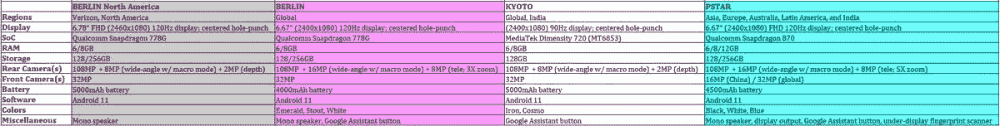

# 第二代摩托罗拉边缘系列在一个广泛的泄漏细节

> 原文：<https://www.xda-developers.com/motorola-edge-second-generation-leak/>

据@evleaks fame 的 Evan Blass 称，摩托罗拉正准备推出 Edge 系列的多个新产品。这位泄密者透露了联想品牌即将推出的多种产品的规格和一些功能。这四款设备的代号分别为“柏林”、“柏林娜”、“京都”和“pstar”，可能会在今年晚些时候推出，但它们的确切上市日期和定价尚未得到证实。

摩托罗拉 Edge 系列于 2020 年初推出 Edge 和 Edge+，后者是摩托罗拉自 2018 年 Moto Z3 以来的首款旗舰智能手机。随着摩托罗拉 Edge S 在中国的发布，很明显品牌中的“边缘”不仅限于曲面显示器。虽然 Blass 没有透露这四款设备的显示屏曲率，但已经出现了一种不同的模式，将之前和即将推出的“边缘”设备联系在一起。对于摩托罗拉来说，似乎边缘线将由该品牌的中端、价值旗舰和偶尔的高端旗舰组成。

Blass 的推文中透露的四款产品[都属于中端和超值旗舰产品类别——没有关于高端旗舰产品的消息，可能是因为](https://twitter.com/evleaks/status/1408448463742832645)[持续的全球芯片短缺](https://www.xda-developers.com/qualcomm-struggling-make-snapdragon-888/)。

以下是即将推出的摩托罗拉 Edge 系列产品的概要:

## 摩托罗拉“柏林”和“柏林娜”

首先，我们需要明确这两个产品之间的关系。“柏林”似乎只是“柏林”的北美变体。这个代号似乎只是“柏林”加“那”的简单组合，然后被截断。这两款产品在许多方面都很相似，最明显的是它们对 SoC 的选择，但有一些关键的硬件差异，在比较其他产品的全球和美国型号时，你通常不会发现这些差异。例如，显示器、相机设置和电池都有明显的不同。差异非常显著，摩托罗拉有可能在北美和欧洲对产品进行不同的品牌宣传(尽管他们以前就这样做过，即使 NA/EU 变体之间实际上没有差异。)

根据 Blass 的说法，这款代号为“berlin”的设备将采用 6.67 英寸的显示屏，分辨率为 2400x1080(纵横比为 20:9)，刷新率高达 120Hz。它可能会有一个中心打孔的 32MP 前置摄像头。在引擎盖下，该设备将由高通新的骁龙 778G 芯片组提供动力，具有 6 或 8GB 的内存，配备 128 或 256GB 的内部存储，并使用 4000 毫安时电池。这款手机似乎有三个后置摄像头，包括一个主 108MP 摄像头，一个 16MP 广角摄像头，兼作微距摄像头，一个 8MP 长焦摄像头，用于 3 倍变焦。“柏林”设备将支持 WiFi 6E (6GHz WiFi)连接，有一个单声道扬声器，并有一个专用的谷歌助理按钮。摩托罗拉将把搭载 Android 11 的手机开箱，它可能会有多种颜色，包括翡翠色、黑色和白色。

代号为“berlna”的北美版本可能会在威瑞森推出，但尚不清楚它是否会在其他运营商推出。据称，它的显示屏尺寸为 6.78 英寸，分辨率为 2460x1080 像素(纵横比为 20.5:9)，但它也支持 120Hz 的刷新率，并且在中心有一个 32MP 自拍相机的打孔切口。电池可能是一个更大的 5000mAh 单元，尽管手机失去了长焦相机，而是有一个 2MP 深度传感器。广角摄像头也从 16MP 传感器降级到 8MP 传感器。和摩托罗拉的北美设备一样，这款手机上没有谷歌助手按钮。

虽然“柏林”和“柏林娜”的确切市场名称尚未透露，但 Blass 早些时候透露的消息表明，它们都将成为摩托罗拉 Edge 阵容的一部分。

## 摩托罗拉“京都”

在早些时候的一条推文中，Blass 透露一款代号为“京都”的摩托罗拉设备将作为“摩托罗拉 Edge 20 Lite”发布他的推文还将“Moto G60S”和“Moto G50 5G”命名为“里斯本”和“塞班”，但布拉斯在今天的泄露中没有分享这两款产品的规格。有趣的是，摩托罗拉已经推出了另一款支持 5G 的智能手机，名为“ [Moto G50](https://www.xda-developers.com/motorola-moto-g50-5g-price-launch/) ”，尽管其代号为“伊比沙岛”

根据 Blass 的说法，摩托罗拉 Edge 20 Lite 将采用未知尺寸的显示屏，分辨率为 2400x1080 (20:9)，刷新率为 90Hz。像“柏林”和“柏林”一样，“京都”似乎有一个居中的打孔切口。摩托罗拉 Edge 20 Lite 似乎采用了联发科的 Dimensity 720 芯片组，而不是高通骁龙芯片。它也将有 6 或 8GB 的内存，但显然只有 128GB 的单一存储容量。这款设备似乎与“berlna”具有相同的相机设置，这意味着在后部有一个 108MP 主相机，由一个 8MP 广角相机(兼作微距镜头)和一个 2MP 深度传感器连接；同时，前置摄像头是 32MP 的。电池容量也与“berlna”相同——一个结实的 5000mAh 单元。Blass 的泄露进一步完善了规格，显示该设备运行 Android 11，并有一个谷歌助手按钮。后者是有道理的，因为摩托罗拉 Edge 20 Lite 似乎将走向全球市场以及印度，在印度，它可能提供两种颜色:铁和 Cosmo。

## 摩托罗拉“普斯塔”

Blass 泄露的最后一款摩托罗拉智能手机的代号为“pstar”，型号为“XT2153-1”这款产品似乎正在进入亚洲市场、欧洲、澳大利亚、印度和拉丁美洲，它是唯一一款配备旗舰 SoC——骁龙 870——并配有 6、8 或 12GB 内存和 128 或 256GB 存储空间的产品。显示器不是很旗舰——它的尺寸为 6.67 英寸，分辨率为 2400x1080，刷新率为 120 赫兹——但它的摄像头似乎令人印象深刻。Pstar 似乎有一个 108MP 的主摄像头，一个 16MP 的广角镜头(也是微距相机的两倍)，最后是一个 8MP 的 5X 变焦长焦镜头。在正面，摄像头要么是中国版的 16MP 传感器，要么是全球版的 32MP 传感器，它位于显示屏顶部中央的切口下方。该设备将有充足的 4500 毫安时电池供电。它似乎有一个单声道扬声器，一个谷歌助理按钮，一个下显示指纹扫描仪，以及对摩托罗拉“ [Ready For](https://www.xda-developers.com/motorola-ready-for-desktop-mode-edge-plus/) 平台的显示输出支持。

除了 5X 变焦，我们自己的来源揭示了“pstar”的另一个有趣的相机功能这项名为“CrystalTalk 降噪”的功能将使手机音频变焦麦克风捕捉的声音更加清晰。

我们不知道“pstar”将于何时发布，但泄露的消息显示，它将在发布时运行 Android 11，并有黑色、白色或蓝色。

* * *

今天的泄露证实了早期泄露中披露的[的许多细节，但增加了那次泄露中没有提到的更多细节。](https://www.xda-developers.com/motorola-edge-berlin-pstar-kyoto-leak/)

 <picture></picture> 

Spec sheet for second-generation Motorola Edge devices. Credits: Evan Blass.