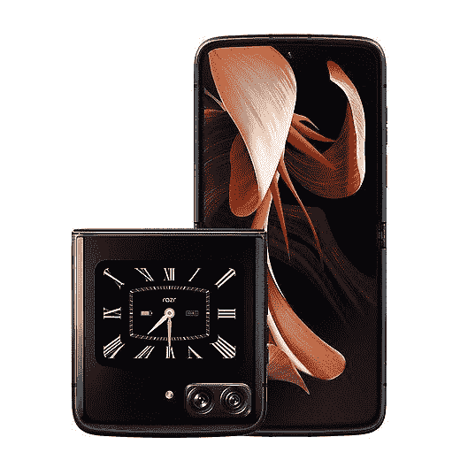

# 您现在可以在英国和欧洲购买 Razr 2022

> 原文：<https://www.xda-developers.com/motorola-razr-2022-available-uk-europe/>

今年早些时候，摩托罗拉在中国发布了其最新的可折叠产品 Razr 2022 T1。当时，该公司没有分享将该设备推向国际市场的计划。但现在它终于可以在英国和欧洲买到了。

你可以在英国以 949 英镑的价格买到 Moto Razr 2022，在欧洲以 1199 英镑的价格买到€，这使它成为三星 Galaxy Z Flip 4 的一个很好的替代产品。该设备集成了高通的骁龙 8 Plus Gen 1 SoC，6.7 英寸 FHD+可折叠显示屏，刷新率为 144Hz，以及 2.7 英寸 FHD+大屏。

 <picture></picture> 

Motorola Razr 2022

##### 摩托罗拉 razr _2022)

摩托罗拉 Razr 2022 是一款蛤壳式可折叠手机，在几个方面超过了 Galaxy Z Flip 4。不过 Galaxy Z Flip 4 还是有更多打磨的软件。

该设备在英国和欧洲提供单 RAM/存储配置，具有 8GB RAM 和 256GB 板载存储。虽然摩托罗拉在中国提供高达 12GB 的内存和 512GB 的板载存储，但这种更高规格的版本目前没有在国际上销售。

摄像头方面，Moto Razr 2022 配备了一个 50MP 主摄像头和一个 13MP 超宽摄像头。它还配备了一个令人印象深刻的 32MP 自拍相机，位于内部显示屏的穿孔切口内。完成硬件是一个 3500 毫安时的电池，提供 33W 有线快速充电支持。

其他值得注意的功能包括 IP52 防尘防水等级，双 eSIM 和物理 SIM 支持，以及基于 Android 12 的摩托罗拉定制软件皮肤。

摩托罗拉尚未透露任何将 Moto Razr 2022 带到美国的计划，但该公司可能会在未来几个月内在该地区推出这款设备。一旦我们了解到更多情况，我们会尽快通知您。在此之前，你可以通过下面的链接查看我们对 Moto Razr 2022 的深入评论。

*你会选择 Moto Razr 2022 而不是三星 Galaxy Z Flip 4 吗？为什么或为什么不？请在下面的评论区告诉我们。*