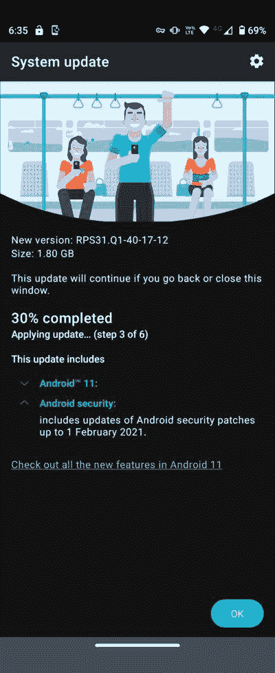
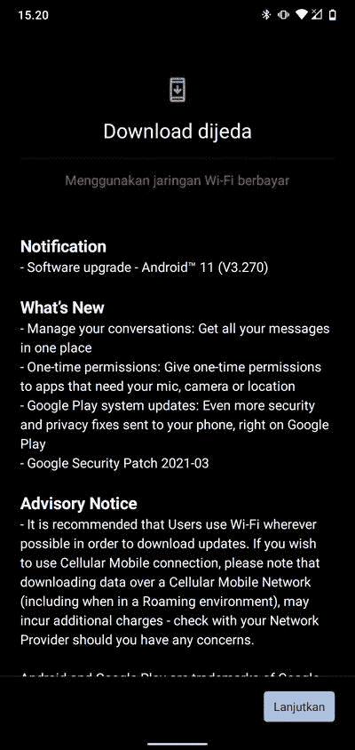

# 摩托罗拉 Razr 5G 和诺基亚 2.2 获得稳定的 Android 11 更新

> 原文：<https://www.xda-developers.com/motorola-razr-5g-nokia-2-2-android-11-update/>

Android 12 的稳定发布已经不远了，但是设备制造商正在继续为他们的智能手机推出 Android 11 更新。例如，摩托罗拉到目前为止在坚持其 [Android 11 更新计划](https://www.xda-developers.com/motorola-android-11-update-release-date/)方面做了相当不错的工作，并为其几款设备发布了更新。然而，由于该公司提供各种不同价位的设备，它仍在为其部分智能手机发布更新。在过去的几周里，联想支持的 OEM 厂商为 [Moto G 5G Plus](https://www.xda-developers.com/motorola-moto-g-5g-plus-android-11-update/) 和[摩托罗拉 One Hyper](https://www.xda-developers.com/motorola-one-hyper-lg-g7-one-stable-android-11-update/) 推出了 Android 11 更新。现在，该公司正在推出摩托罗拉 Razr 5G 的更新。

 <picture></picture> 

Thanks to Reddit user [u/crozone](https://www.reddit.com/user/crozone/) for the screenshot!

早在 3 月份，日本电信运营商 Softback [推出了](https://www.softbank.jp/corp/news/press/sbkk/2021/20210304_03/)一款运营商专用版的摩托罗拉 Razr 5G，开箱即可运行 Android 11。虽然有可能[在普通 Razr 5G](https://forum.xda-developers.com/t/recovery-unofficial-dev-twrp-for-the-moto-razr-5g-xt2071-5.4250963/post-84720253) 上交叉闪存软银固件，但这个过程对普通用户来说不可行。谢天谢地，摩托罗拉现在正在多个地区推出 Android 11 更新，包括印度、澳大利亚、欧洲和几个南美国家，所以你不需要选择手动更新。标记有内部版本号 **RPS31。Q1-40-17-12** ，Razr 5G 的 Android 11 版本大小约为 1.8GB，它带有略旧的【2021 年 2 月安全补丁。

**[摩托罗拉 Razr 5G XDA 论坛](https://forum.xda-developers.com/c/motorola-razr-5g.11537/)**

除了摩托罗拉 Razr 5G，HMD Global 的诺基亚 2.2 也开始接收其 Android 11 更新。与之前的版本一样，此次更新(内部版本号 **V3.270** )带来了 Android 11 中引入的所有新功能以及 2021 年 3 月的 [Android 安全补丁。](https://www.xda-developers.com/android-march-2021-security-update/)

 <picture></picture> 

Thanks to Twitter user [@m_arisR](https://twitter.com/m_arisR) for the screenshot!

根据诺基亚社区论坛上的一篇帖子，第一波更新预计将在今天覆盖 24 个地区的 50%的诺基亚 2.2 用户。如果推广按计划进行，更新将在 4 月 17 日 100%用户登陆。