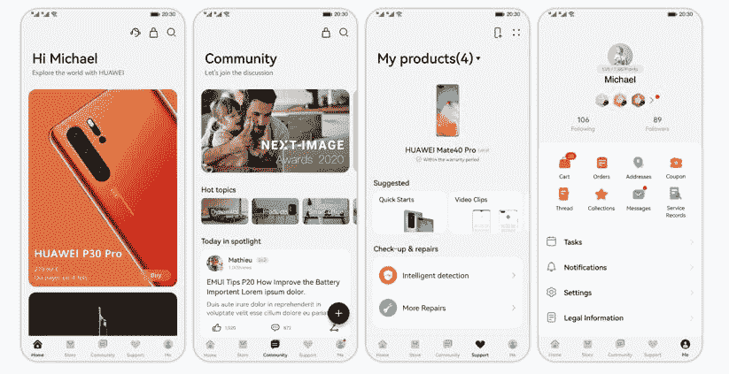

# 我的华为应用:支持和社区更新

> 原文：<https://www.xda-developers.com/my-huawei-app/>

华为正在将其一些最有用的服务和社区应用浓缩到一个新的应用中。这款应用名为 My HUAWEI，可以从[华为 AppGallery](https://www.xda-developers.com/appgallery-huawei-alternative-google-play-store-android/) 下载。这个新的应用程序通过提供一个进入华为官方社区的巨大移动门户，非常注重华为粉丝之间的联系。还提供了服务功能，可帮助您找到特定设备的支持。

## 如何更新到新的 My HUAWEI 应用程序

我的华为应用程序是对您现有支持应用程序的更新。当您更新支持应用程序时，它将更改为新的 My HUAWEI 应用程序。有几种方法可以获得这个新的更新。

1.**自动更新:**如果您在 AppGallery 中启用了“自动更新应用”功能，当新应用可用时，支持应用将更新到 My HUAWEI。

2.**手动更新:**在 AppGallery 中搜索支持 app，点击“更新”安装最新的 My HUAWEI。

3.**手动安装**:在 AppGallery 中搜索我的华为下载 app。

 <picture></picture> 

My HUAWEI App Update

更新完成后，您将看到支持应用程序的标题发生了变化。新标题将显示“我的华为”。一旦你启动新的应用程序，你将会看到一个你需要同意的服务条款。完成这一步后，就可以开始了。

在应用程序的底部有五个标签，可以帮助你四处走动。主页应用程序会显示与你相关的新闻和链接。使用商店选项卡来购买华为当前的交易和最新的新设备。“社区”选项卡将带您进入其他华为粉丝的论坛讨论。支持将帮助您找到常见问题、设备服务选项以及与您的手机相关的视频剪辑的解决方案。最后一个选项卡是您的个人资料页面，在这里您可以轻松跟踪您的个人详细信息，并根据需要进行更改。

 <picture></picture> 

My HUAWEI App Screenshots

这款新应用能够将华为以前的几款应用整合为一款。这将有助于保持您的主屏幕更干净，并且更容易找到任何与华为相关的信息。

###### 我们感谢华为赞助这篇文章。我们的赞助商帮助我们支付与运行 XDA 相关的许多费用，包括服务器成本、全职开发人员、新闻撰稿人等等。虽然您可能会在门户内容旁边看到赞助内容(这些内容将始终被标记为赞助内容),但门户团队对这些帖子不承担任何责任。赞助内容、广告和 XDA 仓库完全由一个独立的团队管理。XDA 绝不会通过接受金钱来赞扬一家公司，或以任何方式改变我们的观点或看法，从而损害其新闻诚信。我们的意见不能被收买。