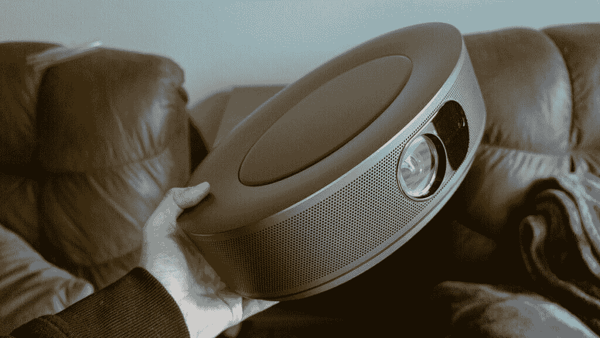
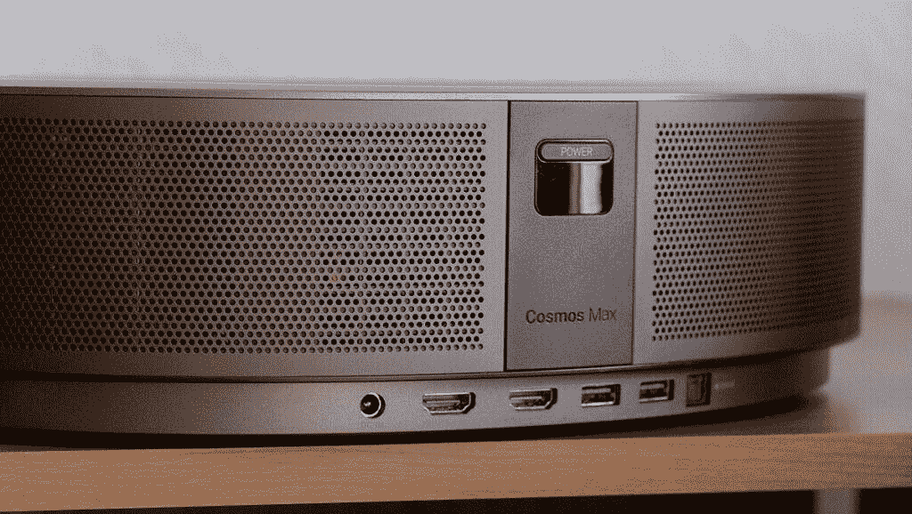
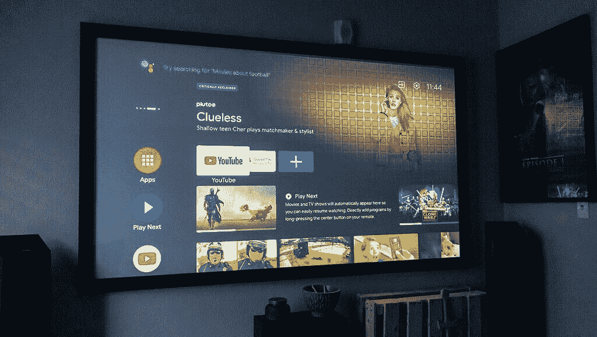
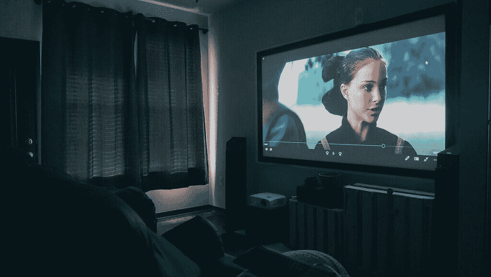
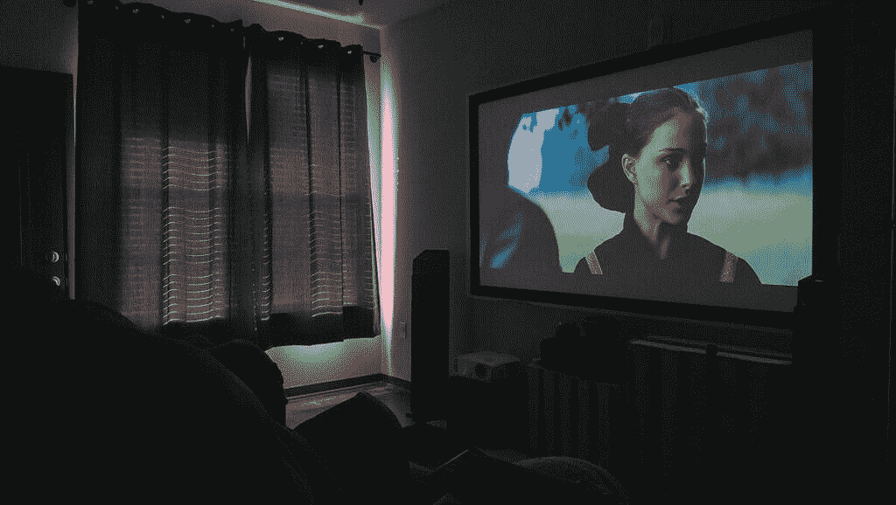
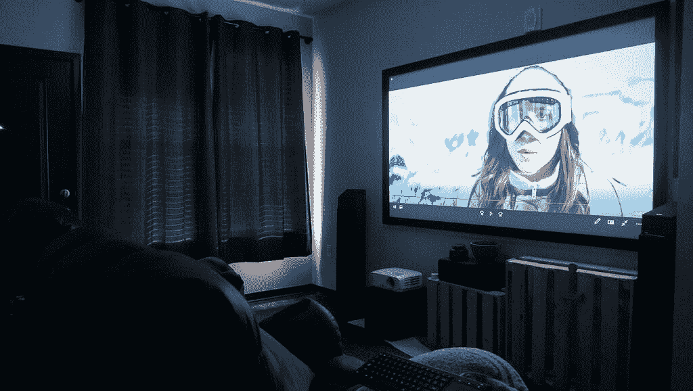
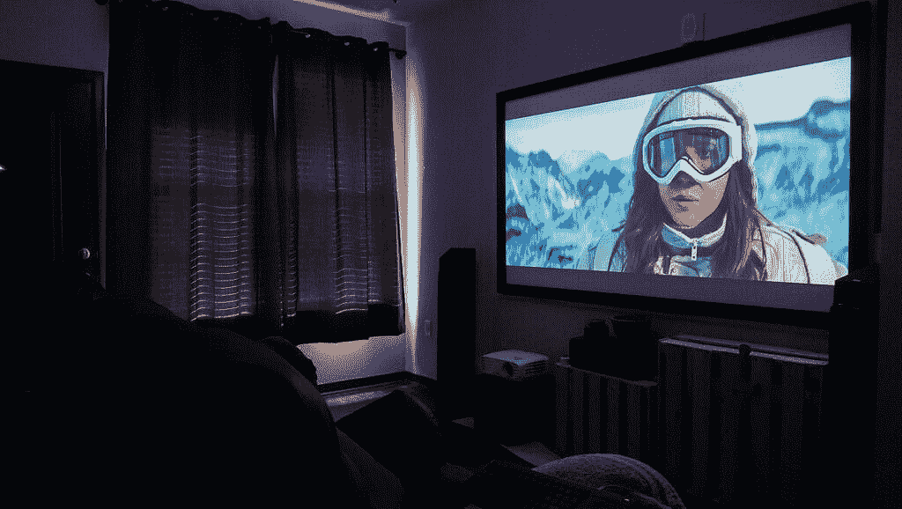

# 星云宇宙最大:最好的多合一家庭影院解决方案？

> 原文：<https://www.xda-developers.com/nebula-cosmos-max/>

Anker 公司生产入门级家庭影院投影仪已经有一段时间了。他们的投影仪注重简单、便携和高质量。宇宙最大星云是他们迄今为止最雄心勃勃的投影仪。这款 4K HDR 投影仪配有谷歌电视，并采用了一些最新的投影仪技术。这款投影仪的售价为 1，699.99 美元，将与该价格范围内的其他 4K 解决方案展开竞争。所以让我们来看看，看看星云宇宙 Max 的优缺点。

### **用星云宇宙 Max 准备终极超级碗观赛体验。进入游戏！**

 <picture></picture> 

Nebula Cosmos Max

星云宇宙最大值是体验你最喜爱的运动项目的最佳方式。以和电视一样的价格，你可以在一个巨大的 150 英寸屏幕上体验游戏，在一个非常令人印象深刻的 4K HDR 图像中。Dolby Digital Plus 扬声器让您听到充满整个房间的声音的每个细节。使用谷歌电视访问 ESPN 等应用程序，这样您就可以将内容直接传输到您的投影仪，而无需任何额外的硬件。这些东西使得 Nebula Cosmos Max 成为任何热爱观看体育比赛并希望提升体验的人的绝佳解决方案。

因此，如果你有兴趣跳到投影仪系统，请继续阅读我们对星云宇宙最大值的完整评论。

## 建造和设计

大多数投影仪很少努力让自己看起来漂亮。这是因为家庭影院爱好者倾向于将投影仪藏在看不见的地方。由于星云宇宙最大值更多的是一个便携式投影仪，这将经常被放在咖啡桌上或其他地方看到它。正因为如此，投影仪的设计非常漂亮。一个对称的椭圆形使透镜位于投影仪的中间，扬声器格栅环绕边缘。甚至连端口都直接放在后面的中央。

在投影仪的底部，您会发现一个三脚架，便于安装。机器的顶部显示了一个背光的星空，中间是星云标志。可以在谷歌电视设置中打开和关闭星星和徽标，因此您可以选择只显示星星、只显示徽标、两者都显示或都不显示。

遥控器有基本的导航按钮、自动对焦按钮和专用的谷歌助手按钮。不幸的是，遥控器没有背光，这将使你使用你的手机作为手电筒，看看你按下了什么。由于布局简单，随着时间的推移，您会记住这些按钮，但这在开始时会有点麻烦。

## 连通性

Nebula Cosmos Max 旨在提供一体化的便携体验。实现这种便携性需要一个简化的连接系统。谷歌电视操作系统允许你将 AV 接收器、蓝光播放器或媒体盒留在身后。您可以使用这款智能投影仪，通过 Google TV 上的任何流媒体服务来播放电影或节目。这包括像网飞和 Hulu 这样的服务。但你也应该考虑 ESPN 体育，这是观看即将到来的超级碗的终极方式。

当然，有了谷歌电视，你就可以内置 **WiFi** 和**蓝牙**。您将能够连接到网络，并配对控制器或遥控器，而无需使用额外的电缆。这增加了该投影仪的便携性。有了所有这些内置功能，你就可以和朋友一起看东西了，而且你只需要一根电源线。这是终极的一体化解决方案。

谷歌电视将在 Cosmos 的内部硬件上运行，该硬件由 2GB 内存和 12GB 存储空间组成。这个系统相当快，但是你会注意到它偶尔会死机。内部存储将很快填满，可用存储空间略高于 9GB。如果你打算添加许多应用程序或下载电影，我建议添加一个带有可用端口的 USB 驱动器。

 <picture></picture> 

Nebula Cosmos Max Ports

现在，尽管投影仪能够完全独立于其他设备使用，但这并不意味着它没有将它集成到家庭影院系统所需的所有端口。事实上，星云 Cosmos Max 包括**两个 HDMI 端口**、**两个 USB 端口**、**一个光学端口**。这些端口位于投影仪的背面，很容易接触到。

我可以将这台投影仪放在我的家庭影院中播放蓝光，并使用我的 5.1.2 扬声器设置。您可以通过 HDMI 将此投影仪连接到 AV 接收器，并且可以使用 USB 端口添加控制器、鼠标/键盘、麦克风或外部驱动器。利用 USB 端口的一个很好的方法是，在将投影仪带到电影之夜之前，将一些电影或节目预载到 USB 驱动器上。这也消除了对任何互联网连接的需求，同时仍然能够使用谷歌电视观看电影。

## 声音的

投影仪并不以内置音频质量好而闻名。事实上，他们通常很糟糕。宇宙最大星云的情况并非如此。该投影仪有四个 10W 扬声器，专门用于提供**杜比数字加**音频体验。这些产品旨在为您和您的朋友提供 360 度的音频，同时让您欣赏电影。

音频质量非常好，即使不使用外部扬声器，您也可以享受观看电影的乐趣。四个专用扬声器让投影仪用高质量的音频充满整个房间，带来身临其境、激动人心的观看体验。这种效应在观看体育比赛时尤其明显。对话和其他声音的分离对于确保你不会错过正在说的任何东西是很重要的。

因此，尽管音质比标准内置投影仪扬声器好得多，但不要指望它能提供真正的家庭影院音频体验。它比其他内置扬声器好得多，但它不是为了取代真正的环绕声系统而设计的。通过打开蓝牙扬声器模式，投影仪甚至可以兼作蓝牙扬声器。此模式允许您使用内置扬声器播放手机中的音乐。这是一个很酷的功能，可以充分利用这些高品质的扬声器。

## 显示

### 分辨率、大小和启动时间

这款投影仪最强的地方在于它拥有一个 **4K 分辨率** (3840 x 2160p)。为了实现这一分辨率，投影仪使用了升级技术，这是该价格范围内任何其他投影仪的典型技术。它配备了 0.47 英寸 4K UHD DMD 芯片，原生分辨率为 1920×1080p。升级后的结果令人印象深刻。在这台投影仪上观看 4K 电影明显比我用来比较的其他 4K 投影仪好。

 <picture></picture> 

Nebula Cosmos Max 4K Display with Google TV

该显示器能够达到 150 英寸，投掷比为 1.2:1。这将满足临时用户以及家庭影院爱好者。使用自动梯形失真和聚焦功能，可以非常简单地根据屏幕调整投影仪显示。投影仪会自动调整梯形失真以补偿投影角度，因此您每次都能获得完美的效果。自动调节就像按遥控器上的专用按钮一样简单，它会改变投影仪的焦点，直到它看起来完美为止。这些自动化功能将大大减少设置时间，这进一步增加了这台机器的便携性。

启动时间非常短。投影仪只需要 8 秒钟就可以开始显示图像，26 秒钟就可以完全启动谷歌电视。这个过程通常要长得多，因为投影仪往往需要很长时间预热。星云宇宙 Max 在启动时间方面做得非常好。

### HDR 和亮度

你可以在你的星云宇宙最大值上欣赏 HDR 10 号的内容。这台投影仪能够很好地显示 HDR，但并不完美。良好的 HDR 体验依赖于明亮的显示器。当 HDR 打开时，你希望能够在黑暗的场景中看到更多的细节。然而，星云宇宙最大值的 1500 流明并不足以在有很多黑暗场景的电影中获得良好的 HDR。不过，对于较亮的场景，这种方法确实非常有效，正如你在下面的图像样本中看到的那样。

 <picture></picture> 

HDR OFF

 <picture></picture> 

HDR ON

电影:幽灵的威胁[4K HDR 迪士尼加版]

你会注意到，当 HDR 打开时，在较暗的场景中你会丢失相当多的细节。我发现自己反复检查亮度水平，以确保它是在最大亮度。

 <picture></picture> 

HDR OFF

 <picture></picture> 

HDR ON

电影:《盗梦空间》[4K·HDR]

另一方面，HDR 能够极大地改善如上图所示的场景。《盗梦空间》中的这个场景发生在雪地里，当在投影仪上观看时，通常完全被吹散了。HDR 的背景拯救了这部电影，让它看起来更好看。

你最终会在一些电影中使用 HDR，而在另一些电影中跳过它。它可以在谷歌电视设置中打开和关闭。

## 价格

星云宇宙最大值的价格是 1699.99 美元，但现在[你可以节省 10%](https://us.seenebula.com/pages/subscription-offer?utm_source=web&utm_medium=influencer&utm_content=superbowl_xda&utm_campaign=us_nebula_superbowl&utm_term=) 正好赶上超级碗。这个价格对于刚刚开始使用家庭影院系统的人来说是一个很好的解决方案，或者对于任何想要得到最好的便携式 4K 投影仪的人来说也是一个很好的解决方案。不管怎样，你的电影之夜将会有一个大的升级。

[**得到星云宇宙 Max**](https://us.seenebula.com/pages/subscription-offer?utm_source=web&utm_medium=influencer&utm_content=superbowl_xda&utm_campaign=us_nebula_superbowl&utm_term=)

###### 我们感谢 Anker 赞助了这篇文章。我们的赞助商帮助我们支付与运行 XDA 相关的许多费用，包括服务器成本、全职开发人员、新闻撰稿人等等。虽然您可能会在门户内容旁边看到赞助内容(这些内容将始终被标记为赞助内容),但门户团队对这些帖子不承担任何责任。赞助内容、广告和 XDA 仓库完全由一个独立的团队管理。XDA 绝不会通过接受金钱来赞扬一家公司，或以任何方式改变我们的观点或看法，从而损害其新闻诚信。我们的意见不能被收买。