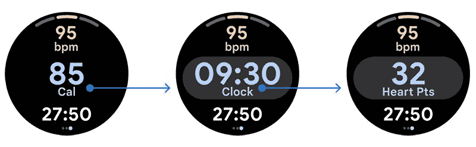
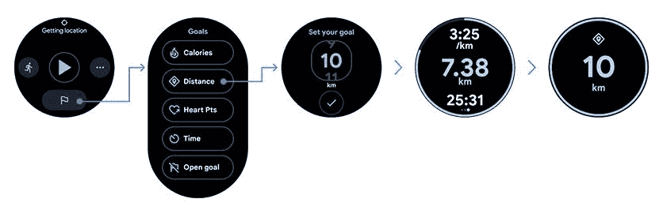
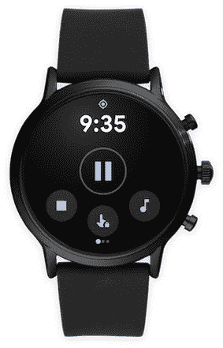

# 这是新的谷歌 Fit 设计和功能来穿操作系统

> 原文：<https://www.xda-developers.com/new-google-fit-design-features-coming-wear-os/>

本月早些时候，谷歌[宣布对安卓系统上的谷歌 Fit 应用](https://www.xda-developers.com/google-fit-android-revamped-home-screen-new-wear-os-features/)和 [Wear 操作系统](https://www.xda-developers.com/tag/google-wear-os/)进行更新，并重新设计了用户界面和新功能。此次更新为 Android 上的 Google Fit 应用程序带来了一个新的易于查看的中心，它总结了您的指标、每日和每周的心脏点和步骤目标，以及您最近的锻炼。该中心还显示您的心率、体重和血压随时间的变化趋势。该应用程序还获得了重新设计的主屏幕，可以快速访问睡眠分析。

对于 Wear OS 设备，谷歌为你最近的训练和重要指标推出了新的磁贴。但该公司当时没有透露这些新瓷砖的太多细节。谷歌现在终于[发布了更多关于 Wear OS 设备的 Google Fit 更新的信息](https://support.google.com/wearos/thread/84883193?hl=en)，下面是它的样子:

针对 Wear OS 设备的 Google Fit 更新旨在通过全新的设计提供更好的用户体验。正如我们在之前的报道中所看到的，更新后的设计用两个专用于您的绩效的图块向您显示了所有重要的指标。向右滑动这些磁贴，您就可以在锻炼过程中快速访问媒体控制和设置。

如果你外出跑步，该应用程序将为你覆盖的每公里/英里推送提醒，并一目了然地显示你的分段时间。它还将为您提供与上次拆分相比的最新表现。

新的 performance tiles 还将在屏幕顶部包括心率区，这将让您快速检查您在锻炼过程中是否获得了心跳点数。最重要的是，只需轻轻一点，这些磁贴就能让您在所有指标(卡路里、步数、时间、心脏点数)之间快速切换，帮助您准确地看到您最关心的内容。

 <picture></picture> 

New Heart Points zone

此外，Google Fit 更新还让您可以更轻松地在 Wear OS 智能手表上设置锻炼目标。为此，您只需点击屏幕底部的旗帜图标，选择一个指标，然后设定您想要的目标。

 <picture></picture> 

Easily set workout goals

然后，你的手表会显示你的进度，并在你达到目标时发出提醒。该应用程序还将通过这个新动画推送心脏点和步骤的每日目标通知:

更新还引入了一个触摸锁定按钮，以防止意外触摸中断您的锻炼。但即使打开了触摸锁定，你也可以使用智能手表上的硬件按钮暂停/继续锻炼或切换屏幕。要关机，你必须按住电源按钮。

 <picture></picture> 

New Touch Lock button

最后，Google Fit for Wear OS 现在也有一个 Breathe Tile，可以帮助你减压，更容易地访问指导呼吸会话。一旦呼吸练习完成，该应用程序还会显示一个总结，展示您的心率在开始和结束之间的变化。该板块还将向您展示上周您的呼吸会议的回顾，因此您可以轻松地跟踪您的进展。

Wear OS 设备的新 Google Fit 更新将于本周开始向用户推出。如果你还没有这款应用，你可以通过访问智能手表上的 Play Store 下载最新版本。