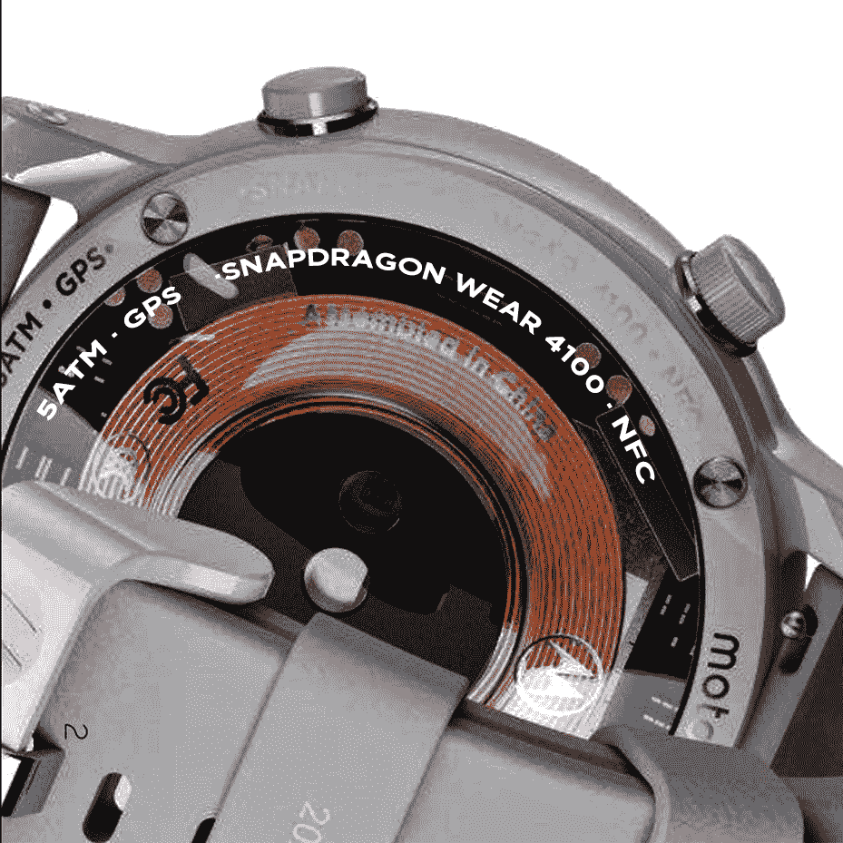

# 这些摩托品牌的智能手表不是摩托罗拉制造的

> 原文：<https://www.xda-developers.com/new-moto-branded-smartwatches-are-coming-but-theyre-not-what-you-may-think/>

**更新 1 (03/02/2021 @美国东部时间下午 1:15):**我们已经了解了两款即将发布的摩托罗拉智能手表的更多细节。[点击此处获取信息。](#update1)下面保留了 2021 年 2 月 28 日发表的文章。

摩托罗拉已经经历了几次智能手机产品线的转变，这无意中导致了更复杂的品牌和命名方案([这从来都不是好事](https://www.xda-developers.com/opinion-smartphone-branding-out-of-control/))。但其智能手表部门发生了有趣的转变。上次我们看到摩托罗拉智能手表时，它实际上并不是由摩托罗拉制造的。相反，它是由一家名为 eBuyNow 的公司制造的，摩托罗拉只授权了它的品牌名称。现在，新一代摩托罗拉品牌的智能手表即将到来，但与我们之前看到的相比，它们是非常不同的产品。也许这是好的，也许这是坏的，但这是不同的。

这里我们应该注意的第一件事是，这并不是真正的泄漏。这一消息来自一次公开销售演示，首次由 Felipe Berhau 在 Twitter 上强调。(这里可以看到[，via](https://cebrands.ca/CEBrands-CorporatePresentation.pdf)[9 to 5 GoogleT5)。在手表本身上，它们似乎在任何地方都没有以前的品牌(这就是为什么我们注意到这些是 Moto 品牌的智能手表)。相反，演示文稿上写着“Moto Watch & One”，暗示我们将有一款 Moto Watch 和一款 Moto One watch。](https://9to5google.com/2021/02/26/new-moto-wear-os/)

还有第三款手表，显然将被称为“Moto G”智能手表。Moto G 系列智能手机由中端和低端设备组成，因此这种情况下的 G 手表可能是更低端的智能手表。据推测，“Moto One”智能手表将遵循 One 系列智能手机的总体路线，而 Moto 手表可能是该系列中合适的旗舰智能手表。同样，这只是基于图像的推测。

这些智能手表，就像上一款 Moto 360 智能手表一样，不是由摩托罗拉内部制造的，但如果上市，将会以 Moto 品牌销售。我们不知道这些智能手表何时会上市，也不知道它们是否会上市，所以我们必须拭目以待。

* * *

## 更新:骁龙 Wear 4100，无线充电，和 Wear OS

/r/WearOS subreddit 上眼尖的 reddits[发现 eBuyNow 展示的智能手表底部刻有“骁龙 Wear 4100”。此外，还有“NFC”、“5ATM”和“GPS”的铭文，这表明它将支持非接触式支付，可以承受高达 5ATM 的水压，并支持位置跟踪。我们还可以在图像中看到无线充电线圈。总而言之，这表明新的摩托罗拉品牌智能手表将会有一些令人兴奋的功能。当它推出时，它也可能是市场上性能最好的 Wear OS 智能手表之一，因为它包含了](https://www.reddit.com/r/WearOS/comments/lvvj9h/new_moto_watch_backplate_text_blown_up_names/)[的骁龙 Wear 4100](https://www.xda-developers.com/qualcomm-snapdragon-4100-announcement-wear-os-smartwatches/) ，它也为[的 Mobvoi TicWatch Pro 3](https://www.xda-developers.com/mobvoi-ticwatch-pro-3-review/) 提供动力。

 <picture></picture> 

New Moto Watch backplate text blown up in Photoshop. Image credits: Redditor [TheMacJezza](https://www.reddit.com/user/TheMacJezza)