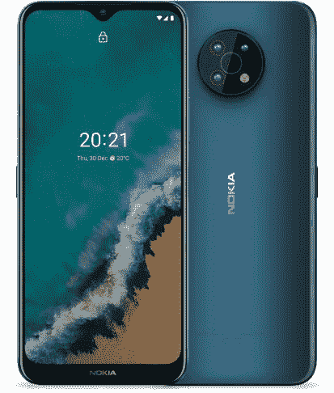

# 2023 年最佳诺基亚手机

> 原文：<https://www.xda-developers.com/new-nokia-normandy-shots-point-to-wp-styled-ui-lumia-like-body/>

诺基亚没有在旗舰领域与最好的手机竞争，但它仍然有很多不会在你的口袋里烧一个大洞的设备。很多这样的手机都很容易买到，而且价格合理，功能和规格都很齐全。在美国可以买到的诺基亚手机相当少，但我们已经强调了 2023 年你现在可以买到的最好的手机。这些手机在各自的领域可能缺乏“哇”的因素，但它们肯定会挠你怀旧的神经。因此，如果你被说服在 2023 年购买新的诺基亚智能手机，那么现在在美国你有以下选择:

## 最佳综合奖:诺基亚 XR20

诺基亚 XR20 是目前你能在美国买到的最好的诺基亚手机之一。它由骁龙 480 芯片驱动，可以购买高达 6GB 的内存和高达 128GB 的内部存储。它还支持通过高达 512GB 的 microSD 卡进行可扩展存储。显示器是一个 6.67 英寸的全高清+面板，带有一个 800 万像素自拍相机的打孔切口。后部有一个 4800 万像素的主摄像头和一个 1300 万像素的超宽镜头。

与诺基亚 X100 5G 不同，XR20 与美国的许多运营商兼容。这不是 T-Mobile 的专利。因此，它也很容易从许多零售商那里买到。XR20 的一个亮点是，它是一款经过 MIL-STD 810 G 认证的坚固手机，这意味着它不会那么容易就放弃你。它非常适合那些生活方式积极的人，或者只是对设备有点笨拙的人。XR20 还具有 IP68 的防尘和防水等级，因此它也应该能够处理游泳池中偶尔的浸泡。

自首次发布以来，诺基亚 XR20 的价格已经下降。你现在可以以 400 美元的价格买到 XR20，这对它带来的一切来说都不算太坏。最近[也将](https://www.xda-developers.com/nokia-g50-xr20-android-13/)更新到了 Android 13，所以你在这里可以得到一个非常好的装有最新版本 Android 的设备。

 <picture></picture> 

Nokia XR20

##### 诺基亚 XR20

诺基亚 XR20 是一款坚固的智能手机，有一些不错的规格。如果你正在寻找一部可以使用很长时间的手机，这是一个不错的选择。

## 最超值手机:诺基亚 G400 5G

诺基亚 G400 5G 是我们目前在美国选择的最有价值的诺基亚手机。大约 200 美元，你就可以获得 5G 支持，120Hz 显示 FHD+显示器和 5,000mAh 大电池。它也由骁龙 480 Plus 变种驱动，与常规的骁龙 480 芯片相比，它的时钟速度更高。您可能不会注意到普通骁龙 480 和 Plus 之间的显著性能差异，但更高的时钟速度可能会对资源密集型任务有所帮助。

诺基亚 G400 5G 还在背面安装了一个三摄像头，其中包括一个 48MP 主传感器。你还可以获得 1600 万像素的自拍摄像头，而 XR20 和 G50 都只有 800 万像素的传感器。诺基亚 G400 的其他一些值得注意的功能包括通过 microSD 卡可扩展至 1TB 的存储空间。诺基亚 G400 5G 还兼容美国的许多主要运营商，包括威瑞森、美国电话电报公司等。

##### 诺基亚 G400

诺基亚 G400 5G 是一款不错的中端产品，支持 5G，120Hz 显示屏和骁龙 480 Plus。

## 备选最超值手机:诺基亚 G50

诺基亚 G50 也是物有所值类别中的可靠选择，因为它以合理的价格提供了良好的功能和规格组合。对于那些寻求功能强大的 5G 智能手机的人来说，这是一个很好的选择，可以持续一整天甚至更长时间。对于想买一部软件干净的手机而又不想花太多钱的人来说，这也很好。就整体规格而言，它也非常类似于诺基亚 G400，因此您只会看到一些差异。

诺基亚 G50 配有 6.82 英寸的大尺寸全高清液晶面板，带有露珠凹槽，由骁龙 480 芯片组驱动，与 XR20 相似。在光学方面，你可以在后面获得 4800 万像素的三摄像头设置，在前面获得 800 万像素的自拍相机。这款手机还配有一块 4，630 毫安时的电池，确保你一次充电可以使用一整天以上。5G 连接和长达三年的 Android 更新是额外的奖励，因此它带来了相当好的价值。

诺基亚 G50 目前的定价为 300 美元，但它经常以折扣价出售。你可以点击下面的链接，在网上找到最好的价格。

 <picture></picture> 

Nokia G50

##### 诺基亚 G50

诺基亚 G50 是任何寻求电池续航时间长的智能手机和长时间观看内容的大显示屏的人的完美选择。它还拥有良好的 5G 连接芯片组。

## 最佳入门级手机:诺基亚 G20

诺基亚 G20 是一款很棒的入门级设备，在美国售价约为 180 美元。它可能没有所有的花里胡哨，但它对那些想买一部基本 Android 手机的人来说很好。你也可以考虑在那个价位买它作为辅助设备。诺基亚 G10 的一个亮点是它有 5050 毫安时的电量，该公司表示一次充电可以持续两天。它由相对低端的 Helio G35 芯片组驱动，功耗非常低。

有一个 6.5 英寸的高清显示屏用于观看内容，手机有 4GB 的内存和高达 128GB 的板载存储。您还可以通过 microSD 卡将存储空间扩展至 512GB。至于光学系统，后面有一个四摄像头设置，包括一个 48MP 主摄像头和一个 5MP 超宽传感器。诺基亚 G20 开箱即可运行 Android 11，并配有侧装式指纹扫描仪以确保安全。

诺基亚 G20 是诺基亚 G10 的升级版。它配备了更快的芯片和更大的内存，还配备了四摄像头。

## 最佳国际诺基亚手机:诺基亚 X30

诺基亚 X30 是市场上最新的诺基亚手机之一，遗憾的是它还没有在美国上市。这是一款中型游侠，配备 90Hz FHD+显示屏，由骁龙 695 SoC 供电。你也可以购买高达 8GB 的内存，这与 2023 年大多数智能手机的内存更接近。这绝对是这个系列中最强大的诺基亚手机，我们希望它尽快到达美国。

诺基亚 X30 的其他一些值得注意的功能包括 IP67 等级，4200 毫安时电池，支持高达 33W 的快速充电，两个后置摄像头，以及开箱即用的 Android 12。

##### 诺基亚 X30 5G

X30 是市场上最新的诺基亚手机之一，但目前还不能在美国购买。

这就把我们带到了这个特殊系列的结尾，在这个系列中，我们强调了 2023 年最好的诺基亚手机。这个系列中的大多数智能手机在美国都很容易买到，所以一定要去看看。XR20 和 G400 非常相似，但 XR20 在耐用性方面略胜 G400 一筹。它不仅具有 IP68 防护等级，还具有其他一些附加功能，包括用于面板的康宁大猩猩玻璃 Victus，而不是 G400 上的普通 2.5D 玻璃。你也可以看看其他负担得起的选择，包括 20 国集团。

如果你对其他品牌的选择持开放态度，那么一定要看看我们汇编的[最佳安卓智能手机](https://www.xda-developers.com/best-android-phones/)。如果你特别想买实惠的手机，你可以看看我们的[最便宜的安卓手机](https://www.xda-developers.com/best-cheap-android-phones/)清单。