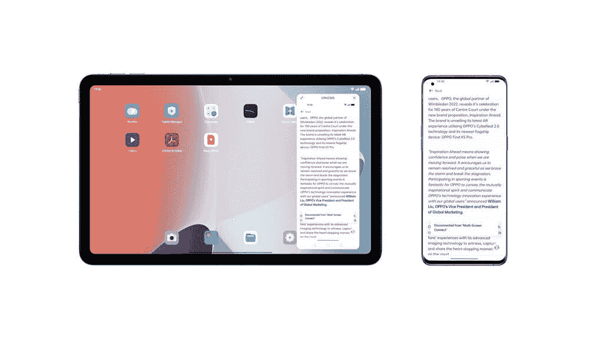
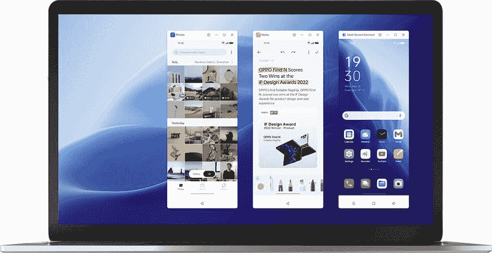
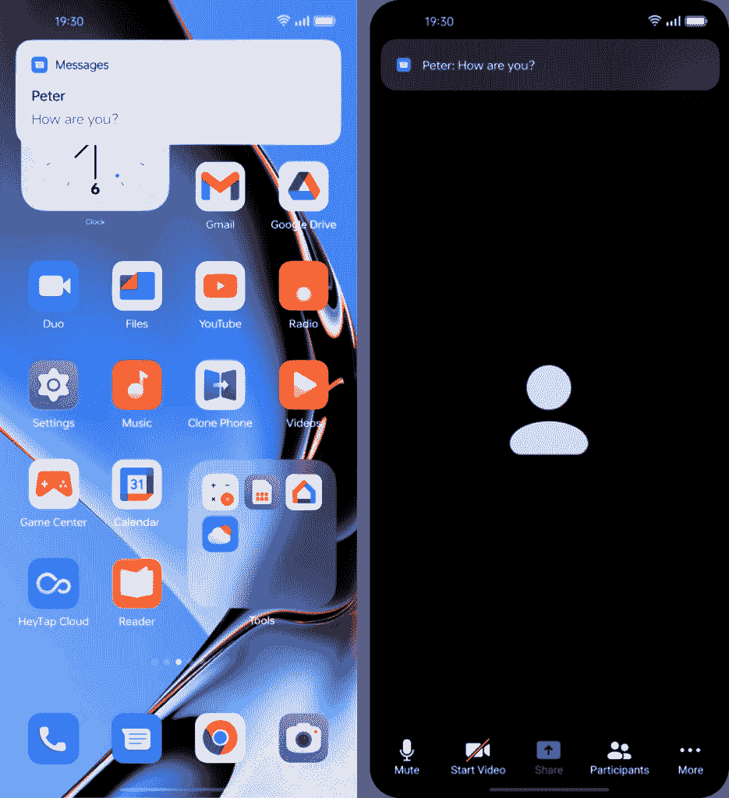
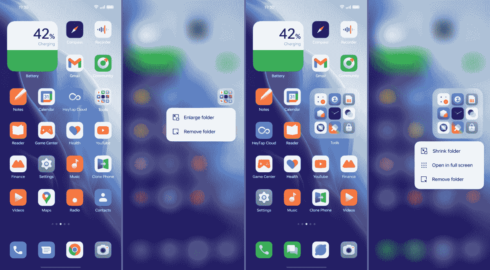
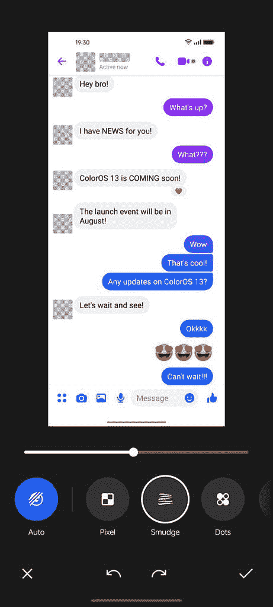

# 这些新的 OPPO ColorOS 13 功能将提高您的工作效率

> 原文：<https://www.xda-developers.com/new-oppo-coloros-13-features-boost-productivity/>

Android 13 来了，它为 Android 手机带来了许多新的更新和改进。OPPO 正在努力以 ColorOS 13 的形式为您带来最新的更新，该产品计划从今年 8 月开始在全年的不同时间上市。因为 ColorOS 是一个评论非常高的平台，我们很高兴看到 OPPO 用户在 2022 年下半年会有什么新功能。我们也很高兴分享这些新增功能如何协同工作来提高您的工作效率，使 ColorOS 13 成为您智能工作和生活的终极助手。请继续阅读，快速了解 ColorOS 13 中的所有新功能。

## ColorOS 13 中提高工作效率的新功能

**多屏连接**让使用多台设备成为无缝体验。现在，您的工作流程可以在手机、OPPO Pad Air 和 PC 电脑之间轻松传输，不会出现任何中断。这使您可以轻松地将任务与更统一的系统保持同步。

 <picture></picture> 

ColorOS 13 Multi-Screen Connect

使用 ColorOS 13 中新的多屏连接功能，您可以在设备之间传输各种类型的文件，而不会消耗数据。这种直接连接即使在没有互联网连接的情况下也能工作，因为设备是直接相互连接的。此功能还支持设备之间的剪贴板共享，以帮助您轻松复制和粘贴。在 PC 上使用多屏幕连接时，您可以在台式机或笔记本电脑的大屏幕上同时显示多个应用程序。有了多屏连接，你可以忘记浪费时间，不断切换应用程序。

 <picture></picture> 

ColorOS 13 Multi-Screen Connect

网上会议的流行在过去的两年里爆炸式增长，越来越多的人在家工作。OPPO 通过名为**会议助手**的新功能改善了你的在线会议。当您的会议开始时，会议助理会优先处理无线数据包，以确保您有稳定的连接。你的横幅通知也被简化为更少的干扰，减少了干扰，省去了你刷掉大通知以正确查看某人视频的麻烦。最后，您还可以添加 OPPO Notes*的快捷方式，它可以被视为一个易于访问的浮动弹出窗口。

 <picture></picture> 

ColorOS 13 Meeting Assistant simplifies notifications during online meetings

## 智能生活的新特性

主屏幕的新更新允许您进行更多自定义，以便更快地访问常用功能和特性。ColorOS 13 附带了一个名为 **Shelf** 的功能，可以通过各种小工具快速浏览有用的信息。顶部有搜索功能，查找您需要的本地和在线信息比以往任何时候都更容易。

找到新的**主屏幕窗口部件**，它可以用动态布局显示有用的信息。然后使用**大文件夹**选项创建一个可以从主屏幕启动的应用程序文件夹。忘记必须打开文件夹了；从默认视图可以看到应用程序图标！

 <picture></picture> 

ColorOS 13 Large Folder

在过去的几个版本中，OPPO 的永远在线显示一直是 ColorOS 的亮点之一，随着 ColorOS 13 的更新，这一点变得更好。持续显示减少了菜单层级，帮助用户快速浏览重要信息。这给用户带来了更快的信息访问速度。**智能常亮显示屏**将 Spotify 控件带到你的 AOD 上，允许你播放、暂停和随机播放歌曲；这显示在佐马托和斯威奇的食品配送信息旁边。 **Bitmoji Always-On Display** 将你的动画角色带到 AOD，它模仿你的手机认为你当时在现实生活中可能正在做的事情。 **Insight Always-On Display** 在用户的 AOD 上显示用户的数字行为，使用一个颜色条来跟踪你解锁手机的次数和花费的时间。

除了始终显示的洞察力， **Blossom 壁纸**还可以帮助您监控智能手机的使用情况，实现更好的生活平衡。它将壁纸上植物芽的生长可视化，以表明你花了多少时间粘在手机屏幕上。

 <picture></picture> 

ColorOS 13 Blossom Wallpaper

UI 中的更新可以在整个系统中找到。得益于新颖、简洁、舒适的水形设计；ColorOS 13 配备了改进的布局和系统层次结构，以及更新的字体和排版，提高了可读性。总的来说，由于新的**卡片式布局**、**水形设计**和新的**自适应布局**，你将在 ColorOS 13 中体验到显著改进和更具凝聚力的用户界面，这可以为不同的屏幕尺寸和纵横比格式化你的显示。

OPPO 新的自主开发的**动态计算引擎**在这次最新更新中实现，它提供了系统级的技术解决方案，以提供更流畅、更稳定的系统。它通过改进硬件资源的调度来增强基本的用户体验。这通过在高性能和低功耗之间实现更好的平衡而延长了电池寿命。它还允许用户在后台保留更多的应用程序，同时在多个应用程序之间切换，而不会出现延迟或丢失应用程序的状态。对于那些在手机上进行大量多任务处理的人来说，这是一个好消息！

截图有了一个新的安全功能，可以让你一键模糊头像和用户名。自动像素化功能可以自动检测敏感信息，在将信息发布到网上或发送给朋友之前，您可以选择将其模糊化。私人保险箱现在使用广泛使用的高级加密标准(AES)进行加密，以提供高级别的安全性。并且还集成了 Android 13 的底层隐私保护功能。诸如此类的功能是 ColorOS 成为注重隐私的用户的最佳解决方案之一的原因。

 <picture></picture> 

ColorOS 13 Auto Pixelate

## 更新计划

OPPO 一直在发布一些 2022 年上市的最好的智能手机，配备了令人惊叹的硬件和尖端技术。有了 ColorOS 13，您的 OPPO 设备在生产力、定制和娱乐方面的潜力得到了进一步发挥。请按照以下测试版发布时间表寻找您的 OPPO 手机的更新:

*   【2022 年 8 月:找 X5 Pro，找 X5
*   【2022 年 9 月:找 X3 Pro，雷诺 8 Pro 5G
*   【2022 年 10 月:雷诺 8 5G，雷诺 7 Pro 5G，雷诺 7 5G，雷诺 7，雷诺 6 5G，F21 Pro，K10 5G，A77 5G，A76
*   【2022 年 11 月:雷诺 7 Z 5G，雷诺 6 Pro 5G，雷诺 6 Pro 5G 排灯节版，雷诺 6 Z 5G，雷诺 5 Pro 5G，雷诺 5 Pro，F21 Pro 5G，F19+ Pro，K10，A96
*   【2022 年 12 月:找 X5 Lite，找 X3 Neo 5G，找 X3 Lite 5G，找 X2 Pro，找 X2 Pro Automobili 兰博基尼版，找 X2，雷诺 8，雷诺 8 Z 5G，雷诺 5 5G，雷诺 5 Z 5G，A94 5G，A74 5G
*   **来自 H1 2023:** Pad Air、Reno8Lite 5G、Reno7 Lite 5G、Reno7 A、Reno6、Reno6 Lite、Reno5、Reno5 漫威版、Reno5 F、Reno5 Lite、Reno5 A、F19 Pro、F19、F19s、A95、A94、A77、A74、A57、A55、A54 5G、A53s 5G、A16s

***注:** OPPO Notes 在 ColorOS13.0 的特定型号上可用，在进一步 OTA 更新的其余型号上可用。更多信息请参考实际型号介绍。

*我们感谢 OPPO 赞助这篇文章。我们的赞助商帮助我们支付与运行 XDA 相关的许多费用，包括服务器成本、全职开发人员、新闻撰稿人等等。虽然您可能会在门户内容旁边看到赞助内容(这些内容将始终被标记为赞助内容),但门户团队对这些帖子不承担任何责任。赞助内容、广告和 XDA 仓库完全由一个独立的团队管理。XDA 绝不会通过接受金钱来赞扬一家公司，或以任何方式改变我们的观点或看法，从而损害其新闻诚信。我们的意见不能被收买。*