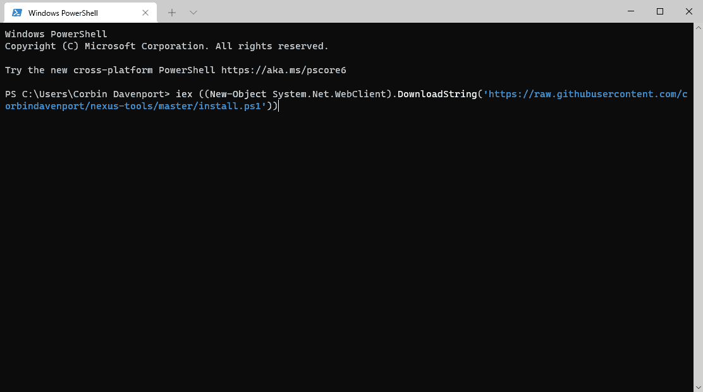

# Nexus Tools 是一个超级快速的 ADB 和快速启动安装程序，适用于 PC 和 Mac

> 原文：<https://www.xda-developers.com/nexus-tools-5/>

# Nexus Tools 5 是一款用于 Windows、Linux、Mac 和 Chrome 操作系统的超快速 ADB 和快速启动安装程序

Nexus Tools 可以在几秒钟内安装 ADB、Fastboot 和其他 Android 实用程序。它可以在 Windows、macOS、Linux 和 Chrome OS 上运行。

ADB 和 Fastboot 是 Android 开发或修改时最重要的两个工具。以前不下载整个 Android SDK 就安装它们是一件痛苦的事情，但是自从 Google 开始单独发布 SDK 平台工具包后，在几分钟内安装 ADB 和相关的实用程序就不是太难了。然而，有一种更简单的方法可以让你在任何电脑上安装所有的东西:Nexus Tools。

Nexus Tools 最初是我在 2013 年创建的，作为 ADB 和 Fastboot 的一键安装方式，在谷歌提供单独下载之前，它实际上是由 XDA 在 2014 年覆盖的[。您只需在终端(或 Windows 上的 PowerShell)中键入一个命令，Nexus Tools 就会将最新的 SDK 平台工具包下载到您的主文件夹中，并将所有内容添加到您系统的 path 变量中。之后，您可以正常运行 ADB、Fastboot 和其他实用程序。](https://www.xda-developers.com/set-up-adb-and-fastboot-on-linux-mac-os-x-and-chrome-os-with-a-single-command/)

Linux、macOS、WSL 和 Chrome OS 上的 Nexus 工具可以在终端应用程序中使用以下命令运行。如果你有 Chromebook，你需要先[启用 Linux 应用](https://www.xda-developers.com/linux-apps-chrome-os/)。

```
 bash <(curl -s https: 
```

可以通过从“开始”菜单打开 PowerShell 并运行以下命令来使用(本机)Windows 上的 Nexus Tools。

```
 iex ((New-Object System.Net.WebClient).DownloadString('https://raw.githubusercontent.com/corbindavenport/nexus-tools/master/install.ps1')) 
```

或者，你可以从 GitHub 发布页面下载最新版本的。

 <picture></picture> 

Nexus Tools 5.0 on Windows

Nexus Tools 5.0 刚刚完成，它有一个重写的代码库(现在是一个命令行 [Dart](https://www.xda-developers.com/dart-2-12-release/) 应用程序)和初始的 Windows 支持。新的 Windows 版本就像 Linux/macOS 版本一样工作，但它也可以为你下载和安装 ADB 驱动程序，而其他平台不需要这些驱动程序。Nexus Tools 现在也将自己安装到与 SDK tools 相同的目录中，因此您可以通过运行`nexustools -i`随时更新 ADB 和 Fastboot。

这年头自己安装谷歌的平台工具包并不太难，但 Nexus Tools 还是能帮你节省几分钟的时间，而且它提供了轻松的更新。代码也在 GitHub 上[开源。](https://github.com/corbindavenport/nexus-tools)