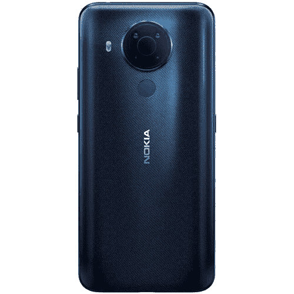
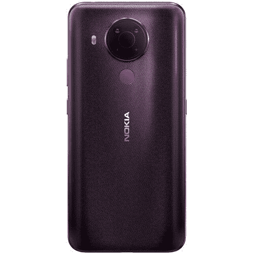

# 立即以 50 美元的价格购买全新的诺基亚 5.4 智能手机！

> 原文：<https://www.xda-developers.com/nokia-5-4-deal-bh/>

如果你不看 B&H 照片和视频的一些伟大的交易，你肯定错过了。他们往往在科技和智能手机上有一些你在其他地方看不到的精彩交易，今天就是其中一个伟大的交易日！今天，你可以在诺基亚 5.4 上节省 50 美元，让你以更低的价格买到物美价廉的智能手机。我们有它的前身诺基亚 5.3，在我们的[最佳廉价安卓手机](https://www.xda-developers.com/best-cheap-android-phones/)名单上是有原因的——这些是一些很棒的廉价设备！

你可能会问，为什么要选择诺基亚 5.4？诺基亚制造了一些很棒的廉价智能手机，5.4 肯定会让那些想要一个好相机而不打旗舰价格的人满意。诺基亚 5.4 拥有四后置摄像头，48MP 广角镜头，5MP 超宽镜头，然后是 2MP 微距镜头和 2MP 深度传感器。这么多摄像头和百万像素！

这是一部北美解锁手机。然而，5.4 版本仅与 GSM 运营商兼容。这意味着你应该可以在美国电话电报公司和 T-Mobile 使用它，但这款手机与威瑞森不兼容。虽然 B&H 的商店页面说它与 Sprint 不兼容，但 Sprint 属于 T-Mobile，所以你的结果可能会有所不同。

老实说，一部像样的智能手机配一个好相机只要 200 美元？你要考虑到这一点，不管你的承运人是谁！建议零售价通常是 250 美元，但现在，B&H 同时推出了诺基亚 5.4 的[极夜](http://xda.tv/Nokia54DealBH)和[黄昏](http://xda.tv/Nokia54DuskDealBH)两种颜色，优惠 50 美元。您还将获得免费快递服务-如果您今天订购，您将在本周末收到您的手机。如果你不确定要哪种颜色，我会选黄昏色——那种深紫色的粉红色真的很独特！

 <picture></picture> 

Nokia 5.4

 <picture></picture> 

Nokia 5.4 (Dusk Colorway)

对于一个月前发布的手机来说，50 美元是一个不可思议的交易！你要抓住这个吗？请在评论中告诉我们！