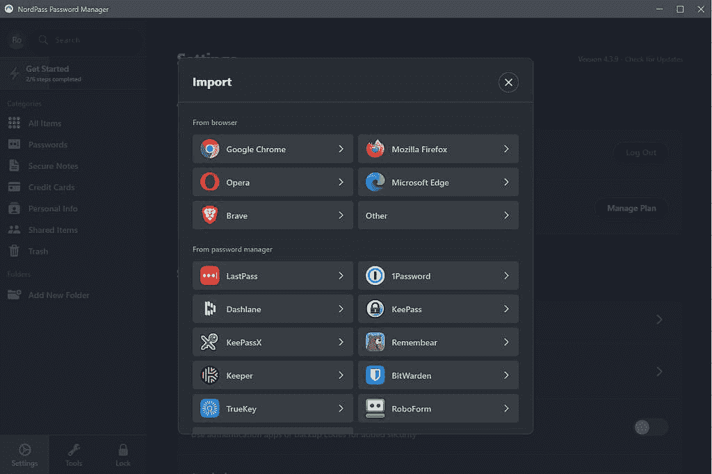
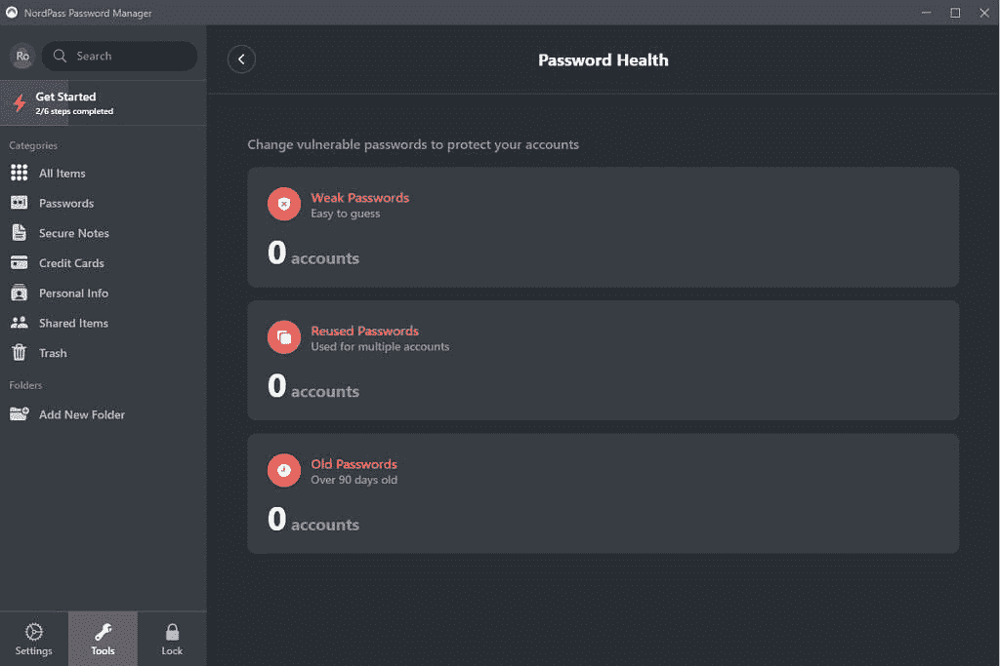

# 以 70%的价格获得两年的 NordPass 密码管理器

> 原文：<https://www.xda-developers.com/nordpass/>

停止推迟获得高质量的密码管理器，并利用 NorPass 夏季销售。密码管理器能够大大提高您的安全性，同时帮助您跟踪所有不同的密码。随着越来越多的人在家工作，现在您有责任确保您的安全。不要让薄弱的密码管理导致黑客危及你的工作或个人帐户。

NordPass 的 [**夏季开始销售**](https://www.anrdoezrs.net/links/100122946/type/dlg/sid/UUxdaUeUpU2877/https://nordpass.com/) ，其订阅计划有巨大折扣。 [NordPass](https://www.anrdoezrs.net/links/100122946/type/dlg/sid/UUxdaUeUpU2877/https://nordpass.com/password-manager/) 是最好的密码管理器之一，这是一个让你更换或开始使用密码管理器的绝佳机会。

*   **1 年订阅-节省 60%**
*   **2 年订阅-节省 70%**

* * *

## 高级功能

**轻松导入密码**

使用 NordPass，您可以通过从浏览器导入现有密码轻松开始。这有助于您快速开始新的密码管理。如果您将密码保存在另一个密码管理系统中，您可以将其导出为. CSV 文件，并将该文件导入 NordPass。从那里，您可以开始使用 NordPass 中包含的所有优秀功能。

 <picture></picture> 

NordPass Import Options

**一键保存并同步新密码**

将新密码保存到 NordPass 很简单。NordPass 有可用的浏览器扩展，它会知道你何时输入了密码。当检测到您的新凭据时，NordPass 会提示您自动将这些凭据保存到您的经理处。这使得新的密码输入像点击一样简单。输入新密码后，该密码将在连接到 NordPass 帐户的所有设备上同步。

NordPass 具有适用于以下浏览器的浏览器扩展:

**安全特性**

这个密码管理器能做的不仅仅是记住你的凭证。您可以使用附带的工具来真正掌控您的安全。密码生成器将帮助您创建满足所有网站要求的安全密码。这是制作新密码的理想方式。

密码健康工具将分析您现有的密码，看看哪些可能是安全风险。这是通过检测可被入侵者访问的重复使用的密码、旧凭据或弱密码来实现的。

 <picture></picture> 

NordPass Password Health

数据泄露扫描仪将跟踪当前的密码泄露，以查看其中是否有您的密码。如果是这样，您将会收到一个违规通知，这样您就可以尽快更改您的密码。这是保持安全的重要工具。数据泄露每天都在发生，你的密码可能已经被泄露了。这个工具将帮助你保持领先。

**安全票据和支付选项**

您的密码并不是您唯一想要保持安全的信息。WiFi 代码、警报代码、方向和秘密公式也是你想要保持安全的东西。这就是 notes 特性的用武之地。这使您可以记录安全的笔记，就像您的密码一样可以同步和存储。

信用卡信息是 NordPass 做得非常好的另一件事。您可以在您的帐户上存储和访问多张信用卡。当您需要访问信用卡信息时，这也使在线结账更加容易。

* * *

订购 NordPass 可以获得一些最好的功能。因此，利用[夏季促销](https://www.anrdoezrs.net/links/100122946/type/dlg/sid/UUxdaUeUpU2877/https://go.nordpass.io/aff_c?offer_id=508&aff_id=56644)来获得两年计划的 70%折扣，并在几分钟内开始改善您的安全性。

[**获取诺德帕斯**](https://www.anrdoezrs.net/links/100122946/type/dlg/sid/UUxdaUeUpU2877/https://go.nordpass.io/aff_c?offer_id=508&aff_id=56644)

###### 我们感谢 NordPass 赞助了这篇文章。我们的赞助商帮助我们支付与运行 XDA 相关的许多费用，包括服务器成本、全职开发人员、新闻撰稿人等等。虽然您可能会在门户内容旁边看到赞助内容(这些内容将始终被标记为赞助内容),但门户团队对这些帖子不承担任何责任。赞助内容、广告和 XDA 仓库完全由一个独立的团队管理。XDA 绝不会通过接受金钱来赞扬一家公司，或以任何方式改变我们的观点或看法，从而损害其新闻诚信。我们的意见不能被收买。