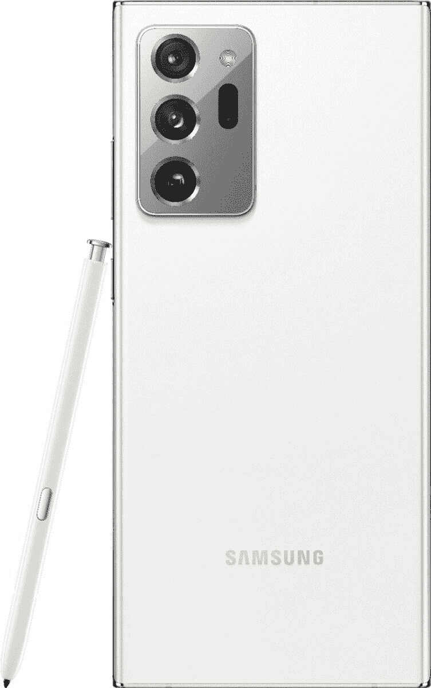
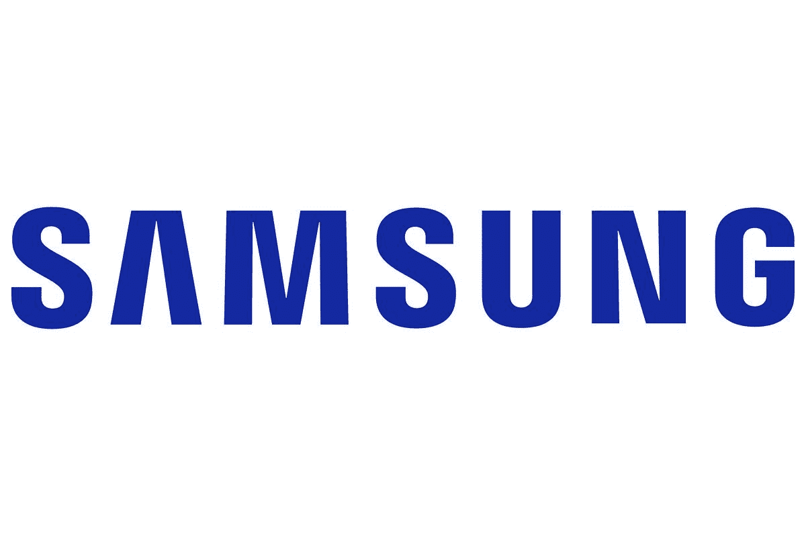

# 仅在今天，购买 Galaxy Note 20 Ultra 即可节省 350 多美元！

> 原文：<https://www.xda-developers.com/note-20-ultra-samsung-discover/>

探索周快乐！不确定那是什么？三星将在三星商店举办为期一周的销售和交易活动，从今天开始，一直持续到 28 日。作为这一庆祝活动的一部分，三星也将有每日交易来增加甜头！今天的交易？在 [Galaxy Note 20 Ultra](https://www.xda-developers.com/samsung-galaxy-note-20/) 上省钱！

如果你想买去年的旗舰，现在是个绝佳的机会。购买 Note 20 Ultra 的运营商版本将为您节省 350 美元。这种折扣无需利用以旧换新！但是，如果你有一个设备以旧换新，你仍然应该这样做，以推动价格更低。

除此之外，您还将获得额外的 50 美元即时点数。也许你可以用它来做一个新的保护套，让你的 Note 20 超级安全！不过，事先警告一下，这项交易只适用于运营商版本的智能手机。如果你正在寻找一个解锁的手机，你不会得到 350 美元和 50 美元的信用！

不过，你可能会奇怪，随着 [Galaxy S21](https://www.xda-developers.com/samsung-galaxy-s21/) 的发布，为什么选择 Note 20 Ultra？Note 20 手机可能有点老，但它们的规格并不差。此外，我们不要忘记令人惊叹的 S-Pen，它可以与 Note 20 系列配合使用，并随设备一起提供。对于 S21 系列，S-Pen 只兼容 S21 Ultra，需要单独购买！

最重要的是，由于它不是最新的三星发布，您将能够节省更多，因为有更多的交易！但这种特殊的折扣只持续到一天结束，所以不要等待！

 <picture></picture> 

Samsung Galaxy Note 20 Ultra

##### 三星 Galaxy Note 20 Ultra

想要一部可以使用 S-Pen 的智能手机吗？Nore 20 Ultra 在三星专卖店有售！在运营商机型上节省 350 美元，并获得 50 美元的即时信用。使用旧设备进行训练，节省更多费用！

如果你想看到所有的三星发现周交易，请查看下面的交易页面。明天再来查看当天的下一笔交易！

 <picture></picture> 

Samsung Discover Week

##### 三星 Galaxy Note 20 Ultra

前往三星商店，看看这家零售商本周出售的所有商品。