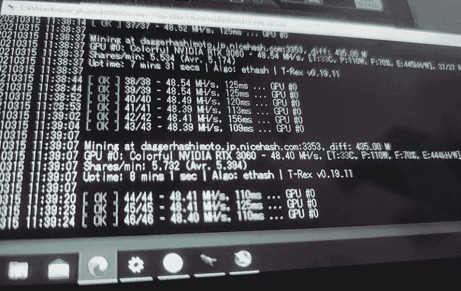
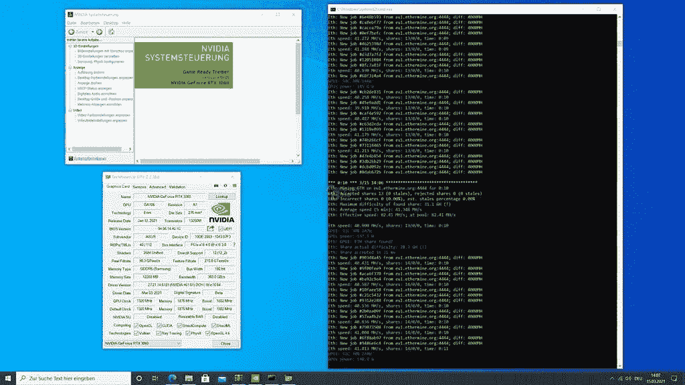

# NVIDIA GeForce RTX 3060 的以太坊哈希速率限制器解锁

> 原文：<https://www.xda-developers.com/nvidia-rtx-3060-hash-rate-limiter-unlocked/>

**更新 1(03/16/2021 @ 04:32PM ET):**NVIDIA 已经发布了驱动程序更新，该更新提高了 GeForce RTX 3060 上以太坊挖掘的哈希速率。[点击这里了解更多信息。](#update1)文章发表于 2021 年 3 月 15 日，下面保留。

就在上个月 NVIDIA 发布其新的 GeForce RTX 3060 显卡之前，该公司[宣布](https://www.xda-developers.com/nvidia-cmp-cryptocurrency-mining-processor/)GPU 的加密货币挖掘功能将在发布时被削弱。该公司的一名代表曾表示，在驱动程序、RTX 3060 芯片和 BIOS(固件)之间将有一个安全的握手，以限制用户删除哈希速率限制器，特别是如果你正在挖掘以太坊。NVIDIA 还表示，不可能回滚到旧版本的驱动程序来恢复卡的原始挖掘功能。

不过，矿工们不用等太久，因为上周有[报道](https://wccftech.com/chinese-cryptocurrency-miners-allegedly-bypass-nvidias-geforce-rtx-3060-hash-rate-limiter-delivers-up-to-50-mh-s-in-ethereum/)称 Geforce RTX 3060 成功解除了采矿限制。虽然这些被证明是不正确的，因为所谓的截图显示了一种完全不同的加密货币，但新的确认现在已经质疑英伟达的不可破解的限制。多个报告再次声称，他们可以挖掘以太坊卡的全部潜力。

 <picture></picture> 

Image: PC Watch

正如 [*PC Watch*](https://pc.watch.impress.co.jp/docs/news/yajiuma/1312085.html) 最先报道的，以太坊挖矿限制可以绕过，不需要修改驱动或 BIOS。

 *编辑部能够确认这样一个事实，即通过与相关方的互动可以规避限制。具体的方法这里就不介绍了，但是不需要修改驱动或者 BIOS，任何人只要稍加努力就可以轻松做到。

显然，只需使用 NVIDIA 通过 Windows Insider 计划分发给开发者的 GeForce 470.05 测试版驱动程序，就可以绕过 RTX 3060 的哈希速率限制器。正如 [*ComputerBase*](https://www.computerbase.de/2021-03/mining-bremse-geforce-rtx-3060-umgehbar-eth-hashrate/) 以及 [*Guru3D*](https://forums.guru3d.com/threads/rtx-3060-with-470-05-not-hashrate-restricted.437112/) 和[*DC*](https://gall.dcinside.com/board/view/?id=pridepc_new4&no=708652&s_type=search_name&s_keyword=%EC%B1%84%EA%B5%B4%EC%95%84%EC%A0%80%EC%94%A8&page=1)内部用户在论坛上的帖子所指出的，安装 beta 驱动程序自动解锁大部分 RTX 3060 GPU 的挖掘性能。

 <picture></picture> 

Image: ComputerBase

在宣布新的开采限制期间，英伟达还宣布了一个专门为开采以太坊和其他加密货币而制造的新产品线。CMP，即加密货币挖掘处理器，由该公司推出，旨在专门解决以太坊挖掘需求，同时确保 RTX 3060 最终掌握在游戏玩家手中，正如预期的那样。但是这个测试版驱动程序的发布——虽然可能是无意的——危及了这个新产品线的发布。

* * *

## 更新 1:驱动程序已提取

正如预期的那样，NVIDIA 在驱动程序更新中意外释放了 RTX 3060 的全部以太坊挖掘潜力。在给[*The Verge*](https://www.theverge.com/2021/3/16/22333544/nvidia-rtx-3060-ethereum-mining-rate-limit-unlock-driver)的一份声明中，NVIDIA 发言人表示“一个开发者驱动程序无意中包含了用于内部开发的代码，该代码在某些配置中删除了 RTX 3060 上的哈希速率限制器。驱动程序已被删除。不幸的是，你不能把精灵放回瓶子里，而且很可能在互联网的某个地方总会有这个驱动程序的镜像副本。*