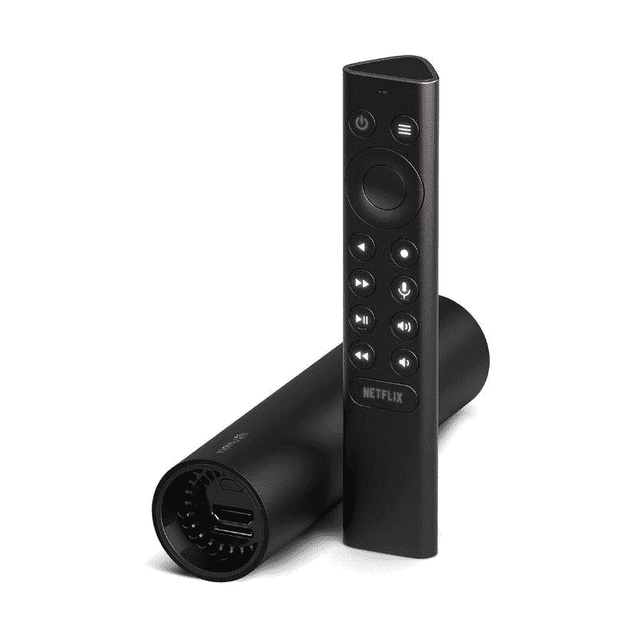
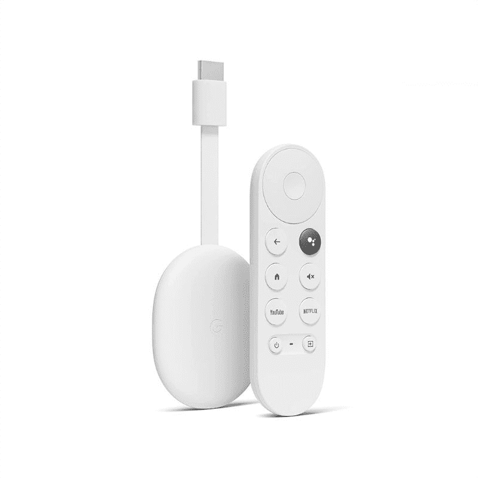
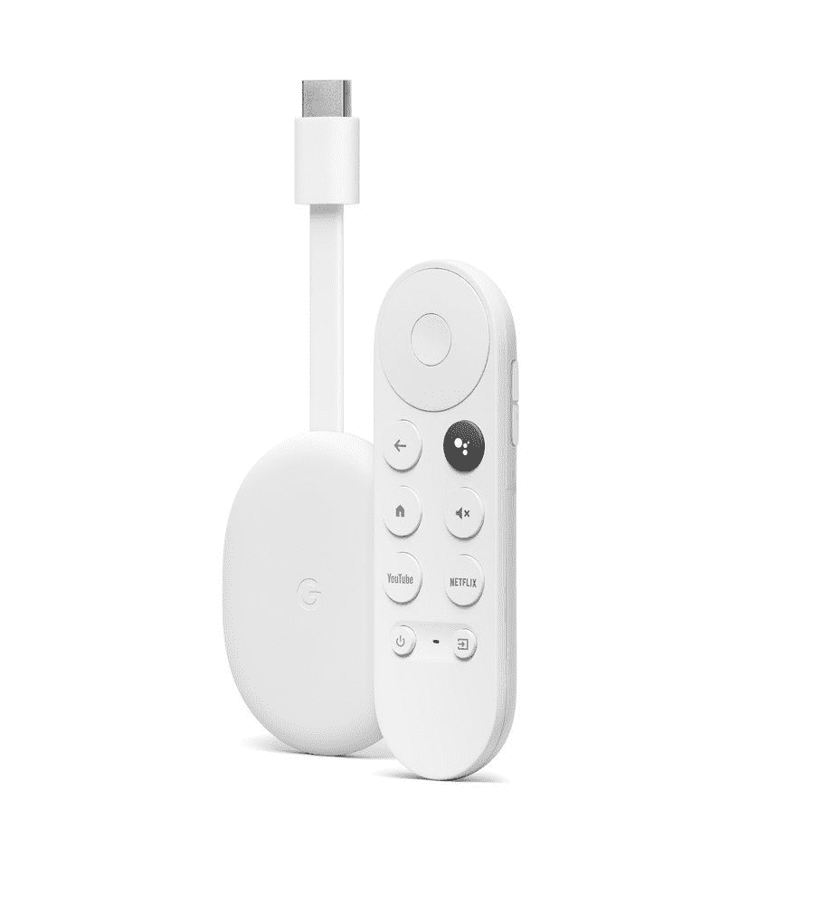
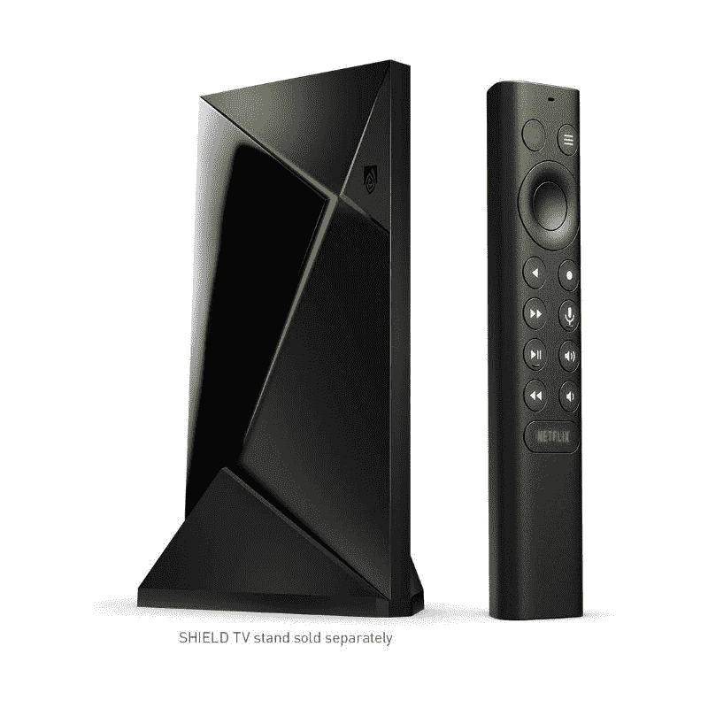
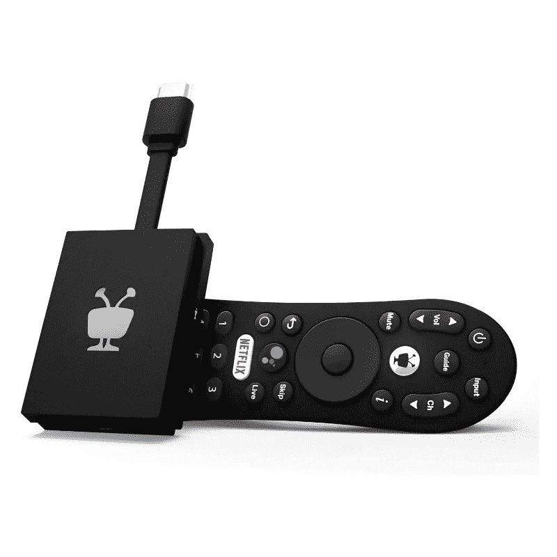
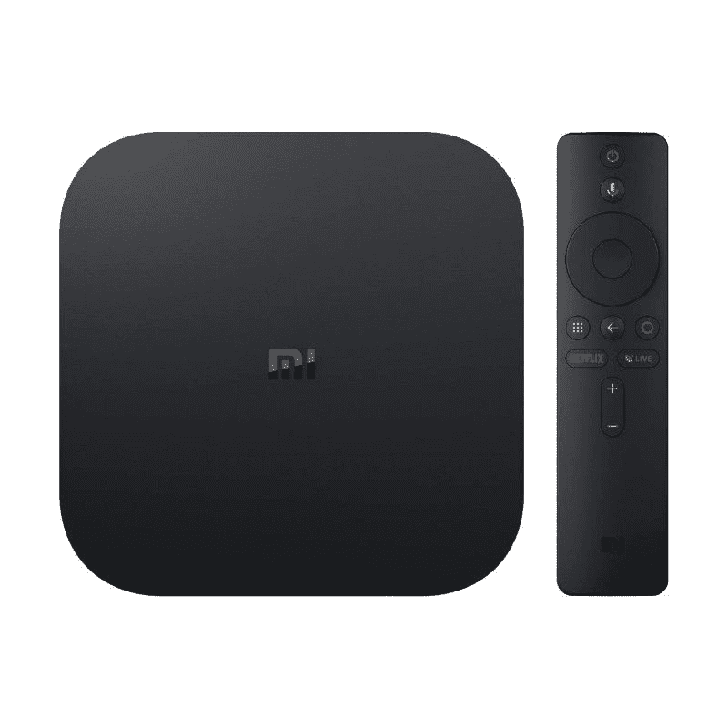

# 2023 年最佳安卓电视盒子和棒

> 原文：<https://www.xda-developers.com/nvidia-tegra-k1-hands-on-at-ces-2014-xda-developer-tv/>

尽管智能电视已经成功进入许多家庭，但仍有许多消费者受困于非智能或“哑”电视。幸运的是，有一种快速简单的方法可以让这些“笨”电视变得智能。你所要做的就是附上一个安卓电视盒子或安卓电视棒，你就能获得在安卓电视平台上运行的电视所拥有的所有功能。市场上并不缺少这些安卓电视盒子，但是我们在这篇文章中为你列出了一些最好的。所以让我们来看看 2022 年你能买到的最好的安卓电视盒子。

我们在这篇文章中添加了安卓电视盒子和安卓电视棒。这两者之间没有真正的区别，除了外形因素和事实上，棍子通常是以预算为导向的，缺乏一些高级功能。

## 最佳整体安卓电视盒子:NVIDIA Shield TV

NVIDIA Shield 电视已经存在了相当长的一段时间。该公司在 2019 年推出了这款特殊的设备，但由于其性能和可靠的功能，它继续保持着领先地位。这款特殊的设备具有令人难以置信的强大规格，使用它可以提供大量令人印象深刻的功能，包括支持 NVIDIA 的 GeForce NOW 云游戏服务。

正如你所看到的，NVIDIA Shield TV 的外形非常紧凑。它比市场上的许多其他安卓电视盒子都要小得多，包括它的兄弟产品 NVIDIA Shield TV Pro。它的管状机身也使它以通用的设计从其他 Android 电视的海洋中脱颖而出。它没有更昂贵的 NVIDIA Shield TV Pro 型号那么多端口，但你仍然可以获得所有的必需品，包括 HDMI 端口、microSD 卡插槽和以太网端口。

在规格方面，NVIDIA Shield TV 采用了该公司自己的 Tegra X1 处理器，配有 256 核 NVIDIA GPU。它配有 2GB 内存和 8GB 存储空间，可通过 microSD 卡进一步扩展。NVIDIA Shield TV 内置语音控制，支持谷歌助手和亚马逊的 Alexa。Shield TV 运行 Android TV，并内置了 Chromecast 4K。

NVIDIA Sheild TV 最棒的一点就是它的遥控器。托布勒龙形状的盾牌遥控器不同于市场上的任何其他遥控器。它不仅可以舒适地握在手中，还提供了许多控制功能。它支持蓝牙和红外控制，还有一个麦克风用于语音控制。Shield 电视遥控器还有背光按钮，便于在夜间或黑暗的房间中使用。当你把它放错地方或者藏在枕头或沙发下面时，还有一个远程定位器可以找到它。

在 2022 年，Shield TV 提供了你所期望的现代流媒体盒子的一切。它还支持 4K HDR 内容、杜比视界和杜比全景声。Shield TV 还使用人工智能升级将高清内容转换为 4K，使其在电视上看起来更好。最重要的是，Shield TV 还支持 GeForce NOW - NVIDIA 云游戏服务，允许你在电视上玩 PC 游戏，而无需花钱购买强大的游戏装备。

尽管已经有几年的历史，NVIDIA Shield TV 仍然会定期更新，以保持新功能的蓬勃发展。NVIDIA Shield 电视目前的价格为 150 美元，我们认为如果你仍然在摇一台没有智能功能的旧电视，这是一个可靠的选择。要求更好选择的高级用户也可以考虑购买 NVIDIA Shield TV Pro，但你必须多付 50 美元。Shield TV Pro 配有传统外观的机身，您可以在以下部分了解更多信息。

 <picture></picture> 

NVIDIA Shield TV

##### 英伟达盾电视

NVIDIA Shield TV 运行在最新版本的 Android TV 上，并内置 Chromecast 支持。

## 备选最佳安卓流媒体设备:Chromecast 4K 和谷歌电视

谷歌的 Chromecast 和谷歌电视很容易脱颖而出，成为市场上最好的流媒体设备之一。它可能不像 NVIDIA Shield TV streaming box 那样功能丰富，但谷歌的 Chromecast 有很多令人喜欢的地方，尤其是它的要价。将 Chromecast 连接到电视并开始使用谷歌电视非常容易。我们认为它是您客厅的绝佳流媒体伴侣。

新 Chromecast 最棒的一点是它的外形。它本质上是一个电视棒，通过 HDMI 端口连接到您的电视。设备本身相当便携，这是我们在这个集合中提到的许多其他流媒体设备不能说的。尽管 Chromecast 大部分时间会隐藏在你的电视后面，但我们感谢谷歌努力让它有三种不同的颜色——雪、日出和天空。你还可以通过新的 Chromecast 获得一个颜色匹配的遥控器，这确实是一个非常好的触摸。

与 NVIDIA Shield TV 相比，遥控器和流媒体设备本身都较小，因此对于那些想要一个更容易在家里携带的小型流媒体设备的人来说，这是完美的。在硬件方面，Chromecast 支持你对 2022 年高质量和现代流媒体设备的一切期望。它提供 4K HDR 流媒体，支持杜比视界和杜比全景声，它是可靠的所有实际流媒体需求。就规格而言，它由 Amlogic S905X3 处理器提供支持，配备 2GB 内存和 8GB 存储空间。它还包括 Wi-Fi 802.11ac (2.4GHz/ 5GHz)连接。

要考虑的最大区别因素是其新的谷歌电视界面。就其带来的功能而言，它与 Android TV 非常相似，但界面要精致得多。谷歌电视从你选择的流媒体服务中提取内容，这意味着你会得到一些很好的推荐，从而轻松找到要看的内容。当谈到直播电视整合时，谷歌电视不是最好的，所以如果你最感兴趣的话，你可能必须看看其他选择。它与谷歌的 YouTube 电视整合得很好，但遗憾的是，其余的电视应用程序没有得到同样的待遇。

装有谷歌电视的新 Chromecast 标价 50 美元，考虑到它带来的一切，这是非常令人印象深刻的。这使得它成为美国最实惠的流媒体设备之一，如果不是最实惠的话。我们很容易向那些寻求简单流媒体设备来满足基本需求的人推荐 Chromecast。它在亚马逊和谷歌的在线商店也经常打折，所以请保持警惕。还有一个更便宜的 Chromecast 版本，它省略了一些功能，以换取相对实惠的价格。然而，我们认为你最好购买新型号的谷歌电视和与之配套的遥控器。

 <picture></picture> 

Chromecast with Google TV

##### 带谷歌电视的谷歌 Chromecast)

配备谷歌电视的新 Chromecast 对于临时用户来说是一款简单且相对实惠的流媒体设备。

## 价格实惠的超值产品:Chromecast HD 和谷歌电视

在推出带有谷歌电视的 Chromecast 4K 两年后，该公司现在在市场上推出了一款名为 Chromecast HD 的新设备。就像之前的版本一样，新的 Chromecast HD 也配备了谷歌电视，这本质上是专为 Chromecast 制作的 Android 电视版本。谷歌电视的体验将在很大程度上保持不变，因为新设备唯一改变的只是输出，真的。

从图片中可以看到，谷歌 Chromecast HD 与谷歌电视非常相似，与已经上市的 Chromecast 4K 非常相似。Chromecast HD 的机身采用了同样的椭圆形设计，可以隐藏在电视后面。这款电脑还有一根短 HDMI 电缆，可以挂在电视背面。它还有一个 USB Type-C 电源端口，类似于 Chromecast 4K 设备。Chromecast HD 的另一个有趣之处是它配有一个遥控器。遥控器也是相同的，这意味着您看到的是相同的大小、按钮布局等等。

Chromecast HD 和 Chromecast 4K 最大的区别之一是输出分辨率。顾名思义，这款新设备支持基本的高清视频。没错，它输出 1920×1080 的视频，非常适合不需要 4K 支持的老式和小型哑电视。Chromecast HD 可以处理 HDR 内容，这是谷歌的一个尝试。

Chromecast HD 与 2020 型号的内部相比也有不同的内部结构。新的有一个 Amlogic S805X2，支持 AV1 解码。与 H264 和 VP9 等编解码器相比，这是一个相当大的进步，我们很高兴看到新的 Chromecast HD 支持它。我们想让你看看我们的 [AV1 解释者帖子](https://www.xda-developers.com/av1/)，其中我们详细介绍了 AV1 是什么以及它对谷歌 Chromecast HD 的重要性。我们强烈建议在拿起 Chromecast HD 之前阅读一下。

2022 年的 Chromecast HD 型号配备了 1.5GB 的内存，而 2020 年的型号配备了 2GB 的内存。不过，您看到的是相同的 8GB 存储，所以没有区别。2022 Chromecast HD 型号的价格为 29.99 美元，比处理更高分辨率视频的型号便宜 20 美元。这使得新的 Chromecast HD 成为这一特定系列中最实惠的选择之一，因此非常适合精打细算的购物者。遗憾的是，你只能得到白色，所以这里没有“天空”和“日出”的颜色选项。

为什么您会想购买 2022 款 Chromecast HD 机型，而不是 2020 款 Chromecast 4K 机型？嗯，高清型号非常适合那些希望通过为他们的 4K 和老式电视配备流媒体设备来使他们的电视变得智能的人。购买支持 4K 的 Chromecast 没有意义，尤其是当你不得不为你不能使用的东西支付更多钱的时候。

 <picture></picture> 

Google Chromecast with Google TV

##### 带谷歌电视的谷歌 Chromecast(高清)

配备谷歌电视(HD)的 Chromecast 是一款更便宜的 Chromecast，只能进行 1080p 播放，但对很多人来说，这就是你需要的全部。

## 超级用户最佳安卓电视:NVIDIA Shield TV Pro

标准的 NVIDIA Shield TV 是我们在市场上可以买到的最佳整体 Android 流媒体设备。它提供了现代流媒体设备的所有基本功能，甚至更多。但是，如果您是一名超级用户，并且想要一台更强大的设备来满足您的日常需求，该怎么办呢？恩，这就是 NVIDIA Shield TV Pro 进入场景的地方。这种特殊的流媒体设备提供了让常规 Shield 电视变得伟大的一切，但它也有一些值得注意的升级。

关于 Shield TV Pro，您首先会注意到的是它更大的外形。就某些附加功能而言，它比普通型号大得多。您可以将其配置为 SmartThings hub，并控制支持的智能家居设备。您还可以获得两个 USB 端口，用于连接外部存储器、键盘等设备。与普通型号相比，专业型号也获得了规格提升。这款电脑配有 3GB 内存，而不是 2GB，你也可以获得 16GB 的存储空间，而不是标准版本的 8GB。

专业型号的规格提升，特别是额外的内存使其成为更好的游戏设备。这一款更适合处理要求更高的 Android 游戏，可能需要超过 2GB 的内存。就像普通的 Shield TV 一样，Pro 型号也支持 NVIDIA 的 GeForce NOW 服务，让您可以播放一些要求最高的 PC 游戏。因此，总体而言，这是一款更强大的设备，应该能够满足高级用户的需求。您还可以将 Pro 型号用作 Plex 服务器，这是另一个很棒的功能。

但是除了明显的规格凸起和外形上的差异，这和普通的 NVIDIA Shield 电视没有太大的区别。这意味着 Pro 型号也配有相同的遥控器，配有传统的按钮布局，具有专用的媒体控制功能。底部还有一个大的网飞按钮，右上角有一个完全可编程的按钮。

NVIDIA Shield TV Pro 上的软件体验与普通型号上的软件体验完全相同。它运行开箱即用的 Android TV 支持的 Android 11，还内置了 Chromecast 4K。还支持谷歌助手和 Alexa，所以你可以选择其中一个作为你的虚拟助手，以帮助你的流媒体需求。

NVIDIA Shield TV Pro 现在可以以 200 美元的价格购买，这意味着它比普通型号贵 50 美元。你确实可以通过这个价格获得很多额外的功能，但这主要取决于个人偏好。你不一定会错过标准型号的任何重要功能，但我们认为，与普通型号相比，高级用户会发现 NVIDIA Shield TV Pro 更有价值。

 <picture></picture> 

NVIDIA Shield TV Pro

##### 英伟达盾电视专业版

NVIDIA Shield TV Pro 比普通型号贵 50 美元，但它带有一些附加功能，为整体包装增加了更多价值。

## 最超值的安卓电视盒子:TiVo Stream 4K

NVIDIA Shield TV 和 Shield TV Pro 都是很棒的流媒体设备，但不可否认的是，它们的价格也很昂贵。毕竟，花 200 美元买一台流媒体设备是一大笔钱。因此，如果你不想花那么多钱给你的普通电视增加一些智能，那么我们建议你去看看 TiVo Stream 4K。你现在可以从亚马逊以低至 36 美元的价格买到这款特殊的流媒体设备，比谷歌新推出的带有谷歌电视的 Chromecast 还要便宜。

不过，不要让 TiVo Stream 4K 傻瓜上的低价标签让你减少对这款设备的考虑。它有一些令人敬畏的功能，使它成为市场上最好的流媒体设备之一。就像本文中提到的其他流媒体设备一样，TiVo Stream 4K 支持与杜比视界和杜比全景声配合使用的 4K HDR 内容。

至于硬件本身，TiVo Stream 4K 类似于谷歌 Chromecast。这是一个小盒子，一端有一个 HDMI 连接，一个用于充电的微型 USB 端口，一个用于连接其他配件和外设的 USB Type-C 端口。它通过 HDMI 连接到您的电视，将它变成一台智能电视。它本质上解锁了你对一系列流媒体应用的访问，比如 YouTube、网飞、Hulu、Amazon Prime 等等。

如果你想知道的话，TiVo Stream 4K 还带有一个遥控器。它的体积比 Chromecast 的大，但也支持更多功能。它采用符合人体工程学的设计，便于日常握持和使用。它配有数字按钮、专用媒体控制、直播电视按钮等。这款特殊的流媒体设备显然有很多令人喜欢的地方，但也存在一些明显的问题。

TiVo Stream 4K 也有自己的用户界面，构建在 Android TV 之上。它本质上是作为一个额外的界面提供的，你可以选择在谷歌的安卓电视上使用。它提供了与标准 Android 电视软件相同的特性和功能，只是它带有不同的视觉光斑。这有点多余，感觉像是在现有 Android 电视体验上的一个不必要的附加，但你确实可以从一些预装的应用程序中提取内容。

在规格方面，TiVo Stream 4K 由 Amlogic S905YE 处理器提供支持，并配有 2GB 的 RAM。您还可以获得 8GB 的存储空间，这与包括 NVIDIA Shield TV 在内的其他选项相同。总的来说，对 TiVo Stream 4K 没有太多抱怨，主要是因为它的要价。使用 TiVo，你的钱花得很值，因为它现在只卖 36 美元。我们还看到这款特别的产品降到了 30 美元，使其成为我们最佳安卓电视盒子列表中最实惠的选择之一。

 <picture></picture> 

TiVo Stream 4K

##### TiVo 流 4K

TiVo Stream 4K 是目前市场上你能找到的最实惠的安卓电视盒子之一。

## 备选最佳安卓电视盒子:小米 Mi Box S

与更实惠的 Mi 电视棒不同，Mi Box S 的占地面积略大，需要在您的桌子或电视支架上有一个专用位置。然而，更大的外形使它能够支持更好的功能。Mi Box S 支持 60fps 的 4K HDR、杜比音频和 DTS 2.0 支持。所有这些都为在您的电视上获得出色的媒体消费体验铺平了道路。

小米盒子 S 最大的好处之一就是你可以获得干净的安卓电视体验。这是它和 TiVo Stream 4K 的最大区别之一，因为后者除了谷歌的 Android TV 之外，还有自己的用户界面。值得注意的是，小米 Mi Box S 还配备了 Chromecast 等常见的额外功能，这是我们对市场上现代流媒体设备的期望。

你还可以用最小设计的 Mi Box S 得到一个相当不错的遥控器。它不像 Chromecast 或 TiVo Stream 4K 那样小巧，也不符合人体工程学，但它配备了正确的按钮，可以帮助你完成任务。可能还值得注意的是，小米不包括其遥控器的 AAA 电池，而其他人则包括。这绝对不是一个交易破坏者，但在作出购买决定之前要考虑的事情。

小米米盒子 S 也不支持开箱直播电视，这点要记住。你必须下载一个额外的应用程序，如 Sling TV，才能使用这个特殊的流盒观看直播电视。考虑到 TiVo Stream 4K 预装了这方面的应用，这有点令人失望。谢天谢地，在 Mi Box 上安装新的应用程序一点也不麻烦，所以这是一种解脱。

然而，小米 Mi Box S 不太好的地方是它的性能。它由小得多的 Mi 电视棒中的同一芯片驱动。您获得了 2GB 的 RAM 和 8GB 的存储空间来满足日常使用，但在性能方面可能会有很多不足之处。缺乏强大的内部功能非常突出，尤其是考虑到新的 Chromecast 和 TiVo Stream 4K 都有更好的内部功能。根据您的使用情况，您可能不会体验到明显的性能差异，但上述流媒体设备可能会击败 Mi Box，让您在放弃之前使用更长时间。

小米盒子 S 目前在美国的售价为 60 美元，这意味着与竞争对手相比，它仍然非常实惠。例如，NVIDIA Shield TV 将花费你高达 150 美元，这对许多用户来说是一个很大的要价。因此，如果你不介意放弃一些功能，满足于一个负担得起的流媒体盒子，那么可以考虑通过点击下面盒子中的链接来查看小米盒子 S。小米盒子 S 在印度被称为[小米盒子 4K](https://www.xda-developers.com/xiaomi-mi-box-4k-android-tv-box-review/) ，你可以阅读我们的评论来了解更多。

 <picture></picture> 

Xiaomi Mi Box S

##### 小米我的箱子 s

小米盒子 S 是你能买到的最划算的安卓流媒体设备之一。它可能不是市场上功能最丰富的选择，但它肯定能完成任务。

* * *

这些是你现在能在美国买到的最好的安卓电视盒子和流媒体棒。NVIDIA Shield TV 无疑是你现在可以买到的最好的 Android 流媒体设备之一，其 Pro 型号更适合高级用户。搭载谷歌电视的 Chromecast 显然是最超值的流媒体设备之一，可以与 TiVo 的 Stream 4K 短兵相接。

这是一个不断发展的列表，所以我们将关注一些新的流媒体设备的市场，看看它们是否可以被添加到这个列表中。那么，你打算购买哪种流媒体设备来让你的“笨”电视变得智能呢？请在评论中告诉我们。