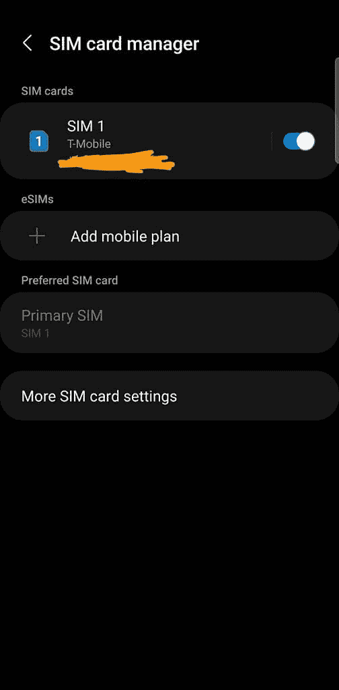

# 三星的 One UI 4 Beta 解锁了美国 Galaxy S21 上的 eSIM 支持

> 原文：<https://www.xda-developers.com/one-ui-4-beta-unlocks-esim-galaxy-s21/>

# 三星的 One UI 4 Beta 解锁了美国 Galaxy S21 上的 eSIM 支持

第一个 UI 4 测试版已经发布，它将在北美的 Galaxy S21、S21+和 S21 Ultra 上解锁 eSIM 支持。

三星最近为 Galaxy S21 系列推出了其 [One UI 4 Beta](https://www.xda-developers.com/one-ui-4-beta-features-overview/) ，看起来 eSIM 也随之加入。

正如用户在 [Reddit](https://www.reddit.com/r/tmobile/comments/po24dy/samsung_oneui_beta_on_the_s21_ultra_adds_esim/) 和 [Max Weinbach 在 Twitter](https://twitter.com/MaxWinebach/status/1437764753682800641) 上发现的那样，One UI 4 Beta 解锁了对美国未锁定 Galaxy S21、S21+和 S21 Ultra 的 eSIM 支持。

 <picture></picture> 

Image credits: /u/topgun966 on Reddit

在大多数手机上，客户需要在运营商的网络上提供物理 SIM 卡。有了 eSIM，您不再需要物理卡。只需向您的运营商提供您设备的唯一标识号，您就可以快速轻松地连接到运营商的网络。由于 Galaxy S21 系列也有一个物理 SIM 卡插槽，解锁 eSIM 意味着手机可以提供给两个不同的网络，一个通过 eSIM，另一个通过物理 SIM。

eSIM 的一大特点是设置时间快。只需为特定网络安装 eSIM 配置文件，并支付一个月的服务费用，就可以快速轻松地测试您所在区域的网络。T-Mobile 甚至通过一个应用程序在 iPhones 上提供 30 天 30GB 免费数据的[试驾](https://www.t-mobile.com/offers/free-trial)计划。

三星之前在 4 月推出了对 T-Mobile Galaxy Note 20 [的 eSIM 支持。当时，它是北美第一款解锁 eSIM 支持的三星设备。](https://www.xda-developers.com/t-mobile-note-20-ultra-adds-esim-support/)

想要在 Galaxy S21 系列设备上使用 eSIM 的客户可以在这里了解更多关于 One UI 4 Beta 计划的信息。One UI 4 的稳定版本计划在年底推出到 Galaxy S21 系列，以防你不想安装测试软件。