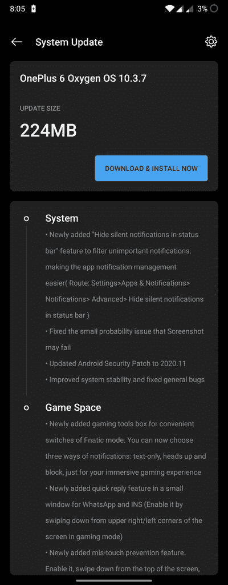

# 下载:OnePlus 6 和 6T 接收 2020 年 11 月补丁和游戏空间功能的更新

> 原文：<https://www.xda-developers.com/oneplus-6-6t-november-2020-patch-game-space-features/>

# 下载:OnePlus 6 和 6T 接收 2020 年 11 月补丁和游戏空间功能的更新

一加为 OnePlus 6 和一加 6T 发布了 OxygenOS 10.3.7。请继续阅读，了解这些版本中的新内容！

几天前，2020 年 11 月的安卓安全补丁更新为一加 7 和 T2 7T T3 系列推出。为了保持这一势头，该公司现在正在本月推出 OnePlus 6 和一加 6T 的安全补丁。和往常一样，我们在下面提供了所有必要的链接，以便于侧装。

**[一加 6 XDA 论坛](https://forum.xda-developers.com/oneplus-6) || [一加 6T XDA 论坛](https://forum.xda-developers.com/oneplus-6t)**

除了 2020 年 9 月的安全补丁之外，OnePlus 6 阵容的先前稳定渠道更新没有增加太多。然而，OxygenOS 10.3.7，即现在推出的更新，带来了一些显著的变化。在更新日志中，一加[强调了](https://forums.oneplus.com/threads/oxygenos-10-3-7-for-the-oneplus-6-and-6t.1342471/)一些修复和功能，包括在游戏模式中新增加的快速回复选项。OEM 还在游戏空间中引入了意外触摸预防功能。

 <picture></picture> 

Thanks to OnePlus Community user [Teja1999](https://forums.oneplus.com/members/teja1999.1736253/) for the screenshot!

以下是更新的完整变更日志:

## 适用于 OnePlus 6/6T 的 OxygenOS 10.3.7

*   **系统**
    *   新增“隐藏状态栏中的静默通知”功能，过滤不重要的通知，使应用程序通知管理更容易(路线:设置>应用程序和通知>通知>高级>隐藏状态栏中的静默通知)
    *   修正了截图可能失败的小概率问题
    *   Android 安全补丁更新至 2020.11
    *   改进了系统稳定性并修复了一般性错误
*   **游戏空间**
    *   新增加的游戏工具箱，方便 Fnatic 模式的切换。您现在可以选择三种通知方式:纯文本、抬头和阻止，只为您带来身临其境的游戏体验
    *   在 WhatsApp 和 INS 的小窗口中新添加的快速回复功能(在游戏模式下，通过从屏幕的右上角/左上角向下滑动来启用它)
    *   新增加的防误触功能。启用它，从屏幕顶部向下滑动，点击，通知栏就会弹出

* * *

## 下载链接

更新是一波一波推出的，所以你必须等待它到达你的设备。如果您现在想下载这个版本，您可以找到下面列出的增量更新和完整 ROM 的下载链接。

*   OnePlus 6 的 OxygenOS 10.3.7
*   适用于一加 6T 的 OxygenOS 10.3.7

* * *

*感谢 XDA 资深会员 [Some_Random_Username](https://forum.xda-developers.com/member.php?u=8234677) 的下载链接！*