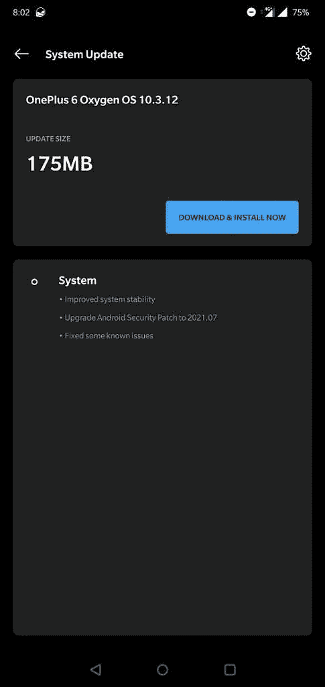

# OxygenOS 10.3.12 为 OnePlus 6 和 6T 带来了 2021 年 7 月的补丁

> 原文：<https://www.xda-developers.com/oneplus-6-6t-oxygenos-10-3-12-july-2021-patches/>

# OnePlus 6 和 6T 在最新更新中收到了 2021 年 7 月的安全补丁

OnePlus 6 系列推出了新的 OxygenOS 更新，带来了更高的系统稳定性和 2021 年 7 月的补丁。

本月早些时候，一加终于为 OnePlus 6 和一加 6T 推出了第一个基于 Android 11 的 OxygenOS 11 公开测试版，允许用户在公开发布前试用新软件。虽然向每个人推出稳定的 Android 11 更新还需要一段时间，但一加正在继续为运行 Android 10 的人改进软件体验。

新的 OxygenOS 更新正在 OnePlus 6 和一加 6T 设备上推出。最新的更新提高了系统的稳定性，修复了已知的错误，并提高了安全补丁级别。这是一个小更新，大小只有 175MB，唯一的亮点是更新了 2021 年 7 月的安全补丁。

OxygenOS 10.3.12 更新变更日志:

*   **系统**
    *   提高系统稳定性
    *   已将 Android 安全补丁升级至 2021.07
    *   修复了一些已知问题

 <picture></picture> 

Screenshot courtesy: *D.Sai Suhail Baba* on the OnePlus Community forums

OxygenOS 10.3.12 已经开始植入 OnePlus 6 和一加 6T 设备。更新将分批推出，因此可能需要一些时间才能到达每个单位。但好消息是，你可以立即在 OnePlus 6/6T 上安装它，而不必等待自动推出。下面我们提供了增量和完整 OTA zips 的直接下载链接，您可以在您的设备上刷新以手动更新您的手机。为此，请从下面下载与您的型号对应的正确 OTA 包，并从恢复中刷新它，或者使用*设置>系统>系统更新下的本地升级选项。*

**[一加 6 XDA 论坛](https://forum.xda-developers.com/c/oneplus-6.7609/) ||| [一加 6T XDA 论坛](https://forum.xda-developers.com/c/oneplus-6t.8257/)**

## 为 OnePlus 6 系列下载 OxygenOS 10.3.12

完整 OTA 拉链的链接还没有上线。我们将更新这篇文章，因为我们可以访问它们，所以请稍后再来查看。

* * *

*感谢 XDA 资深会员 [Some_Random_Username](https://forum.xda-developers.com/m/some_random_username.8234677/) 的下载链接！*