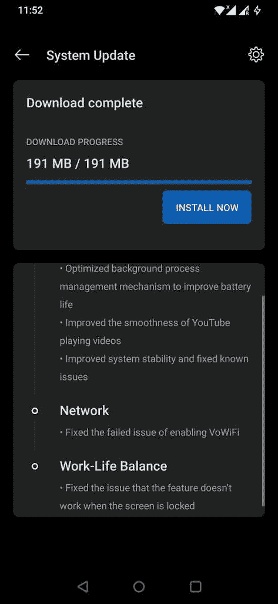

# 一加为 OnePlus 6 和 6T 推出 OxygenOS 11 Open Beta 3

> 原文：<https://www.xda-developers.com/oneplus-6-t-third-oxygenos-open-beta/>

# OnePlus 6 和 6T 接收第三个 OxygenOS 11 beta

OxygenOS 11 Open Beta 3 正在向 OnePlus 6 和 6T 推出，因为一加在正式发布之前继续完善新软件。

上个月，一加为 OnePlus 6 和 OnePlus 6 T 发布了 Android 11 第一个测试版，允许高级用户在稳定版发布前试驾新软件。随后在 7 月底发布了[第二个测试版](https://www.xda-developers.com/oxygenos-open-beta-2-android-11-oneplus-6-6t/)，优化了过热控制管理，增强了 5G 和 Wi-Fi 连接。现在两款手机都获得了新的测试版更新，进一步完善了软件体验。

第三个测试版 OxygenOS 11 beta，正在向 OnePlus 6 和 6T 推出 T1，一加继续修补问题并消除恼人的错误。新的更新承诺提高 YouTube 视频的流畅性，修复了与工作生活平衡功能相关的错误，并优化了后台进程管理以延长电池寿命。

 <picture></picture> 

Screenshot courtesy: OnePlus forum member *ishank_rastogi28*

*   **系统**
    *   优化的后台进程管理机制可延长电池寿命
    *   提高了 YouTube 播放视频的流畅度
    *   提高了系统稳定性并修复了已知问题
*   **网络**
    *   修复了启用 VoWiFi 失败的问题
*   **工作与生活的平衡**
    *   修正了锁定屏幕时该功能不工作的问题

**[OnePlus 6 XDA 论坛](https://forum.xda-developers.com/c/oneplus-6.7609/)|****[一加 6T XDA 论坛](https://forum.xda-developers.com/c/oneplus-6t.8257/)**

OxygenOS 11 Open Beta 3 已经开始向 OnePlus 6 和 6T 设备推出。如果你正在运行第二个测试版，你应该很快就会收到最新的 OTA 版本。一如既往，我们还为以下两款设备提供了增量和完整 OTA zip 包的直接下载链接。如果你来自稳定版本，下载完整的 OTA 如果你使用的是公开测试版 2，请获取增量更新。下载后，将更新包放在内部存储的根目录下。接下来，导航到*设置>系统>系统更新>“本地更新”*，从内存中选择下载的软件包，开始安装过程。

## 下载适用于 OnePlus 6 和 6T 的 OxygenOS 11 公开测试版 3

* * *

*感谢 XDA 资深会员 [Some_Random_Username](https://forum.xda-developers.com/m/some_random_username.8234677/) 的下载链接！*