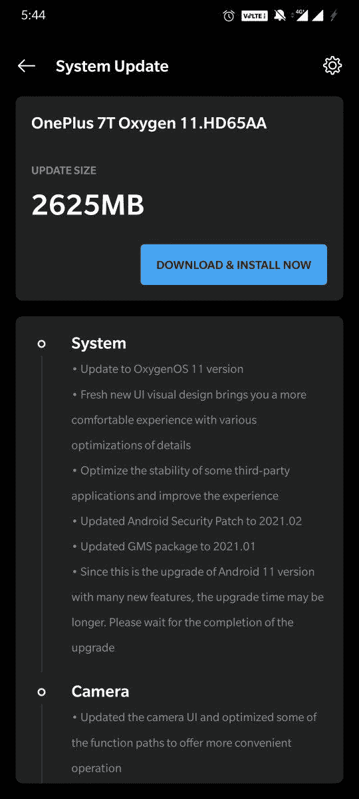

# 一加 7 和 7T 系列获得稳定的 Android 11 和 OxygenOS 11

> 原文：<https://www.xda-developers.com/oneplus-7-7-pro-7t-7t-pro-stable-oxygenos-11-android-11/>

# 下载:一加 7 和一加 7T 系列收到期待已久的稳定的 Android 11 更新与 OxygenOS 11

一加 7/7 Pro 和一加 7T/7T Pro 终于收到了他们基于 Android 11 的稳定的 OxygenOS 11 更新。看看吧！

 <picture></picture> 

Mass Image Compressor Compressed this image. https://sourceforge.net/projects/icompress/ with Quality:95

**更新 1 (03/25/2021 @ 05:25 AM ET):** 为一加 7 系列添加了下载链接。[点击这里了解更多信息。](#update1)文章发表于 2021 年 3 月 22 日，下面保留。

一加最近为一加 7 和一加 7T 系列发布了 Android 11 第四个公开测试版。那个版本主要是修复系统和蓝牙相关的错误。现在，一加已经以分阶段推出的形式为一加 7/7 Pro 和一加 7T/7T Pro 发布了稳定的 OxygenOS 11。

 <picture></picture> 

Thanks to OnePlus Community user [Popkiss1045](https://forums.oneplus.com/members/popkiss1045.2438974/) for the screenshot!

除了期待已久的 Android 版本，Oxygen OS 11 还为这些手机带来了 2021 年 2 月的安全补丁。此外，除了黑暗模式中的可爱新功能，让用户设置自动激活的特定时间范围，更新还引入了 HEVC 视频录制支持。游戏空间应用程序现在提供了快速回复和防止意外触摸的功能。

以下是 7T 系列的完整变更日志:

*   **系统**
    *   OxygenOS 11 版本的更新
    *   全新的 UI 视觉设计，各种细节优化，带给你更舒适的体验
    *   优化部分第三方应用的稳定性，提升体验
    *   将 Android 安全补丁更新至 2021.02
    *   将 GMS 包更新至 2021.01
    *   由于这是 Android 11 版本的升级，有很多新功能，所以升级时间可能会更长。请等待升级完成
*   **摄像机**
    *   更新了相机用户界面，优化了一些功能路径，以提供更方便的操作
    *   新增了 HEVC 编解码器，无缝减少视频存储大小，在不影响质量的情况下捕捉和拍摄更多内容
*   **黑暗模式**
    *   增加了黑暗模式的快捷键，下拉快速设置启用
    *   支持自动开启功能和自定义时间范围(路径:设置-显示-黑暗模式-自动开启-自动启用从日落到日出/自定义时间范围)
*   **游戏空间**
    *   新增加的游戏工具箱，方便 Fnatic 模式的切换。您现在可以选择三种通知方式:纯文本、抬头和阻止，只为您的身临其境的游戏体验
    *   在 Instagram、Whatsapp 和 Telegram 的小窗口中新添加的快速回复功能(在游戏模式下，通过从屏幕的右上角/左上角向下滑动来启用它。
    *   新增加的防误触功能。启用它，从屏幕顶部向下滑动，点击，通知栏就会弹出。
*   **货架**
    *   全新货架界面设计，界面更清晰
    *   增加了天气窗口，动画效果更智能
*   **画廊**
    *   支持故事功能，自动形成每周视频与照片和视频存储。
    *   优化图库的加载屏幕，图像预览更快

变更日志中令人惊讶的是安全补丁级别。考虑到我们已经到了 2021 年 3 月，包括 2 月的安全补丁显然是一个糟糕的选择。

**[一加七大论坛](https://forum.xda-developers.com/c/oneplus-7.8833/)| |[一加七大论坛](https://forum.xda-developers.com/c/oneplus-7-pro.8847/)|**

**[一加 7T 论坛](https://forum.xda-developers.com/c/oneplus-7t.9249/) ||| [一加 7T Pro 论坛](https://forum.xda-developers.com/c/oneplus-7t-pro.9327/)**

* * *

## 下载:适用于一加 7/7 Pro/7T/7T Pro 的 OxygenOS 11

一如既往，基于 Android 11 的 OxygenOS 11 更新目前只面向有限的用户群。一旦一加确认它没有任何重大错误，它应该推出给其余用户。如果您不想等待更新通知弹出，您可以从下面的链接下载更新包并手动安装到您的设备上。然后你可以通过设置>系统更新并从右上方的菜单中选择“本地更新”来下载更新。

**注意:**早期的闪光器报告了构建问题，即相机应用程序无法工作等等。建议用户自行决定是否选择刷新这些版本。

**一加 7**

**一加 7 Pro**

**一加 7T**

**一加 7T Pro**

* * *

*感谢 XDA 资深会员 [Some_Random_Username](https://forum.xda-developers.com/m/some_random_username.8234677/) 的下载链接！*