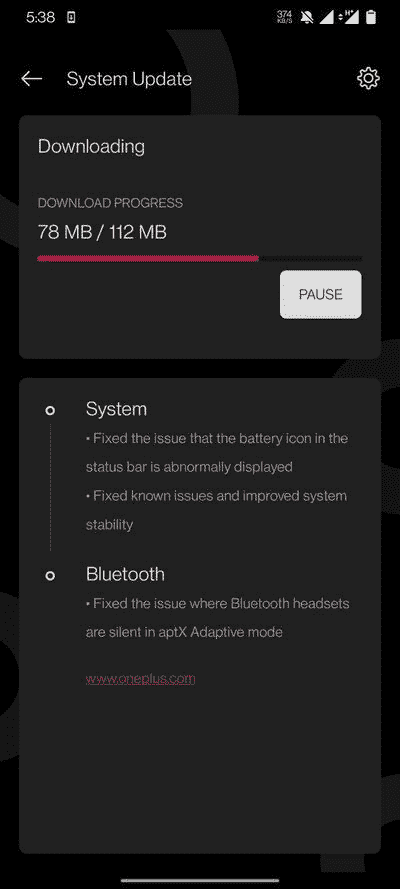

# 基于 Android 11 的 OxygenOS Open Beta 4 向一加 7 和 7T 系列推出

> 原文：<https://www.xda-developers.com/oneplus-7-7t-android-11-oxygenos-open-beta-4/>

# 基于 Android 11 的 OxygenOS Open Beta 4 向一加 7 和 7T 系列推出

Android 11 的第四个 OxygenOS 公开测试版现已发布，适用于一加 7/7 Pro 和一加 7T/7T Pro。继续阅读，了解更多信息！

虽然一加正在为推出[一加 9](https://www.xda-developers.com/oneplus-9/) 系列做准备，但该公司也提醒用户，它没有忘记通过其开放测试程序发布更新的一加 7 和 7T 系列。在我们看到最终稳定的 OxygenOS 11 版本登陆这些设备之前，可能还需要几轮公开测试版，但 OEM 正在朝着这个方向稳步前进，因为基于 Android 11 的第四个 OxygenOS 公开测试版现在可用于一加 7/7 Pro 和一加 7T/7T Pro。

**XDA 论坛:[一加 7](https://forum.xda-developers.com/c/oneplus-7.8833/) | [一加 7 Pro](https://forum.xda-developers.com/c/oneplus-7-pro.8847/) | [一加 7T](https://forum.xda-developers.com/c/oneplus-7t.9249/) | [一加 7T Pro](https://forum.xda-developers.com/c/oneplus-7t-pro.9327/)**

正如预期的那样，Open Beta 4 主要是一个错误修复更新，我们没有看到任何新功能或 UI 变化方面的重大调整。此次更新解决了蓝牙耳机在 aptX 自适应模式下静音的问题，而其余修复则围绕提高整体系统稳定性展开。

一加 7 号和 T2 7 号和 T3 系列的完整更新日志可以在下面找到:

*   **系统**
    *   修正了状态栏中电池图标显示异常的问题
    *   修复了已知问题并提高了系统稳定性
*   **蓝牙**
    *   修复了蓝牙耳机在 aptX 自适应模式下静音的问题

 <picture></picture> 

Thanks to OnePlus Community user [Dipto79](https://forums.oneplus.com/members/dipto79.2715852/) for the screenshot!

请注意，由于 AOD 相关问题，普通的一加 7 没有收到第三个基于 Android 11 的测试版更新[。因此，新版本也将每个](https://forums.oneplus.com/threads/oxygenos-11-open-beta-3-for-the-oneplus-7-and-oneplus-7-pro.1395950/page-69#post-22856550)[开放 Beta 3 特有的变化](https://www.xda-developers.com/oxygenos-11-open-beta-3-oneplus-7-pro-oneplus-7t-pro/)带到了设备上。

## 下载适用于一加 7/7 专业版和一加 7T/7T 专业版的 OxygenOS 11 Open Beta 4

已经在 OxygenOS beta 路径上的用户将收到此更新，如果他们是股票非 rooteded 用户，则作为增量 OTA，如果他们是 root 用户，则作为完整更新。另一方面，不在 beta 路径上的人需要下载并手动刷新 ROM。

**一加 7**

**一加 7 Pro**

**一加 7T**

**一加 7T Pro**

* * *

*感谢 XDA 资深会员 [Some_Random_Username](https://forum.xda-developers.com/m/some_random_username.8234677/) 的下载链接！*