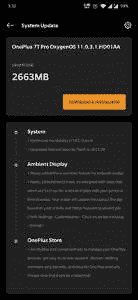

# OxygenOS 11.0.3.1 公司开始向一加 7 系列产品推广

> 原文：<https://www.xda-developers.com/oneplus-7-series-oxygen-update-bitmoji-aod/>

# 最新的一加 7 系列更新带来了 Bitmoji 和 8 月安全补丁

一加 7 系列的 oxygen OS 11.0.3.1 终于带来了 Bitmoji 功能以及 2021 年 8 月的安全补丁。

 <picture></picture> 

Mass Image Compressor Compressed this image. https://sourceforge.net/projects/icompress/ with Quality:95

海量图像压缩器压缩了此图像。https://sourceforge.net/projects/icompress/质量:95

一加正在为一加 7、一加 7 Pro、OnePlu 7T 和一加 7T Pro 推出新的软件更新。最新的更新，oxygen OS 11.0.3.1，终于为一加 7 家族带来了期待已久的 Bitmoji 功能和最新的安全补丁级别。

**[一加 7 XDA 论坛](https://forum.xda-developers.com/c/oneplus-7.8833/) || [一加 7T XDA 论坛](https://forum.xda-developers.com/c/oneplus-7t.9249/)**

新更新中最显著的变化之一是 Bitmoji，它已经在一加 9 和一加 8 系列中可用。更新到 oxygen OS 11.0.3.1 后，一加 7 系车主可以在*设置>定制>环境显示时钟> Bitmoji 下找到 Bitmoji 功能。*新更新还增加了环境显示截图功能，优化了 NFC 稳定性，并将 Android 安全补丁级别提升至 2021 年 8 月。

 <picture></picture> 

Screenshot courtesy: OnePlus forum member [*Rupankar13*](https://forums.oneplus.com/threads/oxygenos-11-0-2-1-for-the-oneplus-7t-pro-and-oneplus-7t.1474555/page-122#post-23612087)

oxygen OS 11.0.3.1 公司为一加 7 系列带来了以下变化:

*   **系统**
    *   优化了 NFC 功能的稳定性
    *   已将 Android 安全补丁升级至 2021.08
*   **环境显示**
    *   新增了环境显示的截图功能
    *   新添加的 Bitmoji 时钟，与 Snapchat 共同设计，将通过您的个人 Bitmoji 头像活跃环境显示。你的头像会根据你的活动和身边发生的事情全天更新(路径:设置-定制-环境显示时钟- Bitmoji)
*   **一加商店**
    *   一种直观便捷的方式来管理您的一加帐户，获得易于访问的支持，发现令人兴奋的会员专属优惠，并购买一加产品。(请注意可以卸载)

OxygenOS 11.0.3.1 公司已经开始推出一加 7 系列。您可以耐心地等待自动 OTA 推出到您的设备上，或者从下面提供的链接下载与您的型号对应的更新包。

**[一加 7 场职业 XDA 论坛](https://forum.xda-developers.com/c/oneplus-7-pro.8847/) || [一加 7T 职业 XDA 论坛](https://forum.xda-developers.com/c/oneplus-7t-pro-regular-mclaren.9327/)**

* * *

## 为一加 7，一加 7 专业版，一加 7T，一加 7T 专业版下载 OxygenOS 11.0.3.1

**一加 7**

**一加 7 Pro**

**一加 7T**

**一加 7T Pro**