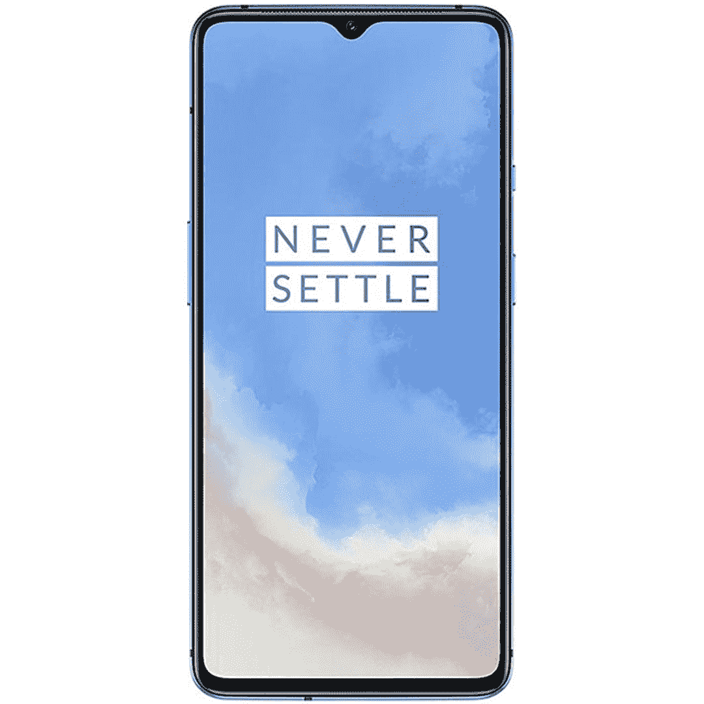

# 12 月 31 日前，以 350 美元的惊人价格购买一加 7T

> 原文：<https://www.xda-developers.com/oneplus-7t-bh-deal/>

今天早些时候，我们向您展示了一款出色的 TCL 10 Pro T1，这是一款值得升级的中端手机。但是，如果你想要*选项*呢？如果您希望能够在正在销售的多款中档手机中进行选择，该怎么办？嗯，今天是你的幸运日，因为中档一加 7T 也在销售，它的价格完全令人难以置信，为 300 美元。事实上，当 XDA [在今年早些时候回顾一加 8](https://www.xda-developers.com/oneplus-8-xda-review/) 时，马里奥·托马斯·塞拉费罗说它还不足以击败 7T。这是对被认为更加“过时”的手机型号的一个重大认可。

所以你可能想知道，这里有什么问题？一加 7T 看起来很便宜，所以价格这么低肯定有原因。良好的...有一个条件，但也不完全是。这个低价是在 B&H 照片和视频，一个以一些伟大的技术交易而闻名的零售商。当然，它们不是亚马逊，但我过去也曾从 B&H 订购过商品，这一直是一种无痛的体验。如果你过去没有向他们订购过，这里就不用担心了！

真正的问题是，虽然这是一部解锁手机，但这个版本的一加 7T 只支持 GSM 网络。这意味着主要运营商，这款智能手机将与美国电话电报公司和 T-Mobile(但不是 Sprint)合作。所以，如果你有威瑞森，这款手机不能保证与你一起工作！

你有两种选择——冰川蓝的“T-Mobile 解锁”7T 和磨砂银的[“工厂解锁”7T](https://www.bhphotovideo.com/c/product/1600545-REG/oneplus_610214661838_7t_t_mobile_smartphone_glacier.html/BI/21019/KBID/17612/SID/UUxdaUeUpU31228) 。从 B & H 所说的来看，它们似乎功能相同，只连接到相同的 GSM 网络。磨砂银交易价格截止到 12 月 31 日，而冰川蓝交易没有到期日，但库存有限。

 <picture></picture> 

Amazon Trade-In

##### 一加 7T

只需 350 美元就能买到一辆一加 7T！有磨砂银和冰川蓝两种颜色可供选择，选择您最喜欢的颜色，在销售一空之前以预算价格购买一部出色的中档手机！