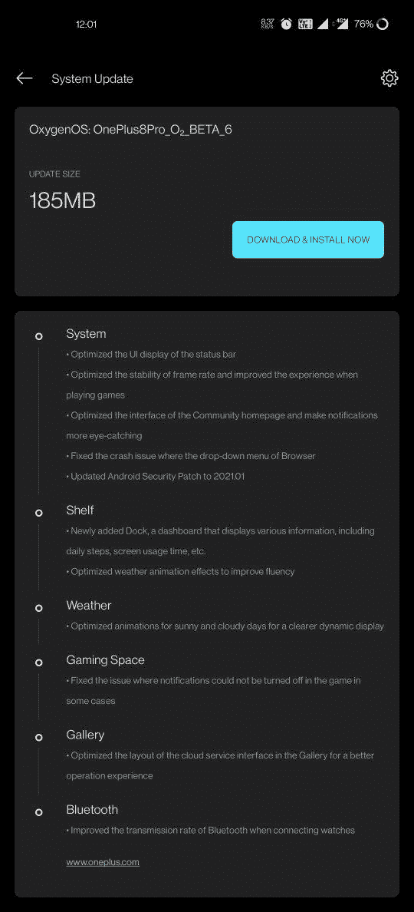

# 一加 8/8 专业版获得 OxygenOS 公开测试版 6，带 2021 年 1 月补丁

> 原文：<https://www.xda-developers.com/oneplus-8-8-pro-oxygenos-open-beta-6/>

# OxygenOS Open Beta 6 为一加 8/8 Pro 推出了新的“Dock”仪表盘、2021 年 1 月补丁等

第六个 OxygenOS 开放测试版已发布，将于 2021 年 1 月为一加 8 和一加 8 专业版提供安全补丁。请继续阅读！

 <picture></picture> 

Mass Image Compressor Compressed this image. https://sourceforge.net/projects/icompress/ with Quality:95

一加已经开始为其 2020 年旗舰智能手机一加 8 和一加 8 Pro 推出 OxygenOS Open Beta 6。手机二人组的最后一个 OxygenOS 公开测试版，[公开测试版 5](https://www.xda-developers.com/oneplus-8-pro-oxygenos-open-beta-5-new-rewind-recording-feature-game-space/) ，在游戏空间引入了“倒带录制”功能和 2020 年 12 月的安全补丁。现在，测试频道的最新版本将“Dock”——一种类似数字健康的仪表板——添加到了[一加货架](https://www.xda-developers.com/oneplus-launcher-4-5-4-adds-swipe-down-gesture-oneplus-shelf/)，并最终带来了【2021 年 1 月的安全补丁。

 <picture></picture> 

Thanks to OnePlus Community member [lkysmruti](https://forums.oneplus.com/members/lkysmruti.3583908/) for the screenshot!

像往常一样，两台设备的变更日志完全相同。除了前面提到的变化，还有一些其他的优化。首先，整个系统的稳定性已经过优化，以获得更好的游戏体验。浏览器应用崩溃问题已被修复，股票图库应用中的云服务接口获得了一层新鲜的油漆。最后，连接手表时蓝牙的传输速率得到了改善，一般的错误据说已经得到了修复。

一加 8 系列的 [OxygenOS Open Beta 6 的完整变更日志可以在下面找到:](https://forums.oneplus.com/threads/oxygenos-open-beta-6-for-the-oneplus-8-and-oneplus-8-pro.1386354/)

*   **系统**
    *   优化了状态栏的用户界面显示
    *   优化了帧率的稳定性，提升了玩游戏时的体验
    *   优化了社区主页的界面，使通知更加醒目
    *   修正了浏览器下拉菜单崩溃的问题
    *   将 Android 安全补丁更新至 2021.01
*   **货架**
    *   新加入的 Dock，一个显示各种信息的仪表盘，包括每天的步数，屏幕使用时间等。
    *   优化天气动画效果以提高流畅度
*   **天气**
    *   针对晴天和阴天优化动画，实现更清晰的动态显示
*   **游戏空间**
    *   修正了在某些情况下游戏中无法关闭通知的问题
*   **画廊**
    *   优化了图库中云服务界面的布局，以获得更好的操作体验
*   **蓝牙**
    *   改进了连接手表时蓝牙的传输速率

**[一加八大论坛](https://forum.xda-developers.com/c/oneplus-8.10349/)| |[一加八大论坛](https://forum.xda-developers.com/c/oneplus-8-pro.10363/)|**

## 下载:一加 8 系列的 OxygenOS Open Beta 6

如果你想从一加 8/8 Pro 的稳定 Android 10 版本升级或者你是 rooted 用户，你可以下载完整的 OTA，或者如果你已经在 Open Beta 5 上并且没有修改软件，你可以下载增量包。无论哪种方式，你都可以将 OTA 复制到手机的内部存储，然后在系统更新应用程序中选择“本地升级”选项。

### 一加 8

### 一加 8 专业版

* * *

*感谢 XDA 资深会员 [Some_Random_Username](https://forum.xda-developers.com/m/some_random_username.8234677/) 提供下载链接！*