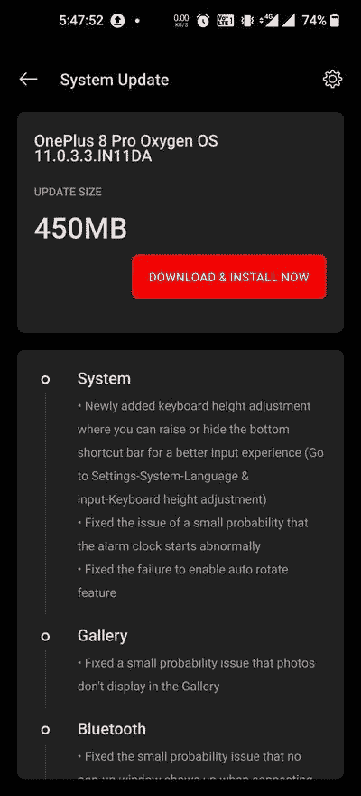

# 带键盘高度调节功能和错误修复的一加 8/8 Pro 接收 oxygen OS 11.0.3.3

> 原文：<https://www.xda-developers.com/oneplus-8-8-pro-receive-oxygenos-11-0-3-3-with-keyboard-height-adjustment-feature-and-bug-fixes/>

# 带键盘高度调节功能和错误修复的一加 8/8 Pro 接收 oxygen OS 11.0.3.3

一加正在向一加 8 系列推出 oxygen OS 11.0.3.3，带来了错误修复和新的键盘高度调节功能。

**更新 1(****01/13/2021****@****06:43am****ET):**下载为欧盟版本添加的链接。滚动到底部了解更多信息。下面保留了 2021 年 1 月 7 日发表的文章。

继最近为一加 8T 推出[OxygenOS 11.0.6.7/8 之后，一加 8 和一加 8 Pro 现在正在稳定频道上接受类似的重大更新。最新稳定的渠道构建——一加 8 系列的 OxygenOS 11.0.3.3——为这些设备带来了一些新功能和改进。其中包括一个方便的键盘高度调节功能，允许你升高或隐藏底部的快捷栏，一个专门针对印度市场的一加商店应用程序，与各种股票应用程序相关的修复，等等。](https://www.xda-developers.com/oneplus-8t-oxygenos-11-0-6-7-keyboard-height-adjustment-november-2020-security-patch/)

**[一加八大论坛](https://forum.xda-developers.com/c/oneplus-8.10349/)| |[一加八大论坛](https://forum.xda-developers.com/c/oneplus-8-pro.10363/)|**

以下是一加 8/8 Pro 版 oxygen OS 11.0.3.3 版的[完整变更日志](https://forums.oneplus.com/threads/oxygenos-11-0-3-3-for-the-oneplus-8-and-oneplus-8-pro.1374182/):

*   **系统**
    *   新增加的键盘高度调整，您可以提高或隐藏底部的快捷栏，以获得更好的输入体验(进入设置-系统-语言和输入-键盘高度调整)
    *   修正了小概率闹钟启动异常的问题
    *   修复了启用自动旋转功能失败的问题
*   **画廊**
    *   修复了照片不显示在图库中的小概率问题
*   **蓝牙**
    *   修正了连接蓝牙耳机时没有弹出窗口出现的小概率问题
*   **网络**
    *   修复了在特定情况下 WiFi 连接失败的问题
*   **一加商店(仅在美国)**
    *   一种直观便捷的方式来管理您的一加帐户，获得易于访问的支持，发现令人兴奋的会员专属优惠，并购买一加产品。(请注意可以卸载)

 <picture></picture> 

Thanks to OnePlus Community Member [Breathout](https://forums.oneplus.com/members/breathout.3102314/) for the screenshot!

## 下载 oxygen OS 11.0.3.3

一如既往，OxygenOS 为当前一代一加智能手机构建的版本是针对不同地区单独编译的。您可以直接从下面的链接下载适合您的设备型号的增量 OTA 文件或完整的 OTA 包。安装时，只需将“系统更新”屏幕中“设置”下的“本地升级”选项指向下载的 ZIP 文件。

### 一加 8

*   印度
*   欧洲
*   全球的
    *   完全 OTA
    *   来自 11.0.2.2 的增量 OTA

### 一加 8 专业版

*   印度
*   欧洲
*   全球的
    *   完全 OTA
    *   来自 11.0.2.2 的增量 OTA

* * *

*感谢 XDA 资深会员 [Some_Random_Username](https://forum.xda-developers.com/m/some_random_username.8234677/) 的下载链接！*