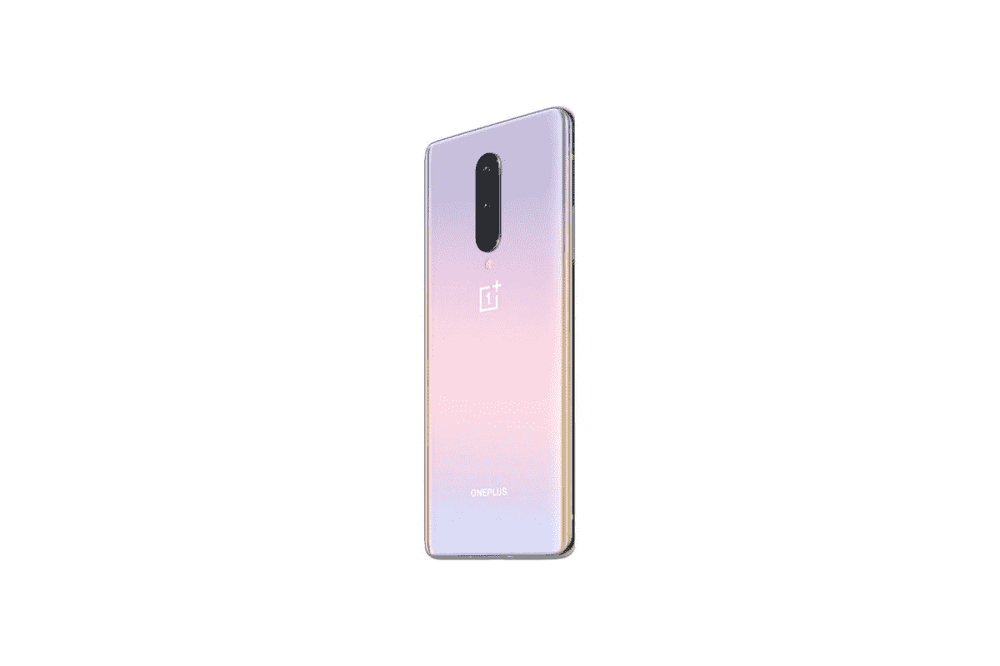

# 今年给某人的袜子里塞满一加 8，100 美元的折扣

> 原文：<https://www.xda-developers.com/oneplus-8-black-friday/>

需要一份很棒的节日礼物吗？为什么不是一加 8？如果你知道你所爱的人需要升级智能手机，那么你不可能比一加的旗舰机更好了。这款智能手机有星际辉光和冰川绿两种颜色，现在你可以在一加商店以 599 美元的价格买到。这个价格比 699 美元的建议零售价低了 100 美元！

为什么选择基数 8？虽然[我们的评论](https://www.xda-developers.com/oneplus-8-xda-review/)指出这款手机可能没有击败一加 7T，但它仍然是一款很棒的手机，如果你是从一款旧手机升级而来，这绝对是一个可靠的选择。谁不喜欢星际辉光的珍珠粉色呢？你也不能抱怨高通骁龙 865，4300 毫安的电池和 4800 万像素的摄像头！

此外，通过一加商店购买一加 8，您可以注册 12 个月的 0%年利率融资。你甚至可以用你的旧手机换更多的钱！它也不一定是一加手机。

这项交易目前只适用于一加商店，所以请确保直接从他们那里拿你的手机！

 <picture></picture> 

OnePlus 8

##### 一加 8

在这个假日购物季，以低廉的价格升级到一加 8。旗舰版在黑色星期五仅售 599 美元。在它没了之前拿一个！

在寻找更强大的东西吗？一加 8 Pro 也在销售中！这是一款比普通 8 更强大的旗舰产品，但当然，它的价格也更高。不过，如果你感兴趣的话，一加 8 Pro 在亚马逊上售价 799 美元。

至于所有这些一加交易，它们在黑色星期五是有效的，所以至少在那之前应该是可用的。但是为什么要等待和应对疯狂的黑色星期五购物高峰呢？今天拿起你的一加 8，下周开始放松。