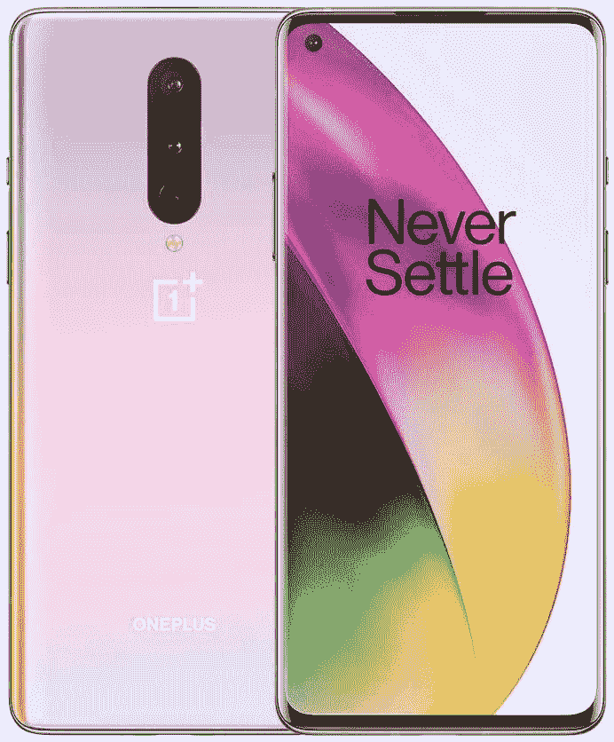

# 抓住威瑞森解锁一加 8 半价了！

> 原文：<https://www.xda-developers.com/oneplus-8-verizon-unlocked-half-off/>

如果你问我，去年推出的一加 8 是一款被低估的智能手机。就功能或性能而言，它没有更受关注的一加 8 Pro 那么强大，但它仍然是一加 7 和一加 7T 的后续产品，拥有更新的旗舰 SoC，高刷新率显示屏，以及可观的内存和存储容量。虽然它可能已经被一加 8T 和一加 9 取代了一段时间，但它仍然是一款相当不错的智能手机，尤其是就其价值而言。它的价格已经低于一加 8 Pro，但现在，你可以以原价的一半购买一台！

一加 8 号配有一个骁龙 865，它是当前旗舰 SoC 骁龙 888 的前身，也是今年为“更便宜”的旗舰智能手机发布的 SoC 骁龙 870 的兄弟。它还配备了高达 256 GB 的存储空间和 12 GB 的内存，4300 毫安的电池和 90 赫兹的显示屏，虽然不太符合一加 8 Pro(以及目前一加的设备)120 赫兹显示屏的规格，但它仍然是 60 赫兹面板的一个显著进步。

一加 8T，它的直接中代后续产品，有几个世代的改进，但一加 8 仍然是最好的，特别是在你目前能找到的价格-399 美元，比原来的 799 美元的价格低 400 美元。

 <picture></picture> 

OnePlus 8 Verizon Unlocked

##### 一加 8

一加 8 在这一点上非常过时，但凭借骁龙 865、8 GB 内存和 128 GB 存储，它仍然非常好用，即使考虑到 2021 年的竞争。

花 399 美元，你可以买到类似摩托罗拉 One 5G Ace 的产品，其内部规格性能较差。虽然它最初是一个威瑞森模型，但它是完全解锁的，这意味着你可以在上面插任何你想插的 SIM 卡。然而，它没有 SIM 卡或手机套餐。它完全兼容威瑞森的 5G UW 网络，并且可以升级到 Android 11。在你还能做的时候，一定要抓住[这笔交易](https://www.bhphotovideo.com/c/product/1615543-REG/oneplus_5011101036_8_5g_uw_smartphone.html/BI/21019/KBID/17612/SID/UUxdaUeUpU3145)！