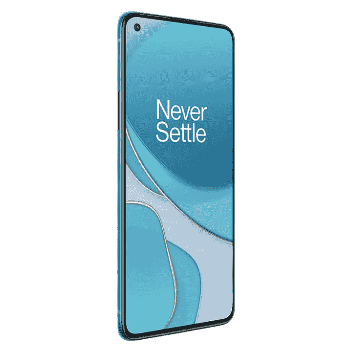
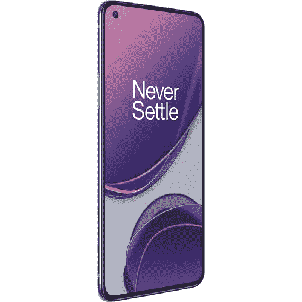

# 就在今天，只需 629 美元，就能买到一加 8T 和一加 Buds！

> 原文：<https://www.xda-developers.com/oneplus-8t-bh-photo-deal/>

你在为一加日争取 1 美元的一加花蕾时遇到麻烦了吗？我明白，我不认为一加希望有这么多人想利用这笔交易，该网站有问题！但是，一加并不是唯一一家给产品大幅折扣的零售商。一加黑色星期五的价格已经开始在互联网上出现，但是今天，另一个突出的交易来自 B & H Photo and Video。他们的[交易区交易](https://www.bhphotovideo.com/c/product/1597465-REG/oneplus_5011101276_8t_dual_sim_256gb_5g.html/BI/21019/KBID/17612/SID/UUxdaUeUpU30681)之一是 629 美元的一加 8T，他们还免费赠送一对一加巴德。

当然，交易区的交易通常只能持续一天，这次也不例外。有海蓝宝石绿和月球银两种颜色，售价比建议零售价低 120 美元。但是折扣随着额外的好处变得更好。

最大的项目当然是免费的一对一加花蕾。我强烈推荐他们。不是因为我自己有一加耳塞，而是因为我的第三方耳塞偶尔会与我的一加 8 Pro 在正确连接方面出现问题。所以，你还不如留在一加的生态系统里！它们也是非常好的耳塞，所以你不会因为带着它们而妥协。

其他免费的好东西包括超移动的 SIM 卡套件，以及获得运营商免费一个月无限制通话、文本和数据折扣的机会。不过，你不必担心，因为这仍然是一部未锁定的手机，它被宣传为可以与任何运营商合作。因此，如果你已经有一个电话计划，你不需要去与超移动！

不确定一加 8T 是否适合你？看看[我们的评论](https://www.xda-developers.com/oneplus-8t-review/)！这是 XDA 推荐的 2020 年手机之一！

 <picture></picture> 

OnePlus 8T

##### 一加 8T 在 B&H

B&H 照片和视频的交易区交易一加 8T 仅售 629 美元！你还会得到一对免费的一加花蕾。

你错过了 B&H 的照片交易吗？虽然价格是 749 美元，但你仍然可以在一加的商店买到免费的一加 8T。

 <picture></picture> 

OnePlus 8T

##### 一加 8T

如果你错过了 B&H 的照片交易，你也可以在一加自己得到一加 8T 的免费一加芽。然而，你要支付 749 美元。

感谢叶楚伟的提示！