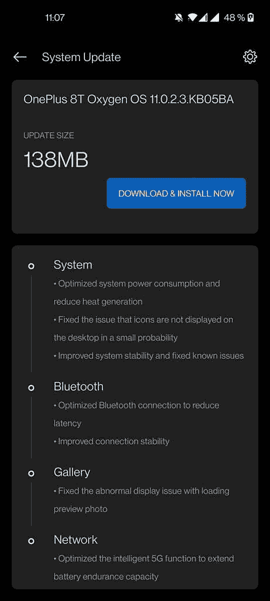

# oxygen OS 11.0.2.3 一加 8T 更新包括 5G 优化

> 原文：<https://www.xda-developers.com/oneplus-8t-oxygenos-11-0-2-3-update-optimizes-5g-power-consumption/>

# oxygen OS 11.0.2.3 一加 8T 更新优化了 5G、功耗等

一加发布了一加 8T 的更新，主要集中在优化系统，以获得更流畅的体验。

一加为一加 8T 发布了新的 OxygenOS 稳定更新，专注于优化系统、蓝牙和网络，以获得更好的体验。其中一个大的变化是 OxygenOS 的“智能 5G 功能”的优化，changelog 称该功能应该可以延长 8T 的电池寿命。

就整体系统性能而言，为一加 8T 发布 oxygen OS 11.0.2.3 有望改善功耗并减少热量产生。此次更新还提高了系统稳定性，并修复了图标不显示在主屏幕上的问题。

 <picture></picture> 

Credits: XDA Recognized Developer [OldDroid](https://forum.xda-developers.com/member.php?u=4960686)

此外，oxygen OS 11.0.2.3 还对蓝牙性能进行了一些更改，包括提高了连接稳定性，并修复了加载预览照片时图库出现的一些异常显示问题。更新中似乎没有任何主要的新功能，但它应该会为一加 8T 车主提供更好的体验。

**[一加 8T 论坛](https://forum.xda-developers.com/oneplus-8t)**

一加今年非常忙，发布了几款新设备，并继续发布其设备的重要更新。最近，该公司[为其一加 8 系列推出了](https://www.xda-developers.com/oneplus-8-series-oxygenos-11-open-beta-3-canvas-aod/) OxygenOS 11 Open Beta 3，其中包括 Canvas AOD，并将 Android 安全补丁级别提升至 2020 年 10 月。

## oxygen OS 11.0.2.3 变更日志和下载

**变更日志**

*   系统
    *   优化系统功耗，减少热量产生
    *   修正了图标小概率不显示在桌面上的问题
    *   提高了系统稳定性并修复了已知问题
*   蓝牙
    *   优化蓝牙连接以减少延迟
    *   提高连接稳定性
*   走廊
    *   修正了预览图片显示不正常的问题
*   网络
    *   优化了智能 5G 功能，以扩展电池和续航能力

**下载量**

*感谢 XDA 资深会员 [Some_Random_Username](https://forum.xda-developers.com/member.php?u=8234677) 提供下载链接！*