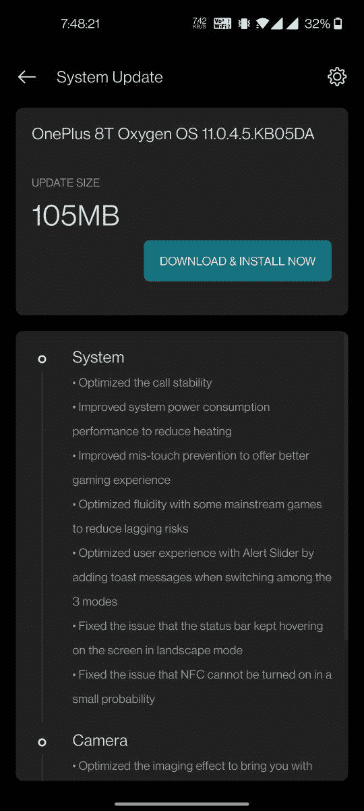

# 11.0.4.5 一加 8T 接收 OxygenOS，修复了通话稳定性、NFC 等问题

> 原文：<https://www.xda-developers.com/oneplus-8t-oxygenos-11-0-4-5-update/>

# 11.0.4.5 一加 8T 接收 OxygenOS，修复了通话稳定性、NFC 等问题

一加为一加 8T 推出了另一个 OxygenOS 稳定更新，并修复了几个错误。前往下载链接！

**更新 1(****2020 年 11 月 16 日** **@** **上午 03:35****ET):**为一加 8T 在欧洲的更新增加了下载链接。滚动到底部了解更多信息。下面保留了 2020 年 11 月 13 日发表的文章。

大约一个月前推出了一加 8T，到目前为止，该公司在保持更新方面做得不错。随着 OxygenOS 11 的多次[更新，到目前为止，](https://www.xda-developers.com/oneplus-8t-oxygenos-11-0-2-3-update-optimizes-5g-power-consumption/)[已经添加了许多修复](https://www.xda-developers.com/download-oneplus-8t-oxygenos-11-build-improvements-power-consumption-camera/)。事实上，该手机刚刚收到了一个小的修补程序更新，将 OxygenOS 版本升级到 11.0.4.5。

**[一加 8T XDA 论坛](https://forum.xda-developers.com/oneplus-8t)**

**[一加 8T 回顾:有道理的 T 升级](https://www.xda-developers.com/oneplus-8t-review/)**

一加提到，此次更新旨在解决 NFC 相关问题，同时提高通话稳定性。你可以阅读下面的整个变更日志，它看起来与上一个稳定版本非常相似(除了那两个修复)。不幸的是，新版本没有增加设备的安全补丁级别，因此一加 8T 仍然保留在 2020 年 10 月的安全补丁上。

*   **系统**
    *   优化了通话稳定性
    *   提高系统功耗性能，减少发热
    *   改进的防误触功能提供更好的游戏体验
    *   优化了一些主流游戏的流动性，以减少滞后风险
    *   通过在 3 种模式之间切换时添加 toast 消息，优化了警报滑块的用户体验
    *   修正了在横向模式下状态栏一直停留在屏幕上的问题
    *   修正了 NFC 在小概率下无法开启的问题
*   **摄像机**
    *   优化了成像效果，带给您更好的拍摄体验
    *   改进的相机稳定性
*   **网络**
    *   优化移动网络连接，提高网络信号强度
    *   修正了玩游戏时网络中断的小概率问题

 <picture></picture> 

Thanks to OnePlus Community user [ShreyasPatil_](https://forums.oneplus.com/members/shreyaspatil_.891364/) for the screenshot!

如果你使用的是 OxygenOS 的最新公开版本，那么你的更新空间只有 105MB。请注意，OTA 目前只针对一加 8T 的印度版本发布，但该公司已经[确认](https://forums.oneplus.com/threads/oxygenos-11-0-4-5-for-the-oneplus-8t.1342473/)欧洲和北美车型将很快推出。

* * *

## 下载:一加 8T 的 oxygen OS 11.0.4.5

更新是一波一波推出的，所以你必须等待它到达你的设备。如果您现在想下载这个版本，您可以找到下面列出的增量更新和完整 ROM 的下载链接。一旦我们得到这篇文章，我们将会更新它的链接。

*   印度
*   欧洲

* * *

*感谢 XDA 资深会员 [Some_Random_Username](https://forum.xda-developers.com/member.php?u=8234677) 的下载链接！*