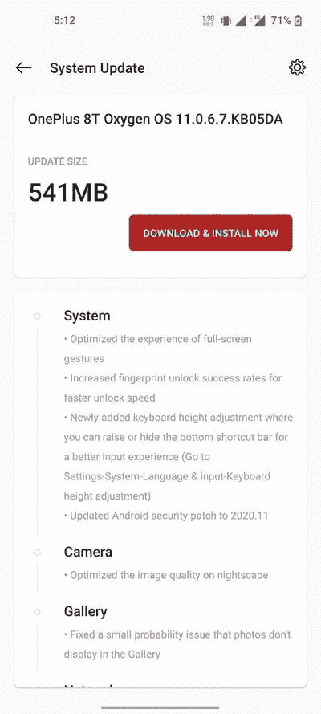

# 11.0.6.7/8/9 一加 8T 获得 OxygenOS，具有新的键盘高度调节功能、2020 年 11 月安全补丁等

> 原文：<https://www.xda-developers.com/oneplus-8t-oxygenos-11-0-6-7-keyboard-height-adjustment-november-2020-security-patch/>

# 11.0.6.7/8/9 一加 8T 获得 OxygenOS，具有新的键盘高度调节功能、2020 年 11 月安全补丁等

通过稳定渠道，一加发布了一加 8T 的 OxygenOS 11.0.6.7。请继续阅读，了解这个版本的新特性！

**更新 1 (01/06/2021 @ 02:23 PM ET):** 一加[正在推出](https://forums.oneplus.com/threads/oxygenos-11-0-6-7-and-11-0-6-8-for-the-oneplus-8t.1369293/page-81#post-22601528)一个新版本，修复用户在使用 oxygen OS 11.0.6.7 时遇到的错误。印度版本的下载链接已经添加，我们将在收到更多 OTA 链接时更新这篇文章。这篇发表于 2021 年 1 月 6 日的文章被保存在下面。

OxygenOS 是驱动一加智能手机的定制皮肤，显然是最整洁、功能最丰富的 Android 之一。UI 不仅快速流畅，而且还提供了广泛的可定制性。最重要的是，一加不断更新新功能，优化早期功能。作为不断发展的一部分，该公司已经通过稳定渠道为一加 8T 推出了新的 OxygenOS 更新，简化了许多元素，以改善用户体验。

**[一加 8T XDA 论坛](https://forum.xda-developers.com/c/oneplus-8t.11579/)**

根据最近在一加论坛上的一篇[帖子，OxygenOS 11.0.6.7/11.0.6.8/](https://forums.oneplus.com/threads/oxygenos-11-0-6-7-for-the-oneplus-8t.1369293/)[11.0.6.9](https://forums.oneplus.com/threads/oxygenos-11-0-6-8-in-na-and-11-0-6-9-eu-for-the-oneplus-8t.1373581/)现可用于一加 8T 的每一个地区版本。此次更新的亮点之一是增加了新的键盘高度调整功能，允许您升高(或隐藏)底部的快捷栏。除此之外，该版本还改善了 nightscape 的图像质量，这是一个专门针对印度模型的一加商店应用程序，以及 2020 年 11 月的 [Android 安全补丁和其他小优化。](https://www.xda-developers.com/november-2020-android-security-update-google-pixel-samsung-galaxy/)

 <picture></picture> 

Thanks to OnePlus Community user [MoshiurBD](https://forums.oneplus.com/members/moshiurbd.1905125/) for the screenshot!

以下是新更新的完整变更日志:

## 一加 8T 系列的 11.0.6.7/11.0.6.8/11.0.6.9 OxygenOS

*   **系统**
    *   优化了全屏手势的体验
    *   提高指纹解锁成功率，加快解锁速度
    *   新增加的键盘高度调整，您可以提高或隐藏底部的快捷栏，以获得更好的输入体验(进入设置-系统-语言和输入-键盘高度调整)
    *   修复了媒体播放器可能会异常暂停的问题
    *   Android 安全补丁更新至 2020.11
*   **摄像机**
    *   优化了夜景的图像质量
*   **画廊**
    *   修复了照片不显示在图库中的小概率问题
*   **网络**
    *   修复了在特定情况下 WiFi 连接失败的问题
    *   提高了通信的稳定性
*   **一加商店(仅限于店内)**
    *   一种直观便捷的方式来管理您的一加帐户，获得易于访问的支持，发现令人兴奋的会员专属优惠，并购买一加产品。(请注意可以卸载)

* * *

## 下载链接

更新已经开始在波播种，所以你将不得不等待它到达你的设备。如果您现在想下载这个版本，您可以找到下面列出的增量更新和完整 ROM 的下载链接。

*   OxygenOS 11.0.6.8(印度/全球)一加 8T
*   OxygenOS 11.0.6.9 公司(欧洲)生产一加 8T

* * *

*感谢 XDA 资深会员 [Some_Random_Username](https://forum.xda-developers.com/m/some_random_username.8234677/) 的下载链接！*