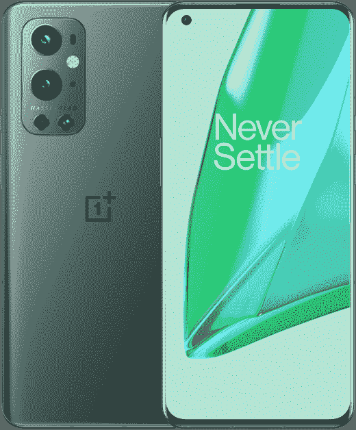
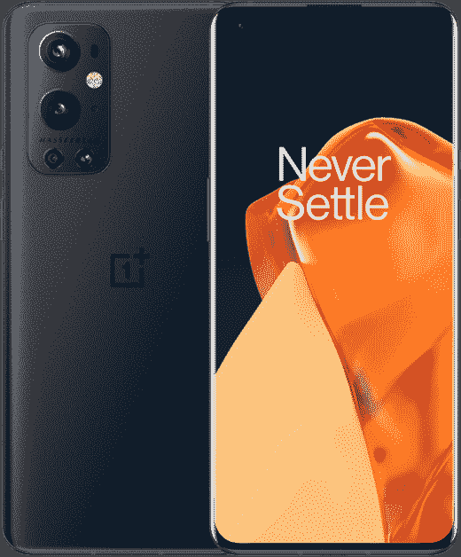
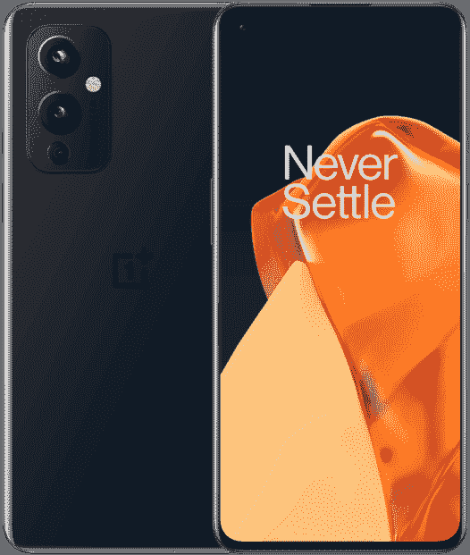
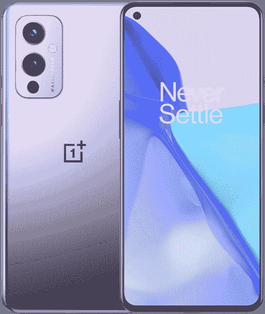
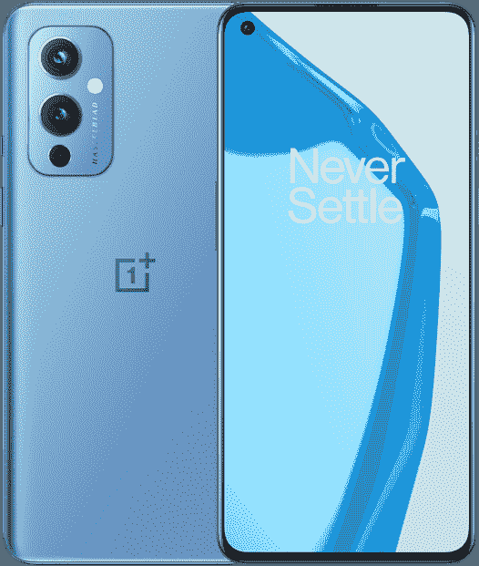
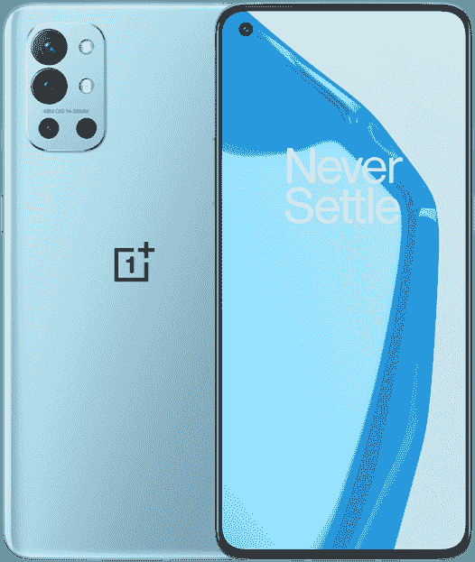
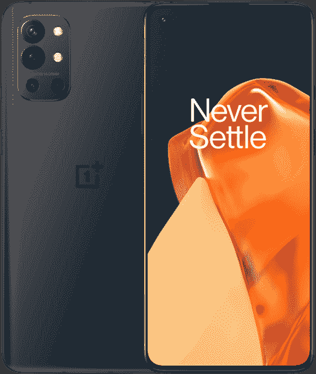

# 一加 9 系列有什么颜色？

> 原文：<https://www.xda-developers.com/oneplus-9-colors/>

# 一加 9 系列有什么颜色？

了解一加 9、一加 9 专业版和一加 9R 的所有颜色选项。他们有很多，所以知道你的选择！

一加 9 系列终于来了，有比以往更多的型号和颜色可供选择。有三种不同的型号:一加 9 专业版、一加 9 和印度独有的一加 9R。一加 9 和一加 9 Pro 都有三种颜色可供选择，尽管不是每个国家都有每种颜色。

在这里，我们将介绍一加 9 系列的每种颜色。对于我们对手机的完整想法，请查看我们专门的[一加 9 Pro 评测](https://www.xda-developers.com/oneplus-9-pro-review/)，以及我们的[一加 9 系列相机评测](https://www.xda-developers.com/oneplus-9-camera-review/)。

## 一加 9 专业颜色

最贵的一加 9 Pro 有三种颜色可供选择:晨雾色、松绿色和恒星黑。以下是每种颜色的详细信息，以及可用性信息。令人恼火的是，在一加 9 Pro 上市的每个市场，并不是每种颜色都有。

 <picture></picture> 

Morning Mist

##### 一加 9

晨雾比通常的黑色和深灰色智能手机颜色更突出，具有轻微的反光效果，但没有其他颜色选项那么响亮。它在所有地区都有售。

 <picture></picture> 

Pint Green

##### 一加 9 专业版

松木绿是“冰川绿”一加 8 Pro 的一个值得继承的颜色，尽管它比那种风格暗一点。它在所有地区都有售。

 <picture></picture> 

Stellar Black

##### 一加 9

Stellar Black 是对 OnePlus One 的回调，采用磨砂哑光玻璃表面，感觉与其他款式不同。不幸的是，它在美国和其他一些地区还不可用，至少目前是这样。

## 一加 9 色

令人困惑的是，普通的一加 9 有三种完全不同的颜色出售:冬雾色、星空黑和北极天空。我们在下面列出了每种颜色的细节。

 <picture></picture> 

OnePlus 9

##### 一加 9

Astral Black 采用了哑光薄膜和光滑玻璃的组合，因此尽管它一眼看上去像一部普通的黑色手机，但近距离看它有更独特的设计。Astral Black 在所有地区都有销售。

 <picture></picture> 

Winter Mist

##### 一加 9

冬季薄雾根据照射到它的光的多少来改变其紫色的强度。看到更多的紫色手机总是很好，谢天谢地，这种颜色在所有地区都有。

 <picture></picture> 

Arctic Sky

##### 一加 9

北极的天空是天蓝色的。它还具有哑光表面，因此从各个角度看都一样。北极天空颜色不在美国和其他一些国家销售。

## 一加 9R 颜色

一加 9 系列的最后一款手机是 9R，只在印度销售。与其他两种型号不同，只有两种颜色可供选择。

 <picture></picture> 

Lake Blue

##### 一加 9

湖蓝是...听起来很像。不过，它更像水蓝色而不是蓝色。

 <picture></picture> 

Carbon Black

##### 一加 9

如果你想要一个纯黑色的手机，这是你的颜色选择。它类似于恒星黑色一加 9 专业版。