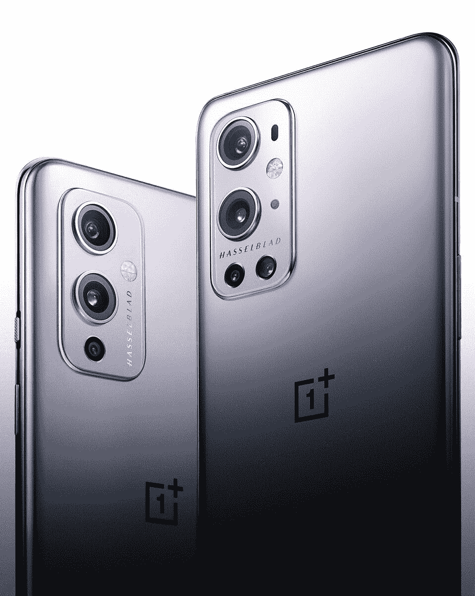
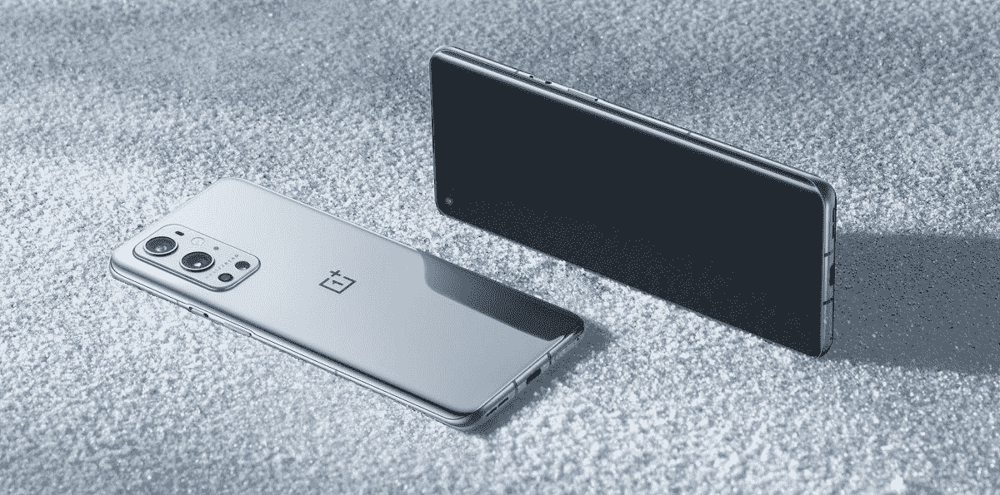

# 一加手表和一加 9 系列发布会:你期待什么？

> 原文：<https://www.xda-developers.com/oneplus-9-series-watch-launch-discussion/>

一加 9 系列将于下周在该公司 2021 年的首次智能手机发布会上发布。一加很早就建立了声誉，创造了高性能的智能手机，在 OxygenOS 上提供了干净和几乎没有膨胀的体验。除了一加 9 和 9 Pro，该公司还将在即将到来的活动中推出其首款智能手表。发布前的许多泄露和官方预告已经塑造了我们对一加 9 系列的期望，尽管相比之下，关于[一加手表](https://www.xda-developers.com/oneplus-watch-launch-oneplus-9-series/)的公开信息要少得多。根据对这些设备的了解，您对它们有什么看法？

该系列中的头条新闻一加 9 Pro 表明，一加正在向前迈出又一大步，以巩固其在其他优质智能手机品牌中的地位。该公司在与哈苏的合作关系上下了很大的赌注，以提高相机性能，这是一加手机过去经常受到评论者批评的一个方面。另一方面，普通的一加 9 应该更符合该公司制造价格合理的智能手机的传统，这种智能手机不依赖于性能。

 <picture></picture> 

OnePlus 9 Series

一加 9 Pro 将率先推出 65W 有线和 50W 无线快速充电功能，QHD+ 120Hz [自适应刷新率显示器](https://www.xda-developers.com/oneplus-9-pro-adaptive-refresh-rate-1-120hz/)，高达 12GB 的内存，以及一个定制的索尼 IMX789 摄像头。一加 9 将采用与去年智能手机类似的摄像头设置，但预计也将增加 65W 有线和较慢的无线充电，全高清+ 120Hz AMOLED 显示屏，以及高达 8GB 的内存。高通旗舰产品[骁龙 888](https://www.xda-developers.com/qualcomm-snapdragon-888-explained-specs-features/) SoC 为两款智能手机提供动力。

 <picture></picture> 

OnePlus 9 Pro. Credits: OnePlus

在今年早些时候推出[一加手环](https://www.xda-developers.com/oneplus-band-review/)后，该品牌正寻求通过圆形表盘智能手表在可穿戴市场占据更大份额。这款智能手表被证实运行的是 T2 专有的操作系统 T3，而不是谷歌的 Wear OS。我们可以期待它与 [Realme Watch S Pro](https://www.xda-developers.com/realme-watch-s-pro-review/) 有一些相似之处，后者也运行在 RTOS(实时操作系统)上。虽然一加只谈到了界面和“无负担设计”，但最近的一则消息[透露，这款手表具有 IP68 等级，快速充电，监测心率、睡眠、压力和 SpO2，并能控制](https://www.xda-developers.com/oneplus-watch-leaked-specifications/)[一加电视](https://www.xda-developers.com/oneplus-tv-review/)。

*一加观看渲染。学分:@ [拆线](https://twitter.com/UnboxTherapy/status/1372881459892084736)*

一加首席执行官 Pete Lau 也证实，一款相对更实惠的智能手机——一加 9R — [将进军印度。这可能是与传闻中的 9E 或 9 Lite 相同的手机，预计将采用类似于](https://www.xda-developers.com/oneplus-9r-gaming-flagship-india/)[一加 8T](https://www.xda-developers.com/oneplus-8t-review/) 的硬件。虽然没有关于这款智能手机的官方细节，但这款手机很可能会配备[骁龙 870](https://www.xda-developers.com/qualcomm-unveils-snapdragon-870/) 芯片组，而不是骁龙 888。

根据这些信息，你对下周发布的智能手机和智能手表有什么看法？请在下面的评论中告诉我们。