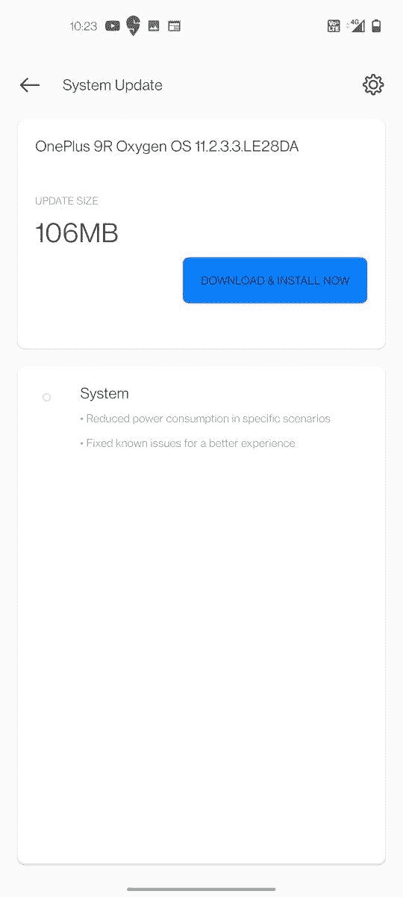

# oxygen OS 11.2.3.3 修补程序更新推出，以解决一加 9R 电池的困境

> 原文：<https://www.xda-developers.com/oneplus-9r-oxygenos-11-2-3-3-hotfix/>

# oxygen OS 11.2.3.3 修补程序更新推出，以解决一加 9R 电池的困境

一加已经开始为一加 9R 推出新的 OxygenOS 修复程序，以解决异常的电池消耗问题。继续阅读，了解更多信息！

在[发布了](https://www.xda-developers.com/oxygenos-11-2-6-6-oneplus-9-pro/)一款为[一加 9](https://www.xda-developers.com/oneplus-9/) 和 9 Pro 打造的全新 OxygenOS 稳定渠道后不久，一加又回来了，带来了产品线中最便宜手机的新更新:一加 9R。一加 9R 的最后一次 OxygenOS 更新是在五月底，[带来了](https://www.xda-developers.com/oneplus-9r-may-2021-patches-update/)几个修复和【2021 年 5 月的安全补丁。嗯，新版本并不那么有趣，因为它更像是一个修复程序，解决了以前版本中发现的一些问题。

 <picture></picture> 

Thanks to OnePlus Community user [Rahul G S](https://forums.oneplus.com/members/rahul-g-s.3048759/) for the screenshot!

根据最近在一加社区论坛上的一篇帖子,原始设备制造商现在已经开始以 11.2.3.3 OxygenOS 的形式为一加 9R 推出新的稳定渠道构建。此更新包括对导致以前版本以异常方式消耗电池电量的问题的修复。除此之外，新版本在功能上几乎是一样的。

oxygen OS 11.2.3.3 版的变更日志如下:

*   **系统**
    *   在特定场景下降低功耗
    *   修复已知问题以获得更好的体验

由于这是一个热修复版本，那些运行 2021 年 5 月版本的人应该很快就会收到空中下载(OTA)更新。如果您不想等待，您可以从下面的下载部分下载 OTA 包，并立即安装在您的一加 9R 上。

**[一加 9R XDA 论坛](https://forum.xda-developers.com/f/oneplus-9r.12183/)**

 <picture></picture> 

OnePlus 9R

##### 一加 9R

一加 9R 标志着一加回归平价旗舰领域。这款手机是去年一加 8T 的翻版，设计略有更新，采用了新的骁龙 870 芯片。

* * *

## 为一加 9R 下载 oxygen OS 11.2.3.3

如果你在 oxygen OS 11.2.1.2 上并且没有修改设备，下载增量包。如果你运行的是一个旧的稳定版本或者是根设备，选择完整的 OTA 包。尽管手动刷新不应该触及数据分区，但是在执行更新之前备份数据总是更好的。

**印度:**