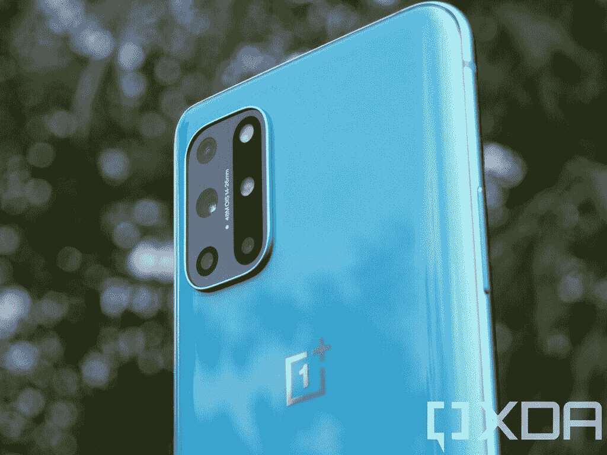
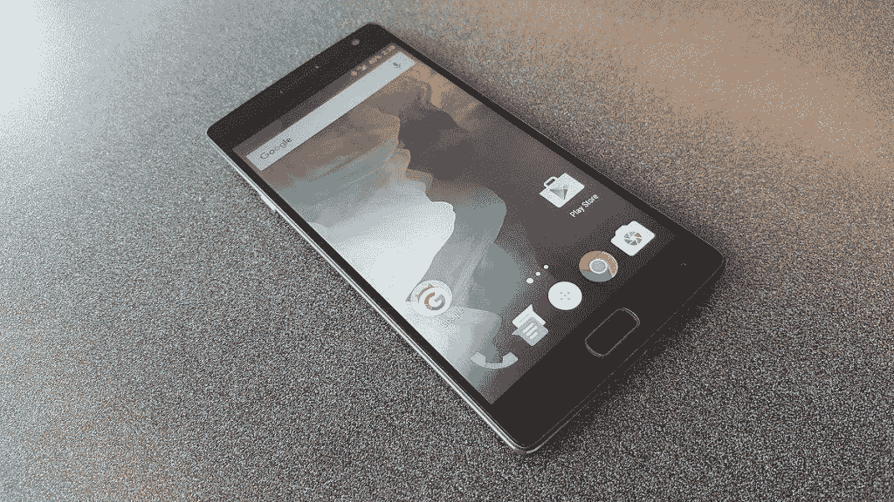
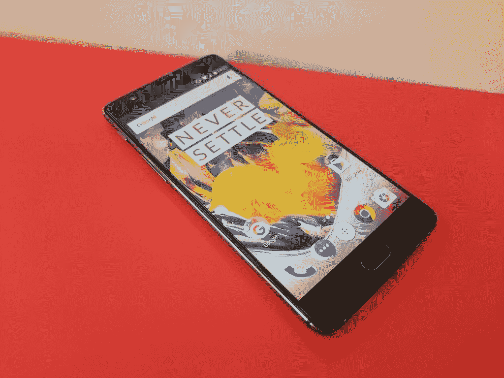
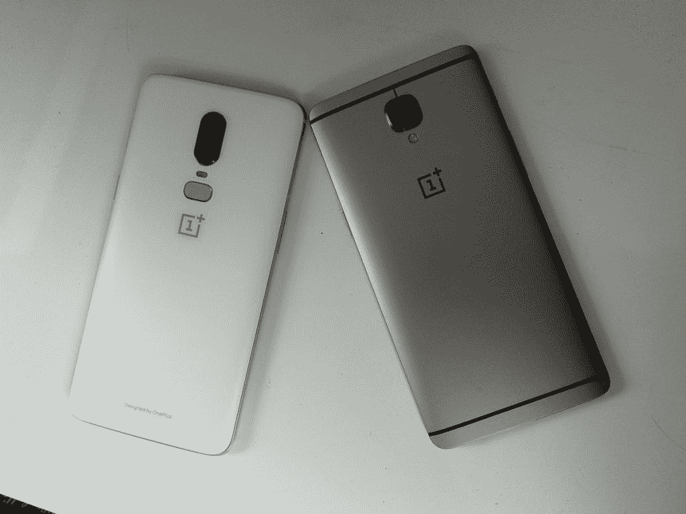

# 为什么我对一加有更高的要求

> 原文：<https://www.xda-developers.com/oneplus-enthusiast-brand-shortcomings/>

一加可能是科技爱好者领域最有影响力的智能手机制造商之一，最近几个月，它以这样或那样的方式出现在每个人的脑海中。由于一加坚持不懈的媒体闪电战，Nord 在互联网上掀起了风暴，我开始意识到为什么我有时会觉得自己对这家公司过于挑剔。我用自己的钱购买了 OnePlus 3 和 OnePlus 6，我记得当时我不得不重温我写的作品，以稍微恢复我自己的意志。在某些方面，我很苛刻——有时过于苛刻——在谈到其他设备制造商时，我不会这么做。

一加自己的起源故事与 XDA 历史息息相关，OnePlus One 搭载 Cyanogen OS，这是现已不存在的 CyanogenMod T3 的商业化版本。在几乎所有方面，OnePlus One 都是发烧友的设备。我记得当时我试图得到一个邀请，尽管我失败了，不得不满足于当时的 [Nexus 5](https://forum.xda-developers.com/google-nexus-5) 。当时“永不满足”这句话的讽刺意味并没有让我忘记，因为实际上要得到我想要的设备是极其困难的。OnePlus One 当然有自己的妥协，但考虑到所提供的价值，它们很容易被忽略。当然，一加随后会继续从事一系列颇有问题的广告活动。随着没有 NFC 功能的 OnePlus 2 的推出，事情变得更加糟糕。

即使在这整个磨难，一加仍然是一个爱好者的最爱。Bootloader 解锁，如果手机坏了可以修复手机的软件镜像，以及在 OnePlus One 的情况下，有两个操作系统可供选择——这些都足以让人们着迷。当他们与 Cyanogen 的交易失败后，一加开始开发[后来被称为 OxygenOS](https://www.xda-developers.com/everything-oxygenos-what-we-know-what-to-expect/) 的东西，你可以选择任何一种 Android 版本在你的设备上运行。XDA 论坛的用户终于可以由一家公司直接提供服务了，这在 Nexus 系列设备之前是从未有过的。即便如此，Nexus 智能手机主要面向开发者，而一加则试图同时迎合开发者和发烧友。

一加有着漫长而动荡的历史，从你我这样的狂热分子的角度来看，这使它处于一个相当独特的位置。

 <picture></picture> 

The OnePlus 8T is OnePlus' latest and greatest smartphone.

## OnePlus 2 和 OnePlus X 在很大程度上阻碍了公司的发展

 <picture></picture> 

The OnePlus 2

继 OnePlus One 的成功之后，OnePlus 2 也获得了巨大的成功。然而，它没能坚持着陆。理论上，它是在没有 NFC 的情况下到达的，这极大地激怒了发烧友社区的成员。然而，当它到来时，事情变得越来越糟。一加称这款设备为“2016 年旗舰杀手”，尽管它是在 2015 年推出的，而且它的价格比上一代产品略高。它还配备了现在臭名昭著的 Snapdragon 810，尽管它被公认为是一款没有那么火的改版产品。OxygenOS 确实有一些很酷的功能，但它没有用户想要的功能。当最终用户发现，尽管承诺两年的更新，但“2016 年旗舰杀手”不会获得 2016 年安卓版本——安卓牛轧糖时，这场戏剧终于达到了高潮。该公司违背了最初的销售承诺，对于喜欢更新智能手机的发烧友来说，这是一个严重的错误。

在 OnePlus 2 发布后，该公司再次推出了另一款智能手机——一加 x。它采用骁龙 801，旨在成为一款负担得起的中端手机。然而，对该设备的支持很快就下降了，这再次证明了他们不愿意支持他们的设备。这不是一个好的外观，爱好者开始变得更加恼火，因为他们觉得被骗了。大约在这个时候，该公司开始了设备播种计划，该计划将向开发者免费提供设备。

## 拯救一加:一加 3

 <picture></picture> 

The OnePlus 3

OnePlus 3 可以说是该公司的第一款严肃手机，在 OnePlus 2 令人难以置信的管理不善之后，它又回到了绘图板。他们需要推出一款能够与最好的智能手机竞争的智能手机，打着“旗舰杀手”的旗号，全程吸引袖手旁观的发烧友群体。它推出了 OxygenOS 3，20W 有线充电，称为“Dash Charge”，以及 NFC。所有这三件事足以吸引爱好者社区回来，更重要的是，没有邀请系统。这是该公司推出的第一款我买得起的智能手机，我一直在等待 Nexus 5，直到我再也拿不下它。

OnePlus 3 标志着该公司的新轨迹。有保证的更新、直接对开发社区做出的承诺以及发送给定制 ROM 开发者的设备有助于修补烧毁的桥梁。其中一个承诺是发布相机 blobs，这样开发者就可以在定制的 rom 上使用 OxygenOS 相机及其处理能力。虽然没有明确发布，但一加设计的相机系统允许开发人员开发相机应用程序、相机处理库，并将其移植到定制的 rom 中。对 OnePlus 3 唯一的主要批评之一是它的摄像头，尽管一年后谷歌摄像头 mod [的发布使其受欢迎程度飙升，因为它在很大程度上解决了这个问题。OnePlus 3 甚至有三个重大更新，被许多人视为试图弥补 OnePlus 2 的失望。](https://www.xda-developers.com/google-camera-hdr-ported/)

## OxygenOS 可以有更多

因为公司自己的 OxygenOS 是在没有商业化定制 ROM 的情况下创建的，我记得对 OxygenOS 寄予厚望。我知道我也不是唯一的一个——我记得在/r/Android 上看到过关于一加如何成为开发者和爱好者更便宜、更好的 Nexus 系列的讨论。在定制 rom 社区的巨大影响下，我认为许多人都有接近库存 Android 的操作系统的愿景，但在当时，他们认为他们会得到的肯定不是他们实际得到的。OxygenOS 花了很长时间才做好，而且缺乏被发烧友认为至关重要的功能。

在 OnePlus 2 的情况下，完全缺乏定制功能，来自 OnePlus One 的用户感觉被骗了。Cyanogen OS 功能丰富，OxygenOS 刚刚起步。饱受电池问题和应用崩溃困扰(脸书是一个特别糟糕的罪犯)，定制 ROM 社区挽救了许多拥有这种设备的人。我的一个朋友直到最近仍然有他自己的 OnePlus 2，他告诉我 OxygenOS 基本上无法使用。随着时间的推移，它慢慢地改善了，尽管 OnePlus 5 上的 OxygenOS 被发现存在基准作弊——在 XDA 被我们发现。一加曾经依赖的一个热心支持者社区发现了自己的疏忽。

随着 OxygenOS 多年来的改进，它甚至花了很长时间才获得基本的功能。该公司最近才在 OxygenOS 11 中添加了一个基本的黑暗模式开关，以及一个永远在线的显示器。这些功能在竞争对手的手机上已经存在多年了。爱好者喜欢功能，而一加几乎没有提供这些功能。OxygenOS 是一个臃肿的操作系统，并不是你可能认为我在说的那种方式。现在有来自脸书和网飞的预装应用程序，但你看不到它的膨胀。

 <picture></picture> 

The OnePlus 6 and the OnePlus 3 - two smartphones I purchased myself from OnePlus.

引擎盖下是最大的问题所在。多年来，一加众多智能手机的通知系统已经失灵。这在 OnePlus 3、 [OnePlus 6](https://forum.xda-developers.com/oneplus-6) 、[一加 7](https://forum.xda-developers.com/oneplus-7) 系列上是个问题，今天在[一加 8](https://forum.xda-developers.com/oneplus-8) 系列和[一加诺德](https://forum.xda-developers.com/oneplus-nord)上仍然是个问题。我女朋友的[一加 7 Pro](https://forum.xda-developers.com/oneplus-7-pro) 甚至错过了闹钟，我自己的[一加 8 Pro](https://forum.xda-developers.com/oneplus-8-pro) 经常错过消息和邮件，我的一加诺德错过了 WhatsApp 的消息和邮件。这些问题也不仅限于我的联系人——[DontKillMyApp](https://dontkillmyapp.com/)将 Oneplus 列为所有**原始设备制造商中最严重的应用查杀者。华为，小米，OPPO？一加比这三个国家都差，但这三个国家的名声最差。不知何故，一加经常不为人知。在我所有的一加设备上，应用程序总是被杀死，其程度是我从未见过的。**

随着 2020 年品牌身份的更新，该公司推出了 [OxygenOS 11](https://www.xda-developers.com/oxygenos-11-beta-oneplus-8-pro-android-11-update-hands-on/) ，这是 OxygenOS 有史以来最大的风格变化之一。许多人把它称为一个界面相似的东西，我真的有点看出来了。它非常强调将你与之互动的内容移到手机的下半部分，这样更容易单手使用。许多人对此有异议，因为他们认为这背离了 OxygenOS 以其“库存 Android”而闻名的外观，即使我认为它从来都不是真正的库存 Android。OxygenOS 10 不仅在引擎盖下，而且在视觉上也有很多变化。

**[一加如何设计 OxygenOS 11 让更大的手机更好用](https://www.xda-developers.com/interview-oneplus-oxygenos-11-one-handed-use-dont-kill-my-app-more/)**

但是，不能否认 OxygenOS 11 和 OxygenOS 10 是一个世界。我个人非常喜欢它，但这又是另一个令发烧友不太喜欢的决定。宣布这一更新的评论帖子充满了批评，许多人质疑一加方向的改变。不仅仅是公司的硬件、定价和开发人员社区发生了变化，就连他们的软件也发生了巨大的变化，许多人都在寻找其他品牌来解决他们的问题。

## 一加会是什么样子

听着，一加，我明白，发烧友市场不是最赚钱的。发烧友希望所有东西都像 OnePlus 一样尽可能便宜。他们想要价格合理、负担得起的技术。他们不想要在价格上与三星 Galaxy S20 匹敌的智能手机，但所有这些都是你慢慢变成的。虽然我认为一加 8 Pro 与类似价格的其他旗舰产品相比非常物有所值，但贵公司已经远离了它的起源。我爱我的一加 8 Pro，我希望我能评论它，因为它是我今年最喜欢的手机之一。我知道我有时很苛刻，一加 8 Pro 可能是迄今为止对你的设备最热情的评价。我在一加 7T Pro 上遇到的许多软件问题都得到了解决，但遗憾的是，它仍然不够完美。“永不妥协”现在感觉就像任何其他基本的公司口号，而不是一个优秀的声明，被吹捧为优于其他品牌的标志。

一加北部是一个很好的例子，它让人感觉像是在利用“永不定居”的口号。这家公司诞生于对发烧友的奉献，然而€400 对一款中档智能手机来说是一个很高的要求。我可以在欧洲亚马逊上买到从€400 到€439 的任何地方的 POCO F2 Pro T1，它远远超过了 Nord。没有 90Hz 的显示屏，但它的其他一切都要优越得多。 [Realme X50](https://forum.xda-developers.com/realme-x50-5g) 甚至提供了同样的骁龙 765G 和 120Hz IPS 显示屏，价格大约低 70 英镑。Nord 甚至在进入市场之前就感觉到了市场的削弱，然而似乎仅仅依靠炒作和品牌认知度就生存了下来。一加一直是炒作的对象，但北欧的感觉不止于此。感觉完全背离了一加曾经的主张。

我通常可以原谅价格的上涨，因为该公司每次迭代都会提供更多产品，一加 8 Pro 在很多方面都感觉非常接近完美的智能手机。它提供了近乎完美的智能手机体验，而价格却始终低于最高端的智能手机，对我来说，这仍然很像一加。该公司一开始就利用发烧友社区来帮助建立自己的地位，但现在它所做的很多事情都感觉像是忽视了同一个社区。一加已经开始自立门户，似乎不再觉得有必要在功能方面与竞争对手展开激烈竞争。它仅靠品牌认知度生存，而品牌认知度包括公众对 OxygenOS 的看法，即 oxygen OS 是一种无膨胀、干净、接近库存的体验，但事实并非如此。

此外，最近有消息称，联合创始人卡尔·裴(Carl Pei)辞去了公司职务，并雄心勃勃地创办了一家新的硬件公司。该公司的另一位联合创始人皮特·刘(Pete Lau)仍在公司，担任首席执行官。然而，他最近[担任了一个额外的角色](https://www.xda-developers.com/oneplus-ceo-pete-lau-joins-oplus-senior-vp/)，担任 OPLUS 的高级副总裁兼首席产品体验官，OPLUS 是一家投资公司，负责监管一加、OPPO，可能还有其他公司。为什么 Carl Pei 在一次重大产品发布会后这么快就离开了公司？谁能说呢？然而，在这个时候离开公司，有很多人想知道裴离开的原因。还有传言称，一加也将在美国推出[两款新的平价 Nord 智能手机](https://www.xda-developers.com/oneplus-nord-n10-5g-us-release-price/)，所以很明显一加一直很忙。

一加的品牌身份发生了彻底的转变，我认为裴的离开就是证据。OxygenOS 已经进行了彻底的重新设计，整个一加也在大力推广他们的 Nord 品牌。随着[智能手表的出现](https://www.xda-developers.com/oneplus-watch-smartwatch-rumor/)，很明显一加不再是过去那个由狂热爱好者打造的小公司了。他们已经做了一台电视，他们在音频方面投入巨资，现在他们也在中端和预算领域进行尝试。随着一加用越来越多的产品稀释其产品组合，它将彻底改变其品牌身份。

我对一加特别苛刻，因为它仍然感觉像是发烧友品牌，但随着每一个新版本的发布，它感觉越来越偏离只是另一个原始设备制造商。