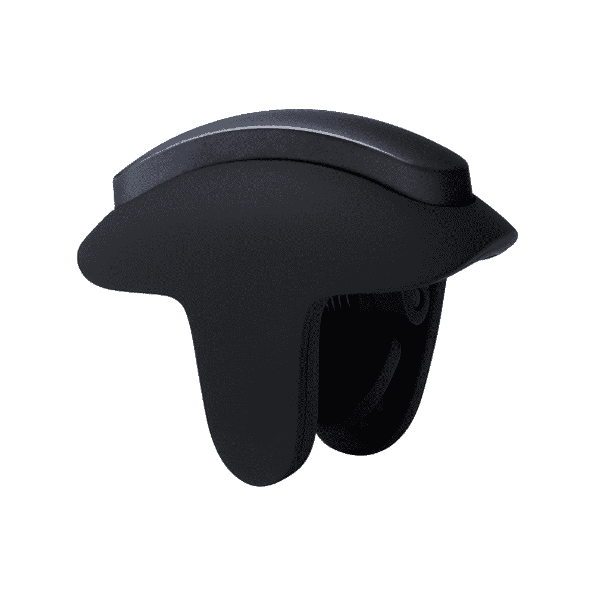

# 一加游戏触发器旨在增强您的游戏体验

> 原文：<https://www.xda-developers.com/oneplus-gaming-triggers-are-here/>

# 一加推出了游戏触发器，以增强您的智能手机的游戏体验

一加推出了一款名为“一加游戏触发器”的新肩部触发器配件，旨在提高你在游戏中的表现。

虽然可以使用手机显示屏玩《使命召唤:手机》等第一人称射击游戏和《自由之火》和《PUBG》等皇家战役游戏，但在触摸屏上实际使用物理按钮而不是虚拟按钮有很多好处。在游戏中，它们可以让你反应更快，移动更容易，整体来说做事更快更有效率。但是如果我不想去任何地方都带着一个控制器呢？一加认为他们有解决办法:新的一加游戏触发器在这里。

这些触发器背后的想法并不新鲜，也绝对不新奇。水平玩游戏时，触发器安装在手机顶部，按下时会触摸显示屏的特定部分，您可以将游戏中的按钮移动到触发器所在的位置，使用触发器按压它们，增强您的游戏体验。例如，如果我想在《使命召唤:移动》中将左扳机设置为瞄准，右扳机设置为射击，这是我可以做到的。这是一个古老的想法，实际上已经有很长一段时间了，虽然它可能看起来很初级，但它是一个非常有效的解决方案，它们实际上与游戏手机上的许多专用肩部按钮具有相同的功能。

一加不断迎合越来越多的游戏玩家，正如最近推出的一加 9R 所示。虽然你可以在你的一加 9R 和任何其他一加手机上使用这些触发器，但这些触发器实际上与大多数运行 iOS 和 Android 的智能手机兼容。对₹1,099 来说，它们是任何智能手机(不管是不是 OnePlus)的廉价而漂亮的附件，可以提高你在射击游戏和电子竞技游戏中的性能和反应时间，由于它使用电容传导，它不需要蓝牙或任何其他类型的额外硬件:你只需要一部带触摸屏的手机。

 <picture></picture> 

OnePlus Gaming Triggers

##### 一加博彩触发器

一加游戏触发器是一个简单的附加组件，用于增强您的移动游戏性能。专为配合你的一加 9R 或几乎任何 Android 或 iOS 设备使用而设计。