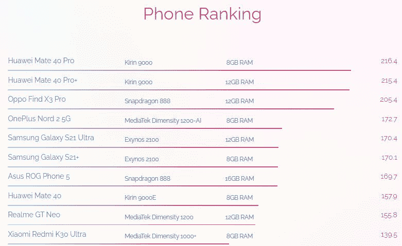
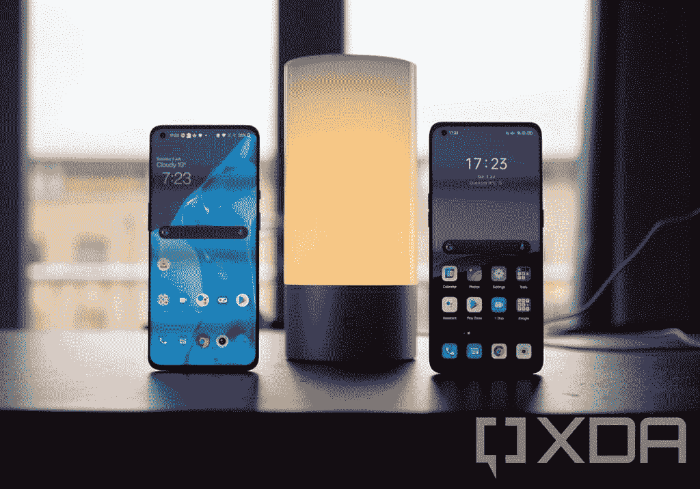

# 与一加讨论一加诺德 2:处理器，基准，引导加载程序，等等

> 原文：<https://www.xda-developers.com/oneplus-nord-2-oliver-zhang-interaction/>

随着去年一加诺德手机的推出，一加重新进入了中端智能手机市场。虽然这款手机没有获得太多的好评，但它在几个市场上销售火爆，因为它以相对实惠的价格为用户提供了一加标志性的快速流畅的体验。继最初的 Nord 取得成功后，一加在 Nord 的旗帜下推出了其他几款设备，但没有一款能够达到同样的受欢迎程度。然而，即将到来的一加诺德 2 似乎有潜力达到新的高度。

在过去的几周里，我们已经看到了一些关于一加诺德 2 的泄露。这些泄露几乎揭示了这款手机的一切，从它的[设计](https://www.xda-developers.com/oneplus-nord-2-leaked-renders/)到它的[规格](https://www.xda-developers.com/oneplus-nord-2-leak-specifications/)。和往常一样，一加也开始在发布前透露该设备的关键细节。上周，[一加证实](https://www.xda-developers.com/oneplus-nord-2-confirmed-to-feature-mediatek-dimensity-1200-chipset/)一加诺德 2 将是该公司第一款采用联发科芯片的手机——旗舰手机 Dimensity 1200。今天，在 XDA 与我们的互动中，一加的产品总监 Oliver Zhang 分享了一些关于即将推出的智能手机的更多关键信息。

* * *

一加与高通的骁龙系列移动芯片组有着长期而富有成效的关系，可以追溯到 OnePlus One。即使当一加去年扩大其产品组合以包括不同价格段的设备时，它仍然坚持使用骁龙芯片。因此，我们问一加为什么选择在一加诺德 2 上改用联发科的 SoC。

对此，张先生表示:“一加与不同的合作伙伴合作，帮助我们为用户提供卓越的体验，并根据我们想要提供的最终体验为每款设备选择组件。对于 Nord 2，我们与联发科技密切合作，增强了 Dimensity 1200 及其基于人工智能的功能，为 Nord 2 带来了摄影、显示、游戏等方面的改进。”

我们进一步询问，为什么一加没有选择在最近推出的一加诺德 CE 上做同样的事情，为用户提供更好的设备价值主张。该价格范围内的许多原始设备制造商选择了联发科，效果很好，由于 G90T 和 Dimensity 系列的成功，人们也普遍对联发科芯片组的想法产生了兴趣。一个不同的联发科 SoC 可能也有意义。

对此，张先生说:“我们选择芯片组等关键组件是基于它允许我们以目标价位提供的性能和体验。联发科天玑 1200 是一款旗舰级处理器，结合我们已经完成的协作工作，我们认为它可以让我们在 Nord 2 上带来更快更流畅的体验。”

### 我们可以期待在一加诺德 2 上看到哪些人工智能的增强？

出于对上述人工智能增强功能的好奇，我们请一加详细介绍了我们可以在一加诺德 2 上看到的人工智能功能。我们还询问了人工智能的增强是否只是一种营销工具，或者它们是否真的在区分一加诺德 2 上的 Dimensity 1200 和其他手机上的相同 SoC 方面发挥了作用。

张先生说，Nord 2 芯片组上的“AI”品牌不是一种营销工具。他进一步补充说，一加“与联发科密切合作，在 SoC 上进行合作，并增强其基于人工智能的功能，在名称中添加“人工智能”是我们工作的准确反映。在联发科 Dimensity 开放资源架构之上完成的协作人工智能工作为 Nord 2 带来了许多基于人工智能的新功能，以增强各种接触点的用户体验。”

此外，张先生透露了我们将在一加诺德 2 上看到的基于人工智能的功能的关键细节。其中包括 **AI 分辨率提升、AI 色彩提升、AI 照片增强、AI 视频增强和 Nightscape Ultra** 。一加声称，人工智能分辨率提升和人工智能颜色提升功能将显著增强设备的显示体验。

AI Color Boost 功能将“利用 AI 的上下文感知能力来检测用户正在热门应用程序的屏幕上观看的内容”，并自动将标准动态范围内容转换为高动态范围。另一方面，AI 分辨率提升功能将自动将流行的社交媒体应用程序上的低分辨率视频增强为高清分辨率。“当输入的视频是 540p 或更低时，分辨率提升就会触发，这样我们就能确保视频质量的最低标准，”张先生补充道。

***注:**联发科的 Dimensity 开放资源架构(DORA)平台允许原始设备制造商访问其片内资源，以帮助他们在其设备上提供定制的摄像头、显示器、图形、人工智能处理、传感器和连接功能。您可以通过点击[此链接](https://i.mediatek.com/dimensityopenresource)了解更多关于 DORA 平台的信息。*

### 这些人工智能增强提供了任何性能优势吗？

我们还询问了一加，Dimensity 1200 的人工智能增强功能是否会为用户提供任何切实的性能优势，或者帮助 Nord 2 在人工智能基准测试中表现更好。作为回应，张先生与我们分享了一加诺德 2 的 AI 基准测试分数。在安德烈·伊格纳托夫的[人工智能基准测试](https://play.google.com/store/apps/details?id=org.benchmark.demo)中，**一加·诺德 2 获得 172.7** 。

[看排名](https://ai-benchmark.com/ranking.html)，这明显高于其他采用常规 Dimensity 1200 芯片组(Realme GT Neo: 155.8)和骁龙 870 (OPPO Find X3: 94.5)的手机发布的分数。也高于采用三星旗舰 Exynos 2100 芯片的设备发布的分数(三星 Galaxy S21 Ultra: 170.4，三星 Galaxy S21+: 169.7)。有趣的是，一加诺德 2 在榜单前十名中占据一席之地，领先于几款采用高通旗舰骁龙 888 芯片的旗舰手机。

 <picture></picture> 

AI Benchmark phone ranking

这些人工智能的增强有望转化为现实世界的性能优势，以及改善的摄影、显示和游戏体验。基准测试分数并不总是准确反映设备的真实性能，所以我们必须等待，看看一加诺德 2 在我们拿到它时的表现。

既然我们谈到了基准测试分数的话题，我们还问了一加最近的[性能节流惨败](https://www.xda-developers.com/oneplus-9-pro-performance-throttling-popular-apps/)和随后的[一加旗舰产品从 Geekbench](https://twitter.com/geekbench/status/1412433598200823810) 退市会如何影响消费者对上述基准测试分数的信心。

作为回应，张先生说:“用户可以始终对一加充满信心，因为我们始终优先考虑性能，并通过使用最优质的组件提供出色的用户体验。我们和用户一样关心强大的性能，但最近因为与某些应用程序合作以使其 CPU 性能与良好用户体验所需的电量相匹配而受到批评。然而，我们认为这样做是我们的责任，以避免不必要的电力使用，因为这将提供更好的整体体验。”

张先生还举了以下例子来解释为什么一加 9 系列会降低几个热门应用的性能:“当你的手机需要非常快时，比如当你打开应用时，它会充分发挥骁龙 888 的潜力。但当它不需要太多电力时，比如当你只是滚动浏览你的 Twitter feed 时，我们就让它省电。我们确保用户体验不受影响。”这也符合我们在对一加 9 Pro 的评测中观察到的情况。

### 一加诺德 2 真的能提供你想要的智能手机的所有功能吗？

一加在 Nord 2 的营销材料中声称，它提供了“你想要的一切”因此，我们询问该公司，它是否真的提供了你想要的智能手机的所有功能，以及它是否配得上最近在社交媒体上流传的“旗舰杀手”的称号。

“这一切都要追溯到目标受众。旗舰产品迎合想要最新和最新创新的用户——这就是为什么伟大的旗舰产品集成了如此多的功能。但是 Nord 2 属于一加诺德线，这是一个产品组合，旨在让用户更容易获得一加的体验，这些用户不一定需要最新的和最新的，而只是一部伟大的日常手机。基于这一定义，我们认为我们选择了强大的硬件、出色的摄像头、出色的设计和质量的完美结合，来提供一款真正让用户能够每天做他们想做的事情的手机，同时还在这个价位上提供了一些旗舰级的功能。”

尽管张先生没有透露一加 Nord 2 硬件的许多细节，但他证实，这款手机将采用与第一代 Nord 相同的 6.43 英寸 fluid AMOLED 显示屏，刷新率为 90 赫兹。但是，由于上面提到的人工智能增强，Nord 2 将提供比其前身更好的显示体验。

### 考虑到 OxygenOS 11.3 是第一个基于集成 OxygenOS-ColorOS 代码库的版本，我们可以期待在 OxygenOS 11.3 中看到什么变化？

一加最近分享了一份[更新的设备软件维护时间表](https://www.xda-developers.com/oneplus-flagships-three-major-android-upgrades-four-years-security-updates/)，并宣布它正在与 OPPO 合作[将 OxygenOS 的代码库与 OPPO 的 ColorOS](https://www.xda-developers.com/oxygenos-coloros-merger-inevitable/) 合并。此举背后的想法是帮助该公司更好地利用共享资源，简化设备更新。尽管在声明中，一加声称当前手机上的集成代码库将随着 Android 12 的更新而发生，但该公司现在已经确认**一加诺德 2 将是第一款基于集成代码库**的 OxygenOS 版本(v11.3)的手机。

 <picture></picture> 

OnePlus 9 Pro and OPPO Find X3 Pro

出于对合并影响的好奇，我们问一加，我们可以期待在 Nord 2 上看到 OxygenOS 11.3 的哪些变化，以及它将如何惠及最终用户。“代码库集成背后的主要想法是简化我们的 R&D 资源，这将帮助我们为我们的设备提供更及时、更稳定的软件更新，同时能够更长时间地维护我们的设备。从用户的角度来看，使用 OxygenOS 时，日常情况不会有太大变化。Nord 2 用户将体验到我们的用户期望从一加获得的同样快速和流畅的体验。”

### 一加诺德 2 还会保留它的引导程序可解锁性吗？

虽然代码库合并不会影响到最终用户的氧气体验，但一些一加粉丝表示，他们担心合并后一加可能会阻止用户解锁引导程序。我们借此机会澄清，一加是否也会步 OPPO 的后尘，阻止用户解锁手机的引导程序。你会很高兴知道**一加会让用户解锁一加诺德 2** 上的引导加载程序，即使手机运行的是基于集成代码库的氧合操作系统。

* * *

基于这种互动，我们认为一加 Nord 2 有潜力复制原始 Nord 的成功，并成为今年销售良好的中档手机。但是因为我们还没有拿到这个设备，所以现在下结论还为时过早。一加将于 7 月 22 日揭开一加诺德 2 的面纱，我们迫不及待地想测试它，看看它是否真的如宣传的那样。请确保您关注我们未来的报道，这样您就不会错过我们的完整评论。