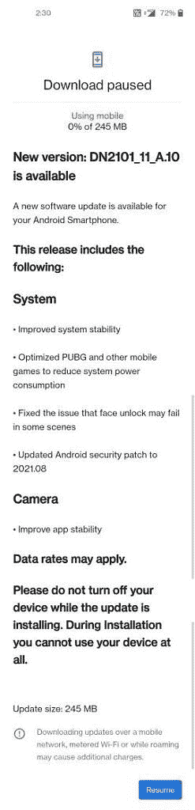

# OxygenOS 11.3.A.10 在印度一加 Nord 2 推出

> 原文：<https://www.xda-developers.com/oneplus-nord-2-pubg-optimization-august-2021-patches/>

自上个月推出以来，一加已经为其最新的平价旗舰产品一加诺德 2 推出了几项软件更新。[首次发布后更新](https://www.xda-developers.com/oneplus-nord-2-oxygenos-first-update/)优化了自动亮度模式，增加了超分辨率模式，提高了应用性能，优化了网络性能。随后的更新集中在调整相机性能和修复用户报告的错误。现在，一加诺德 2 是拿起另一个软件更新，进一步微调整体软件体验。

**[一加诺德 2 点评:轻松我最喜欢的一加手机](https://www.xda-developers.com/oneplus-nord-2-review/)**

OxygenOS 11.3.A.10 正在向一加诺德 2 公司推出。最新的更新包括对 PUBG 和其他游戏的电池优化。如果你在玩 PUBG 或其他游戏时遇到了异常高的电池消耗，那么在更新到 OxygenOS 11.3.A.10 后，你应该会看到一些改进。在其他地方，面部解锁 bug 已被修复，相机应用程序稳定性得到进一步改善，安全补丁级别已被推迟到 2021 年 8 月。

 <picture></picture> 

Screenshot courtesy: [*N_Rakesh*](https://forums.oneplus.com/threads/oxygenos-a-09-for-the-oneplus-nord-2-5g.1483819/page-6#post-23611983) on OnePlus forums

OxygenOS 11.3.A.10 重 245MB，带来了以下变化:

*   **系统**
    *   提高系统稳定性
    *   优化 PUBG 和其他手机游戏，降低系统功耗
    *   修正了面部解锁在某些场景下可能会失败的问题
    *   将 Android 安全补丁更新至 2021.08
*   **摄像机**

OxygenOS 11.3.A.10 已经开始在印度的一加 Nord 2 装置上播种。您可以通过前往*设置>系统>系统更新来检查更新。与每一次 OxygenOS 的推出一样，新的更新是分批推出的，所以在它到达每个单位之前还需要一些时间。如果不想等待，可以从下面的下载部分下载增量 OTA 包，手动安装更新。*

**[一加诺德 2 XDA 论坛](https://forum.xda-developers.com/f/oneplus-nord-2-5g.12375/)**

## 为一加诺德 2 下载 OxygenOS 11.3.A.10

完整的 OTA zip 链接尚未上线。我们将在访问后更新这篇文章，请稍后再来查看。

* * *

*感谢 XDA 知名开发者 [yshalsager](https://forum.xda-developers.com/m/yshalsager.6084385/) 提供下载链接。*