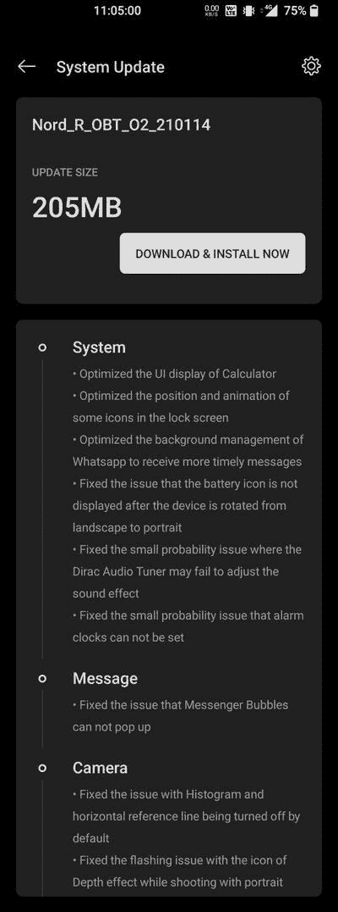

# 一加诺德公司的第二个 OxygenOS 11 测试版将于 2021 年 1 月推出安全补丁

> 原文：<https://www.xda-developers.com/oneplus-nord-android-11-oxygenos-open-beta-2/>

# 一加诺德公司的第二个 OxygenOS 11 测试版将于 2021 年 1 月推出安全补丁

第二个 OxygenOS 开放测试版已经为一加北部发布了 Android 11 和 2021 年 1 月的安全补丁。请继续阅读！

距离第一个基于 Android 11 的 OxygenOS 开放测试版更新[在一加北部的](https://www.xda-developers.com/oneplus-nord-android-11-oxygenos-open-beta-1/)到来只有大约三周的时间。保持更新列车滚动，该公司现在发出另一个公开测试版更新 mid-ranger 5G 智能手机。就新功能而言，新版本可能不是一个巨大的更新，但它确实带来了最新的谷歌安全补丁和一系列受欢迎的系统漏洞修复。

 <picture></picture> 

Thanks to OnePlus Community user [MihirRaj](https://forums.oneplus.com/members/mihirraj.3939466/) for the screenshot!

根据一加的说法，一加北部的 OxygenOS Open Beta 2 有几项增强功能，可能会提高日常稳定性。例如，已经对相机、时钟和信使气泡进行了修复。安全现在更新到本月(【2021 年 1 月)的补丁，虽然在[官方更新公告帖](https://forums.oneplus.com/threads/oxygenos-open-beta-2-for-the-oneplus-nord.1381805/)中没有提到。以下是完整的变更日志:

*   **系统**
    *   优化了计算器的用户界面显示
    *   优化了锁屏中一些图标的位置和动画
    *   优化了 Whatsapp 的后台管理，接收更及时的消息
    *   修正了设备从横向旋转到纵向后电池图标不显示的问题
    *   修正了 Dirac 音频调谐器可能无法调整声音效果的小概率问题
    *   修正了不能设置闹钟的小概率问题
*   **消息**
    *   修正了信使气泡不能弹出的问题
*   **摄像机**
    *   修正了直方图和水平参考线默认关闭的问题
    *   修正了人像模式下拍摄时深度效果图标闪烁的问题
*   **网络**
    *   修正了 SIM 2 不能被设置为默认卡的问题

**[一加诺德 XDA 论坛](https://forum.xda-developers.com/c/oneplus-nord.11081/)**

## 下载:适用于一加北部的 OxygenOS Open Beta 2

像往常一样，我们在这里有更新的下载链接。

如果你想从一加诺德稳定的 Android 10 版本升级或者你是 rooted 用户，你可以下载完整的 OTA，或者如果你已经在 Open Beta 1 上并且没有修改软件，你可以下载增量包。无论哪种方式，你都可以将 OTA 复制到手机的内部存储，然后在系统更新应用程序中选择“本地升级”选项。

* * *

*感谢 XDA 资深会员 [Some_Random_Username](https://forum.xda-developers.com/m/some_random_username.8234677/) 提供下载链接！*