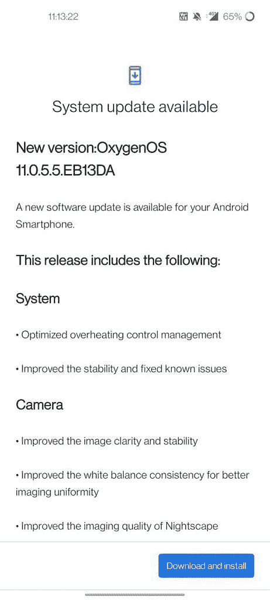

# 11.0.5.5 一加诺德 CE 5G 公司获得 OxygenOS 摄像头和系统改进

> 原文：<https://www.xda-developers.com/oneplus-nord-ce-5g-update-camera-system-improvements/>

# 11.0.5.5 一加诺德 CE 5G 公司获得 OxygenOS 摄像头和系统改进

一加诺德 CE 5G 的最新 OxygenOS 11 更新带来了更多系统和相机改进。从帖子里的链接下载。

一加最新的中档智能手机——一加诺德 CE 5G(——正在进行又一次软件更新。最新的更新建立在与[上一版本](https://www.xda-developers.com/oneplus-nord-ce-5g-oxygenos-update-june-pacth/)一起推出的系统和相机改进的基础上，对过热控制管理、图像清晰度和稳定性以及白平衡一致性进行了优化。如果你的手机还没有收到更新，你可以从下面的链接下载固件包。

 <picture></picture> 

Screenshot courtesy: kalashkesharwani on the OnePlus Community forums

面向一加诺德 CE 5G 的 OxygenOS 11.0.5.5 已经开始向印度用户推出，它有以下变更日志:

*   系统
    *   优化过热控制管理
    *   提高了稳定性并修复了已知的错误
*   照相机
    *   提高了图像的清晰度和稳定性
    *   改善了白平衡一致性，以获得更好的成像均匀性
    *   提高了夜景的成像质量

与所有 OxygenOS 更新一样，面向一加诺德 CE 5G 的 oxygen OS 11.0.5.5 将分阶段推出。这意味着今天更新将只对少数用户推出。一旦一加确认它没有任何重大问题，它应该会推出更多的用户。因此，您可能需要等待几天才能在您的设备上收到 OTA 通知。对于那些希望跳过等待的人，我们在下面提供了固件包的下载链接。

**[一加诺德 CE 5G XDA 论坛](https://forum.xda-developers.com/f/oneplus-nord-ce-5g.12343/)**

## 为一加诺德 CE 5G 下载 oxygen OS 11.0.5.5

*   **全球(11.0.5.5.EB13AA):**
*   **欧洲(11.0.5.5.EB13BA ):**
*   **India (11.0.5.5.EB13DA):**

* * *

*感谢 XDA 公认的开发者 [yshalsager](https://forum.xda-developers.com/m/yshalsager.6084385/) 提供的下载链接！*