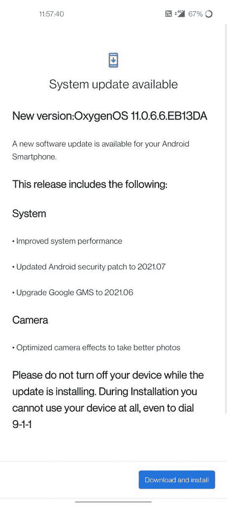

# OxygenOS 11.0.6.6 公司为一加北欧 CE 带来了更新的安全补丁

> 原文：<https://www.xda-developers.com/oneplus-nord-ce-oxygenos-11-0-6-6-new-security-patches/>

# 一加诺德 CE 更新带来了优化的相机效果和更新的安全补丁

一加诺德消费电子公司的 oxygen OS 11.0.6.6 优化了相机体验，提高了安全补丁级别。

紧随今天早些时候一加诺德更新之后，一加诺德 CE 也开始了新的软件构建。一加诺德 CE 在 7 月下旬接受了最后一次更新，优化了过热控制管理，[改善了相机性能](https://www.xda-developers.com/oneplus-nord-ce-5g-update-camera-system-improvements/)，包括图像清晰度、夜景和白平衡一致性。通过 oxygen OS 11.0.6.6，一加进一步优化了相机体验，同时也提高了整体系统性能。

**[一加诺德 CE 5G 回顾:搞定所有要点](https://www.xda-developers.com/oneplus-nord-ce-5g-review/)**

一加已经开始向一加北欧公司在印度、欧洲和北美的用户推广 11.0.6.6 oxygen OS。最新的更新将 Android 安全补丁级别提升至 2021 年 7 月，并将谷歌 GMS 提升至 2021.06。此外，一加表示，他们还优化了相机效果以及系统性能。

 <picture></picture> 

Screenshot courtesy: OnePlus forum member *kalashkesharwani*

OxygenOS 11.0.6.6 的完整变更日志:

*   **系统**
    *   提高系统性能
    *   将 Android 安全补丁更新至 2021.07
    *   将 Google GMS 升级到 2021.06
*   **摄像机**
    *   优化相机效果，拍摄更好的照片

OxygenOS 11.0.6.6 已经开始在一加北欧市场推出，用户可以期待在未来几天收到新的更新。与往常一样，更新是分阶段进行的，所以它可能需要一些时间才能到达每个设备。如果您不想等待，我们在下面提供了 OTA 链接，供您手动更新您的设备。从下面的列表中下载与您的型号对应的正确版本，并使用设备设置中的“本地升级”选项进行安装。

**[一加北欧 CE XDA 论坛](https://forum.xda-developers.com/f/oneplus-nord-ce-5g.12343/)**

## 为一加诺德 CE 5G 下载 oxygen OS 11.0.6.6

全球和欧洲车型的全面 OTA 链接尚未上线。

*   印度(11.0.6.6.EB13AA)
*   **全局(11.0.6.6.EB13DA):**
*   **欧洲(11.0.6.6EB13BA):**

* * *

*感谢 XDA 知名开发者 [yshalsager](https://forum.xda-developers.com/m/yshalsager.6084385/) 提供下载链接。*