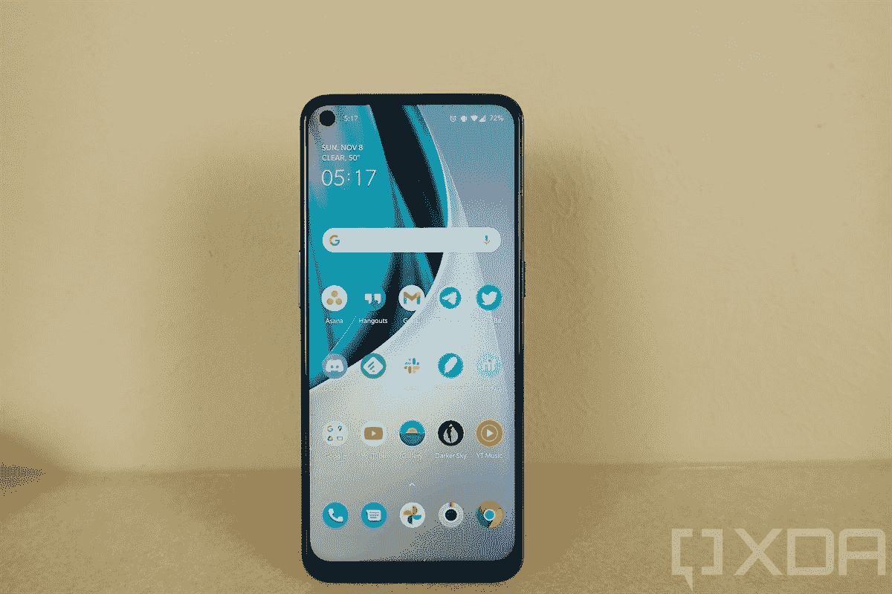

# 一加诺德 N10 5G 现在在欧洲支持免提亚马逊 Alexa

> 原文：<https://www.xda-developers.com/oneplus-nord-n10-5g-europe-now-supports-hands-free-amazon-alexa/>

# 欧洲的一加诺德 N10 5G 现在支持免提亚马逊 Alexa

如果你有一加诺德 N10 5G 的欧盟版本，你现在可以在任何屏幕上利用亚马逊 Alexa 的免提功能。

 <picture></picture> 

binary comment

如果你有一台一加诺德 N10 5G，你现在可以完全抛弃谷歌助手，转而使用 Alexa。虽然你可以将 Alexa 设置为几乎任何现代安卓手机的默认语音助手，但整体体验可能无法与谷歌助手相提并论。例如，当你在 Alexa 应用程序之外或屏幕关闭时，你不能使用你的声音来触发 Alexa。要做到这一点，你的手机必须支持免提 Alexa 功能。

**[一加诺德 N10 5G 论坛](https://forum.xda-developers.com/c/oneplus-nord-n10-5g.11803/)**

我们最近收到一个提示，一加诺德 N10 5G 现在支持免提访问亚马逊 Alexa。我们的线人收到一封来自亚马逊英国的邮件，称他的手机现在有了这项功能。虽然我们无法在亚马逊英国的 Alexa 内置兼容手机列表中找到一加诺德 N10 5G，但一加已经向 XDA 证实，该功能确实支持在部分欧洲市场销售的设备。我们被告知，这些国家包括英国、法国、德国、意大利和西班牙，集成适用于任何欧盟 N10 SKUs。这款手机也不一定要通过亚马逊购买。

不过，一加诺德 N10 5G 并不是第一款支持免提 Alexa 的一加设备。一加 8 系和一加诺德也有。

免提 Alexa 的好处是，你可以在任何屏幕上调用 Alexa，也可以在手机屏幕关闭时调用，就像你可以在任何屏幕上说“OK Google”来触发谷歌助手一样。要在您的一加 N10 5G 上使用 Alexa 免提功能，您首先需要从谷歌 Play 商店下载 Alexa 应用程序，然后更改默认的语音助手服务。为此，请前往设置>应用程序与通知>默认应用程序>数字助理应用程序。从那里，点击“默认数字助理应用程序”，并将 Alexa 设置为默认。请记住，免提 Alexa 目前仅适用于欧洲版本。

*感谢 XDA 会员 [Some_Random_Username](https://forum.xda-developers.com/m/some_random_username.8234677/) 的提示！*