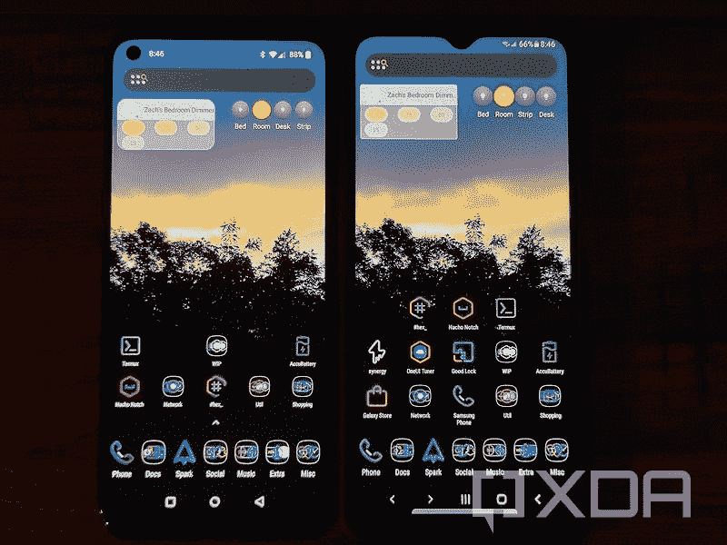
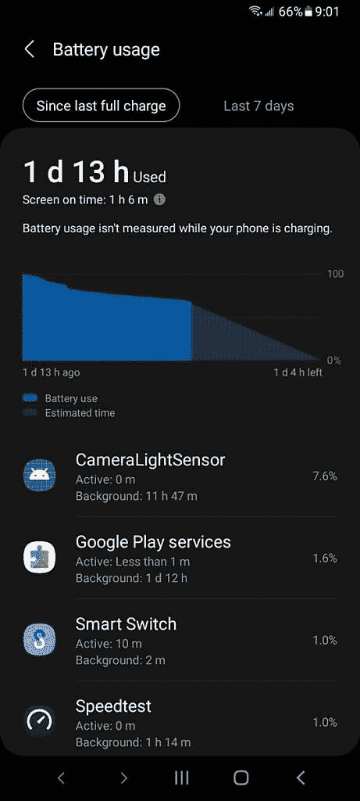
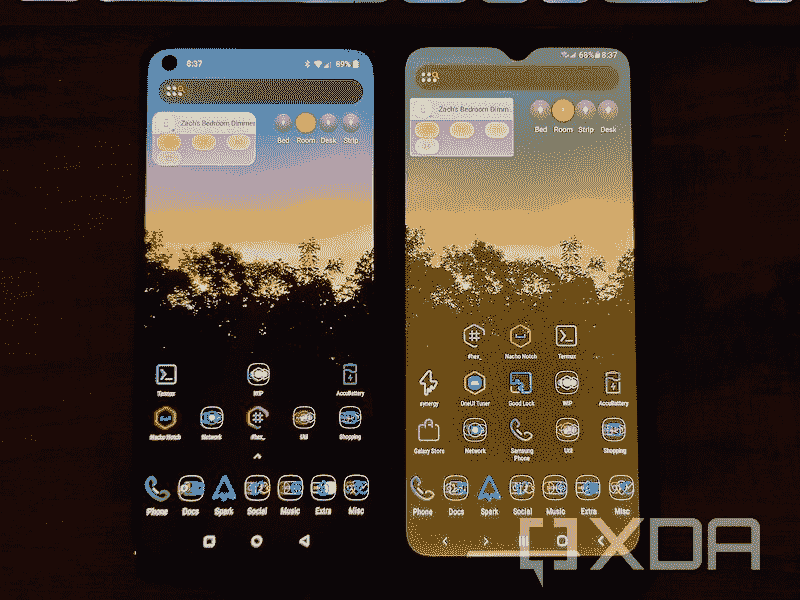
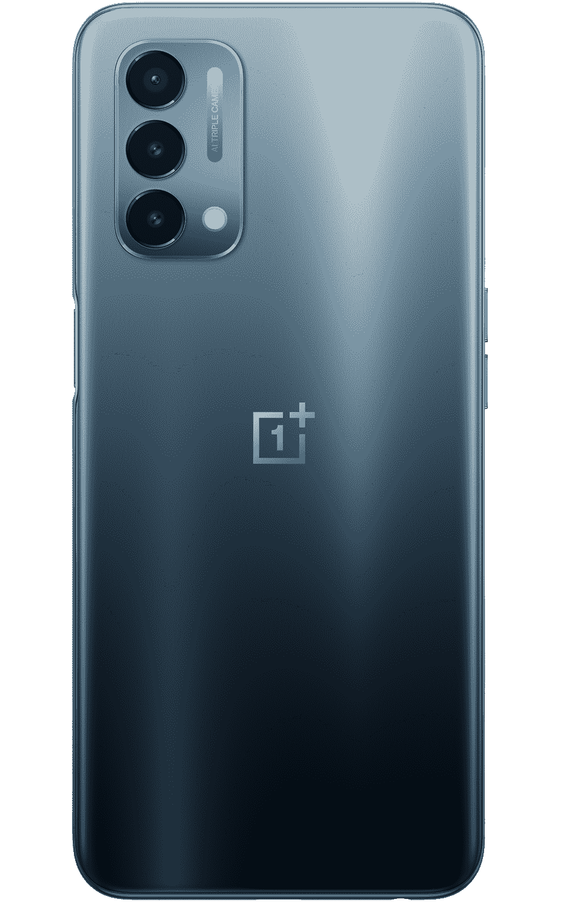
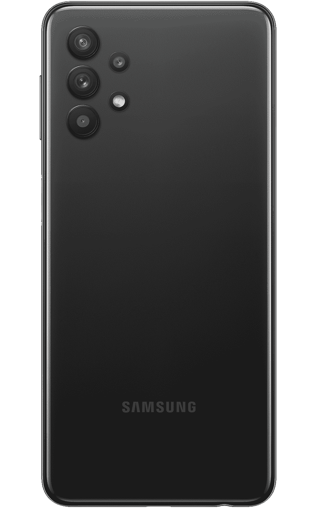

# 一加诺德 N200 vs 三星 Galaxy A32:哪个 5G 手机更好？

> 原文：<https://www.xda-developers.com/oneplus-nord-n200-5g-vs-samsung-galaxy-a32-5g/>

在美国，中端价值智能手机市场从来都不是很好。尽管我们中的一些人很想从欧洲进口廉价手机，但这并不是一个真正的选择。令人欣慰的是，我们似乎开始获得一些世界其他地方一直看到的价值。价格在 200-300 美元之间，美国消费者现在可以在几款廉价手机中进行选择，这些手机可以说比该价格范围内的任何其他手机都更有价值——T2 的一加诺德 N200 5G T3 和 T4 的三星 Galaxy A32 5G T5 就是两个这样的例子。如果你是 T-Mobile 的客户，你甚至有机会通过在任何可用的智能手机上交易来免费获得这两个产品。

不幸的是，一加诺德 N200 5G 和 Galaxy A32 5G 在 T-Mobile 上不再免费，如果你使用另一家运营商或购买解锁产品，你需要付费。但是哪个更好呢？从表面上看，这是两款规格非常相似、价格非常相似的手机。好吧，我疯了，每样都有三个。这意味着我可以进行比较，我将检查从规格到软件的所有内容。

## 显示

让我们从显示屏开始，这可能是智能手机最重要的部分之一。就规格而言，这可能是你会看到这两款手机之间最大的区别。一加诺德 N200 5G 配备了 6.49 英寸的 1080p IPS 显示屏，而三星 Galaxy A32 5G 配备了 6.5 英寸的 720p IPS 显示屏。两者都支持高达 90Hz 的刷新率。

在如此大的显示屏上拥有 720p 的分辨率绝对引人注目。三星的软件在隐藏它方面做得很好，但有时文本或图标会看起来像素化。Nord 的 1080p 显示器使用起来更好，不仅仅是因为它的分辨率更高。

除了具有更好的像素密度，Nord N200 5G 还具有更好的色彩还原能力，更高质量(更均匀)的背光，看起来更亮。总的来说，Nord N200 确实有更好的显示屏。Galaxy A32 5G 彻底输掉了这场战斗。

 <picture></picture> 

Left: Nord N200 5G. Right: Galaxy A32 5G. The background is supposed to look more like how the Nord displays it.

## 摄像机

在我进入这个之前，我想澄清一下，Nord N200 5G 和 Galaxy A32 5G 都没有一个好的相机系统。两者都能在明亮的地方拍摄出尚可的照片和视频。当变焦或在弱光下工作时，两者都不太好。

也就是说，Galaxy A32 5G 至少能产生稍微好一点的照片和视频。细节稍微多一点，颜色和曝光看起来更好。Galaxy A32 5G 还有一个更有用的相机系统，主相机旁边有一个广角传感器。Nord N200 5G 只有一个有用的后置摄像头，其他都是微距和深度传感器。

三星 Galaxy A32 5G 赢得了相机拍摄，但这两者都不足以让它发挥太大作用。

## 存储和内存

如果你在美国购买一加诺德 N200 5G 或三星 Galaxy A32 5G，你在这里只能有一个选择，两者都是一样的——64GB 存储空间和 4GB 内存。不同之处在于可扩展的存储选项。这两款设备都通过使用 microSD 卡支持额外的存储空间，但 Nord N200 5G 仅(官方)支持高达 256GB 的卡，而三星则宣传支持 1TB。

低于 300 美元的手机拥有 1TB 真的重要吗？可能不会，但三星在技术上赢了，除非 Nord N200 5G 的规格是错误的。不幸的是，我甚至没有一个 256GB 的 microSD 来测试这个，所以我不能确认一加的规格是否正确。

## 声音的

一加诺德 N200 5G 和三星 Galaxy A32 5G 都有 3.5 毫米耳机插孔，这是中端和廉价市场的共同点。两者都没有特别令人惊讶的内置 DAC，但它确实存在，而且绝对值得拥有。

然而，当谈到蓝牙时，情况就不同了。诺德 N200 比 Galaxy A32 支持更多的蓝牙音频编解码器，如高通 aptX HD。如果蓝牙音频对你很重要，一加是一个更好的选择。

## 电池和充电

这是一加诺德 N200 5G 和三星 Galaxy A32 5G 非常相似的另一个类别。两款手机都有 5000 毫安时的电池。诺德 N200 支持 18W (9V/2A)充电，而 Galaxy A32 则限制在 15W (9V/1.67A)。如果这 20%的增长是重要的，诺德 N200 更好。

就电池寿命而言，你可能会认为这是相似的，但实际上这有点奇怪，可能与你的预期相反。两者的续航时间都相当长，但 Nord N200 的待机功耗略低于 Galaxy A32。然而，即使分辨率更高、显示屏更亮，它也能以明显更好的屏幕打开时间(室内和室外)来弥补这一点。

据我所知，电池寿命的差异是因为 Galaxy A32 5G 上始终运行 CameraLightSensor 服务。简而言之，这项服务每隔几秒钟就会用自拍相机拍一张照片，并从该图像中推断环境亮度。

总的来说，我会说一加诺德 N200 5G 的电池情况比三星 Galaxy A32 5G 好。

 <picture></picture> 

Even leaving the A32 mostly untouched on standby for over a day results in CameraLightSensor taking up the most battery of all other apps.

## 手机和调制解调器

智能手机的另一个重要部分是其名称中的“电话”部分。打电话、通过蜂窝网络浏览互联网等。

在规格上，三星 Galaxy A32 5G 实际上应该击败一加诺德 N200 5G。Galaxy A32 的联发科天玑 720 支持 LTE Cat16，而 Nord N200 的高通骁龙 480“仅”支持 Cat15。不过，这些都是规格。

实际上，你可能永远也不会看到接近理论上支持的速度。实际上，一加诺德 N200 提供了比 Galaxy A32 更好的无线体验。

首先，一加诺德 N200 有更好的天线。我见过它和 Galaxy A32 5G 在 LTE 频段 41 上有 4dBm 的信号强度差异。有了无线网络和蓝牙，情况就相似了。

在我使用 Galaxy A32 5G 的时候，我经历了几乎持续不断的调制解调器崩溃。蜂窝会随机断开并重新连接，WiFi 比它应该的弱，并且在连接时会随机停止工作，我的 Galaxy Watch Active2 有时会在一个小时内与蓝牙断开多达 30 次。

我已经向 T-Mobile 报告了这些问题，并且正在接收所有三台设备的替换件(它们都有问题)。如果新单位更好，我会更新这篇文章。

.

另一方面，一加诺德 N200 具有坚如磐石的蜂窝性能，更强更可靠的 WiFi 连接，更稳定的蓝牙。我遇到的唯一问题是，它对连接到 LTE 频段 25 和 71 犹豫不决，即使它们比同一地点的替代方案更好。

最后，虽然 Galaxy A32 5G 可能有更好的硬件，但一加诺德 N200 提供了更好的无线体验。

## 杂项硬件

这里有更多的比较点，并不真正保证整个章节。

*   一加诺德 N200 5G 的触感要好得多。它们不是旗舰级别的，但肯定比一加 6T 要好。
*   一加诺德 N200 5G 更轻、更薄、略小。
*   主观上，一加诺德 N200 5G 有一个更好的背板——更有趣的颜色和更好的手感。
*   至少在 T-Mobile 版本中，一加 Nord N200 5G 支持更多 LTE 和 5G 频段。
*   一加诺德 N200 5G 更好地隐藏了它的挡板(它们可能稍微小一点)。
*   三星 Galaxy A32 5G 的自拍相机没有那么碍眼，显示屏更小，状态栏也更短。

## 软件

现在我们已经解决了硬件问题，让我们来谈谈软件。对许多人来说，这是电话的成败部分。我个人从来都不是一加 OxygenOS 的粉丝，我一般都很享受使用三星的 One UI，所以(剧透)这个对比的结论连我都很惊讶。

### 软件皮肤

不出所料，一加诺德 N200 5G 和三星 Galaxy A32 5G 都采用了各自制造商的 Android 皮肤。Nord N200 出厂时自带 oxygen OS 11.0.3.1，而 Galaxy A32 5G 则有一个 UI 3.1。

我不会用太多关于每种皮肤的细节来烦你——有很多评论对每种皮肤进行了深入的讨论——但这里有一个快速的纲要。

OxygenOS 11 与 AOSP 的外观大相径庭，但它保留了 Android 的一些部分，比如一般的通知外观和系统图标。其他部分，如设置应用程序，有特定于一加的自定义。当然，还有一加系统应用程序，如计算器和时钟。我用谷歌版的，所以对我来说，它们只是膨胀。

One UI 3.1 对 Android 的改变甚至超过 OxygenOS 11。风格完全不同，尽可能在任何地方添加模糊，完全重新设计的通知中心和风格，当然还有三星系统应用程序。

就“重量”而言，这两种皮肤都不算轻。但是如果你是一个被大量选项和设置淹没的人，OxygenOS 可能是你更好的选择。

### 表演

尽管一加诺德 N200 5G 和三星 Galaxy A32 5G 的处理器非常相似，但诺德 N200 的性能明显更好。在某些情况下，你可能甚至没有意识到这是一个较低的中档设备。

不幸的是，三星没有为 Galaxy A32 5G 很好地优化其软件。有时，它会工作得很好，动画流畅，加载速度快。但看似随机，它会下降到每秒 15 帧的范围内，加载时间缓慢，经常冻结。我不知道除了普遍缺乏测试和优化之外，还有什么原因会导致这种情况。

另一方面，一加诺德 N200 是一个完全不同的故事。它很少滞后或停顿，感觉就像一个近乎恒定的 90Hz。应用程序加载速度快，动画流畅，在正常使用下几乎不会出现问题。

Nord N200 唯一真正的痛处也是 Galaxy A32 的问题——内存有限。我不在乎任何人说什么，当前版本的 Android 不能在小于 6GB 的内存上运行。这两款手机都不能同时运行两个以上的应用程序，否则一个或多个应用程序必须重新加载。有时一个甚至只打开两个就重新加载，这使得使用 Authy 进行双因素身份验证的事情变得很烦人。

总的来说，一加在软件性能方面绝对胜出。

### 通知

历史上对一加来说是个问题的东西现在不再是了。Nord N200 5G 能够可靠地发送来自 Twitter、Discord、Slack 等任何地方的通知。即使电池优化对它们有效。

几乎具有讽刺意味的是，三星 Galaxy A32 5G 正在与通知做斗争。总的来说，一个用户界面似乎有一个问题，特别是松弛通知，但我经常错过其他东西，如 Galaxy A32 5G 上的电子邮件甚至电报信息。

令人惊讶的是，一加诺德 N200 5G 提供了卓越的通知体验。

### 夜间模式

夜间模式，眼部舒适盾，黄移，f.lux，无论你想叫它什么，最近在智能设备上变得相当流行。在夜晚或黑暗的时候，让屏幕变黄会让显示屏看起来不那么刺眼，据称有助于睡眠周期。几乎每个安卓品牌都有自己的实现。

三星为其配备有机发光二极管显示屏的设备设计的眼部舒适保护罩相当不错。它可以改变色温，而不会真正影响图像。不幸的是，Galaxy A32 5G 采用了 IPS 显示屏。IPS 显示器设备的护眼效果不好。而不是色温偏移，它只是一个丑陋的黄色屏幕覆盖。它看起来很糟糕，可能会使显示器在黑暗中看起来更粗糙，而且总的来说不是特别好。不知道三星为什么要这么做。

另一方面，一加有一个夜间模式，看起来很像三星的有机发光二极管眼部舒适盾。在 Nord N200 5G 上，色温得到了适当的调整，几分钟后你几乎不会注意到它比平时更黄。

到目前为止，一加诺德 N200 5G 有更好的夜间模式。

 <picture></picture> 

The A32 5G's night mode is much more intrusive and distracting.

### 自动亮度

在智能设备上，自动亮度是我们许多人想当然的事情。在三星 Galaxy A32 5G 上，你不能这样做。

三星决定放弃 Galaxy A32 5G 中的专用接近传感器和光线传感器，转而支持使用自拍相机的软件解决方案。通常情况下，这可能不是那么糟糕，但三星确实搞砸了实施。Galaxy A32 喜欢随机降低亮度，即使在全光下也是如此。当它“正常”工作时，它会延迟，而且绝对会耗尽电池。这可能就是为什么 Nord 的屏幕电池寿命如此之长的原因。

另一方面，一加诺德 N200 5G 具有专用的接近和光线传感器，这绝对是一条出路。自动亮度更可靠，反应更灵敏，整体效果更好。

### 环境显示

我使用术语“环境显示”的方式是描述一些设备具有的瞬时黑色背景显示。它会亮起几秒钟以响应手势、事件或通知，然后再次关闭。

这就是一加诺德 N200 5G 所拥有的，即使是它的 IPS 显示屏。如果您拿起电话或收到通知，日期、时间、电池电量和通知会出现几秒钟。三星 Galaxy A32 5G 没有这个功能。

### 更新

从历史上看，一加和三星都不擅长提供更新。不过最近，三星已经显著改进了其流程，而一加似乎仍有问题。

这就是软件故事对三星有利的地方。虽然我们真的没有任何具体的保证，但 Galaxy A30 和 Galaxy A31 都得到了两次重大的版本升级。正因为如此，我可以肯定三星 Galaxy A32 5G 将至少获得 Android 13 和另一年的安全更新。

然而，一加[明确表示](https://www.xda-developers.com/oneplus-flagships-three-major-android-upgrades-four-years-security-updates/)只计划为 Nord N200 5G 提供一个主要版本更新，以及三年的安全更新。这意味着 Nord N200 5G 可能只会正式接收 [Android 12](https://www.xda-developers.com/android-12/) 。两者的安全更新期相同。

如果你进入非官方更新，无论是通过 GSI 还是定制的 ROM，看起来至少 T-Mobile Nord N200 5G 可以解锁引导加载程序，受 T-Mobile 的条款约束。全部付清并激活 40 天，你可以给它 Android 13，14，甚至 15。

## 哪款手机比较好？

当我进行这种比较时，我完全希望在这里推荐三星 Galaxy A32 5G。

但事实证明，一加诺德 N200 5G 几乎在我能想到的所有类别中都击败了它。它有更好的性能、更长的电池寿命、更好的显示屏、更好的蜂窝等等。A32 5G 打败它的地方只有几个。

 <picture></picture> 

OnePlus Nord N200 5G

##### 一加诺德 N200 5G

Nord N200 是一加销售的最便宜的 5G 手机，如果你愿意忽略一些事情，它是一个可靠的选择

所以，这是我的结论。如果相机性能和官方更新支持对你很重要，那就买三星 Galaxy A32 5G 吧。如果软件性能、连接性和其他任何东西对您来说都更重要，请购买一加诺德 N200 5G。

 <picture></picture> 

Samsung Galaxy A32 5G

##### 三星 Galaxy A32 5G

Galaxy A32 5G 可能没有最好的硬件，但它有一个像样的摄像头和三星的更新承诺