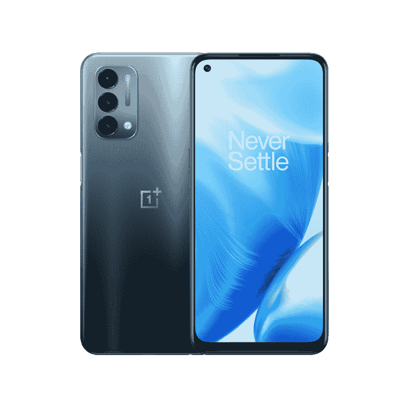

# 一加诺德 N200 防水吗？它有 IP 等级吗？

> 原文：<https://www.xda-developers.com/oneplus-nord-n200-waterproof-ip-rating/>

一加在为其智能手机增加防水和防尘等级方面一直没有最好的记录。一加 8 系列是第一个拥有 IP 等级的一加手机系列，但也有一些警告。该公司还在 9 系列中加入了 [IP 等级，但并不是一加 9 的所有变种都有这个等级。因此，如果你想知道 Nord N200 是否幸运地获得了 IP 等级，你会失望的。一加诺德 N200 不防水，也没有 IP 等级。](https://www.xda-developers.com/is-oneplus-9-series-waterproof/)

一加网站没有提到诺德 N200 的任何防水性能。网上有一些关于这款手机被评为 IPX2 的传言，但该公司尚未正式表态。此外，IPX2 是防水等级最低的设备之一，这意味着你的设备可以承受高达 15 度的水滴，所以你最好让你的设备远离水。

Nord N200 缺乏 IP 认证并不令人惊讶，因为 IP 认证增加了设备的成本。所以，在平价设备的情况下，制造商不想增加设备成本并将其转嫁给消费者。因此，廉价手机通常没有 IP 认证。

Nord N200 可能缺乏 IP 等级，但这款手机有一套不错的规格。你会得到一个 6.49 英寸的全高清+显示屏，90 赫兹的刷新率，Android 11 和高通骁龙 480 SoC。N200 还配备了 5000 毫安时电池，支持 18W 快速充电，侧装指纹传感器和 5G 连接。遗憾的是，它只能与美国的 T-Mobile 5G 配合使用。

此外，N200 配备了三后置摄像头，由 1300 万像素的主摄像头和 1600 万像素的自拍摄像头组成。这款手机还配备了 NFC、USB Type-C 端口、3.5 毫米音频插孔、4GB 内存和 64GB 板载存储。

 <picture></picture> 

OnePlus website

##### 一加北部 N200

一加诺德 N200 是该公司最新的廉价手机。它运行在 Android 11 上，该公司承诺为这款手机提供三年的维护更新，比它的前代产品更多。

如果你打算买这款手机，一定要查看一下 [best Nord N200 deals](https://www.xda-developers.com/best-oneplus-nord-n200-deals/) 来省钱。我们还为您可以购买的廉价 5G 手机选择了[最佳案例](https://www.xda-developers.com/best-oneplus-nord-n200-cases/)，以保护它。