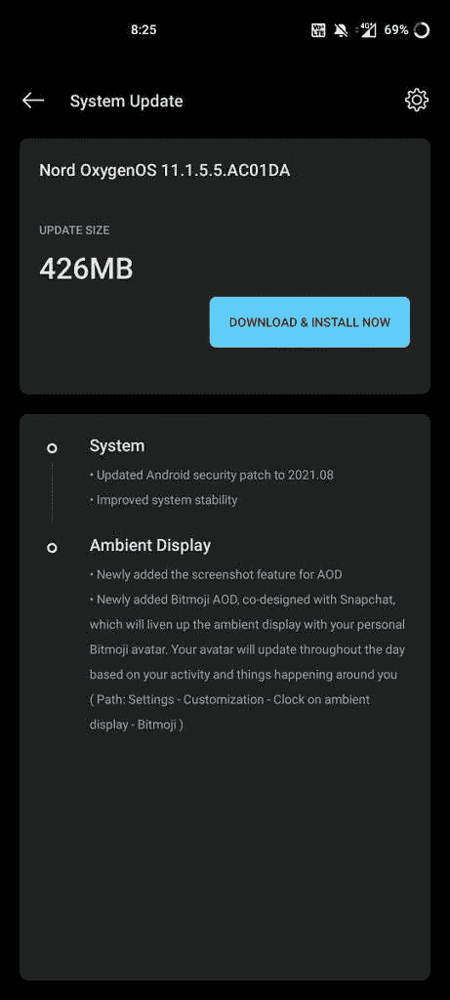

# 2021 年 8 月，11.1.5.5 一加诺德公司获得 OxygenOS 安全补丁

> 原文：<https://www.xda-developers.com/oneplus-nord-oxygenos-11-1-5-5/>

# 11.1.5.5 一加诺德公司获得 OxygenOS 八月安全补丁和环境显示功能

11.1.5.5 一加已经开始向一加北部推广 OxygenOS。此次更新包括 2021 年 8 月的安全补丁和环境显示功能。

11.1.5.5 一加已经开始将 OxygenOS 推广到最初的一加北部。此次更新是继上个月 oxygen OS 11.1.4.4 发布了 2021 年 6 月的安全补丁之后进行的。然而，最新的更新带来了最新的【2021 年 8 月安全补丁和一些环境显示功能。

根据最近在一加社区论坛上发布的[帖子](https://forums.oneplus.com/threads/oxygenos-11-1-5-5-for-the-oneplus-nord.1488033/)，针对一加诺德的最新 OxygenOS 更新包含以下更改:

*   **系统**
    *   将 Android 安全补丁更新至 2021.08
    *   提高系统稳定性
*   **环境显示**
    *   新增加了 AOD 的截图功能
    *   新增加的 Bitmoji AOD，与 Snapchat 共同设计，将通过您的个人 Bitmoji 头像活跃环境显示。你的头像会根据你的活动和你周围发生的事情全天更新(路径:设置-定制-环境显示时钟- Bitmoji)

一加正在分阶段为一加北部推出 OxygenOS 11.1.5.5 更新，因此最初只会有少数用户使用。一旦该公司确认更新没有任何重大问题，它应该开始向更多用户推出。

 <picture></picture> 

Screenshot courtesy [PradeepPlus](https://forums.oneplus.com/threads/oxygenos-11-1-4-4-for-the-oneplus-nord.1465039/page-116#post-23591187) on the OnePlus Community forums

如果您不想等待 OTA 更新，您可以从下面提供的链接下载固件包并手动刷新。为此，请从下面的链接下载与您的版本相对应的适当固件包，并将其放在手机内部存储的根目录下。然后，导航至设置>系统>系统更新>本地更新，并选择更新包以开始安装。安装更新后，您的设备应该会自动重新启动。在安装更新之前，请确保您的设备至少还有 30%的电池电量和至少 3GB 的可用存储空间。

* * *

## 为一加北部下载 oxygen OS 11.1.5.5