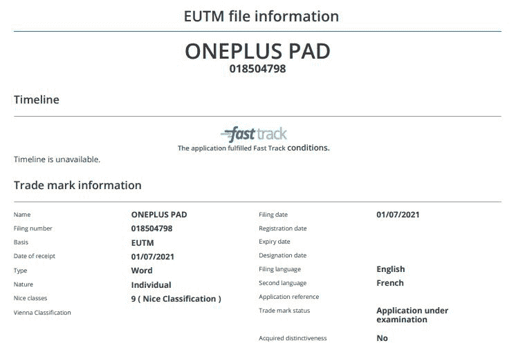

# 一加 Pad 商标表明一款新的平板电脑可能正在研发中

> 原文：<https://www.xda-developers.com/oneplus-pad-trademark/>

# 一加注册了一加 Pad 商标，暗示平板电脑可能正在研发中

一加已经在欧盟 IPO 注册了一加 Pad 商标，这表明平板电脑可能正在研发中。请继续阅读，了解更多信息。

在过去几年里，一加在很大程度上扩展了其产品组合。该公司目前提供各种价位的安卓智能手机、智能电视、健身跟踪可穿戴设备，甚至 TWS 耳机。现在，看起来一加已经准备好加入平板电脑的行列了。

尽管一加尚未发布任何关于其计划发布平板电脑的信息，但它已经在欧盟知识产权局(EUIPO)注册了一个[“一加平板电脑”商标](https://www.mysmartprice.com/gear/oneplus-pad-trademark-euipo-website-oneplus-tablet/)(via*[mysmartprise](https://www.mysmartprice.com/gear/oneplus-pad-trademark-euipo-website-oneplus-tablet/)*)。这让我们相信该公司可能正在开发一款 Android 平板电脑。遗憾的是，除了这款平板电脑的预期名称之外，商标列表没有透露任何其他信息。我们目前还没有关于它的规格的信息，但是一旦我们了解到更多，我们一定会让你知道的。

 <picture></picture> 

OnePlus Pad EUIPO trademark listing

就在一加 Pad 商标上市的几周前，一加[证实](https://www.xda-developers.com/oneplus-merges-oppo/)它已经整合了 OPPO 的几个团队。此举已经帮助 T2 改进了其旗舰设备的软件维护时间表。现在，这种整合正帮助一加专注于更多的产品类别。

更多关于一加更新软件维护时间表的信息，请查看[这篇文章](https://www.xda-developers.com/oneplus-flagships-three-major-android-upgrades-four-years-security-updates/)。