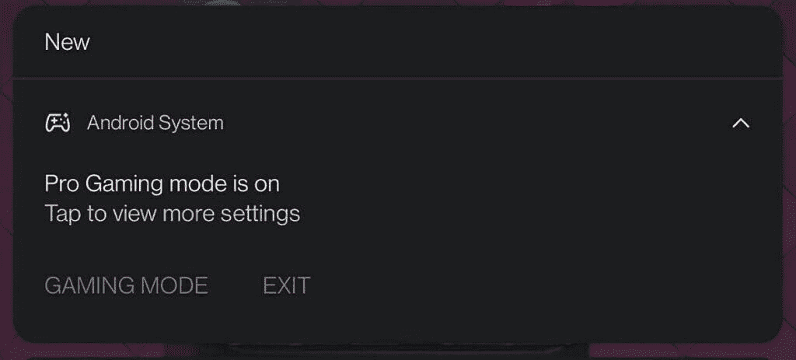

# 一加手机上的 Fnatic 模式被重新命名为专业游戏模式

> 原文：<https://www.xda-developers.com/oneplus-phones-will-no-longer-have-a-fnatic-mode/>

# 随着 Fnatic 合作关系的结束，一加将 Fnatic 模式更名为专业游戏模式

一加与 Fnatic 的合作关系已经结束，该公司现在正在将其设备上的 Fnatic 模式重命名为 Pro Gaming 模式。

早在 2019 年，一加就首次与专业电子竞技组织 Fnatic 在[一加 7](https://www.xda-developers.com/oneplus-7-review/) 系列上合作。这种合作关系为一加手机带来了一种新的游戏模式，称为 Fnatic 模式，以及一个[复活节彩蛋和几个 Fnatic 主题壁纸](https://www.xda-developers.com/fnatic-mode-oneplus-easter-egg-unlock-hidden-wallpaper/)。在一加 7 系列发布后，新模式逐渐[推广到几款旧的一加手机](https://www.xda-developers.com/oxygenos-9-0-7-oneplus-5-oneplus-5t-update/)，并且它一直是 OxygenOS 的重要组成部分。但这种情况很快就会改变。

一加最近[开始为一加 7 系列推出基于](https://www.xda-developers.com/oxygenos-11-open-beta-3-oneplus-7-pro-oneplus-7t-pro/) [Android 11](https://www.xda-developers.com/tag/android-11/) 的 OxygenOS 11 Open Beta 3。根据变更日志，更新只包括一些优化和错误修复。然而，正如 *Reddit* 用户 u/T1Az 最近[指出的](https://www.reddit.com/r/oneplus/comments/lvdwy4/is_fnatic_mode_gone_pro_gaming_mode/)，它也为 Fnatic 模式带来了改变。在最新的公开测试版中，游戏模式已被重命名为“专业游戏模式”。

 <picture></picture> 

Credits: u/T1Az

由于该公司还没有就这一变化做出任何官方声明，我们深入到发布确认这一变化。我们在一加游戏应用中发现了几个新的“职业游戏模式”字符串。然后，我们联系了一加，请其就与 Fnatic 的合作关系发表评论，我们收到了以下声明:

> #### “一加与 Fnatic 的合作关系已经自然结束。享受我们 Fnatic 模式的一加设备用户将继续获得相同的特性和功能，但使用新的专业游戏模式名称。命名更新将在从 6 系列开始的设备之间过渡。Fnatic 一直是一加的支持伙伴，我们期待着未来再次合作的机会。"

由于一加与 Fnatic 的合作伙伴关系一直是品牌/营销合作，你不应该期望在新的职业游戏模式中看到任何功能性的变化。它的所有功能都将保持不变，但它可能不会有 Fnatic 复活节彩蛋或 Fnatic 主题壁纸。

* * *

*感谢 XDA 资深会员 [Some_Random_Username](https://forum.xda-developers.com/m/some_random_username.8234677/) 关于改名的提示！*