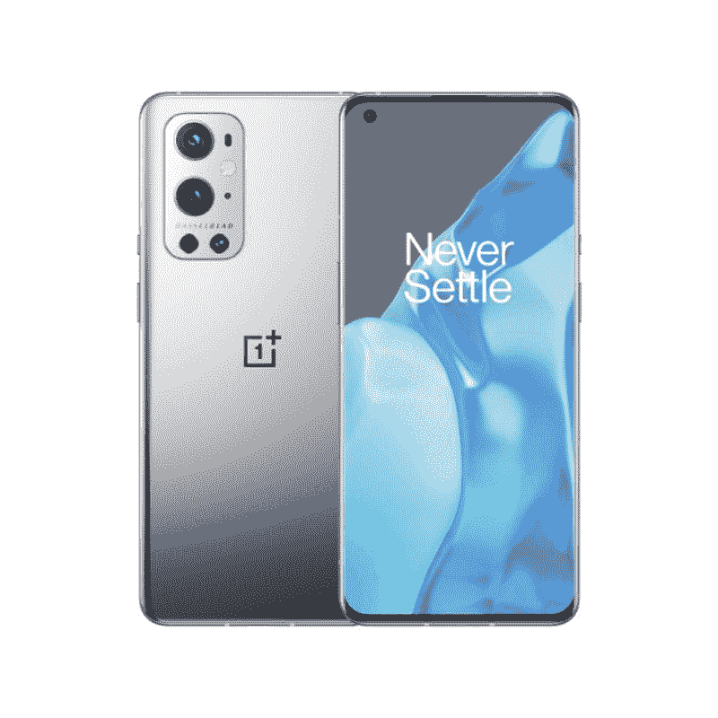

# 2023 年最佳一加手机

> 原文：<https://www.xda-developers.com/oneplus-two-expectation-paths-and-boundaries/>

这些年来，一加发生了很大的变化，其产品组合现在不仅仅包括几款旗舰杀手。从新的旗舰一加 11 设备到 Nord 系列中的预算选项，有许多优秀的一加设备可供选择。因此，如果你想知道 2023 年在美国买哪款一加手机，那么你来对地方了。在这篇文章中，我们将仔细看看顶级一加手机，以及是什么让它们在竞争中脱颖而出。让我们开始吧。

## 最佳综合:一加 11 5G

一加 11 终于推出了，它比前代产品一加 10 Pro 进行了大量升级。它在美国也很容易买到，这就是为什么它已经取代一加 10 Pro 成为你现在可以买到的最好的一加手机。一加 11 的一个亮点是它由新的骁龙 8 代 2 芯片组驱动。它是 2023 年首批采用这种特殊芯片的手机之一，所以你可以预计它将与今年推出的几乎所有旗舰手机相媲美。你还可以购买高达 16GB 的内存，这是 Galaxy S23 等手机的两倍。

一加没有对一加 11 的整体外观和感觉做太多改变，但当你从背面看时，很容易区分一加 10 Pro 和一加 11。一加上的相机模块现在是圆形的，带有更突出的哈苏品牌。这款手机有两种不同的表面，看起来都一样好。相对于市场上的其他基本旗舰产品，三摄像头设置本身相当不错，你可以让这款手机拍摄一些好看的照片。一加 11 号背面的相机系统包括一个 50MP 主相机，一个 48MP 超宽相机和一个 32MP 远摄镜头。一个 16MP 的前置摄像头可以处理自拍，而且它们都能够捕捉高分辨率的视频。在我们的[一加 11 号评论](https://www.xda-developers.com/oneplus-11-review/)中，我们有更多关于相机的细节和样品，所以一定要去看看。

一加 11 也装有我们在去年的旗舰产品中看到的相同的 5000 毫安时电池，但新手机现在支持更快的充电。没错，在美国销售的一加 11 支持 80W 快速充电，而不是我们在去年的旗舰机上看到的 65W 充电支持。其余的硬件也与我们在一加 10 Pro 上看到的非常相似，所以可以肯定地说，一加只是在去年已经很稳固的基础上进行了改进。

一加将继续与新旗舰一起销售 10 Pro 和 10T，但如果你想获得该公司 2023 年提供的绝对最佳产品，我们建议选择去年的新款手机。

一加 11 是该公司的回归，以低于三星的价格提供近乎旗舰的体验。

**Pros**

*   与其他旗舰产品一样的优质制造质量
*   极好的热量
*   强劲的主摄像头

**Cons**

*   按照 2023 标准，长焦镜头的光学范围很短
*   没有无线充电
*   峰值亮度不如其他手机亮

## 备选最佳选择:一加 10T

一加 10T 遵循同样的传统一加模式进行“T”升级。这是一加 10 Pro 的略微降级版本，但它试图用一些独特的功能来弥补它。它可能不是目前最新的一加旗舰产品，但如果你执意要一部 500 美元以下的坚固手机，它是值得考虑的。

一加 10T 在显示和整体建造质量等方面有所下降。你只能在一加 10T 上看到全高清显示屏，而不是在一加 10 Pro 上看到四高清面板。它还配备了塑料边框，而不是 10 Pro 上的金属边框。对许多人来说，这些可能不是很大的障碍，但在做出购买决定时，它们是值得考虑的。一加试图通过提供更快的充电速度和新的芯片组来弥补这些降级。

一加 10T 的一大亮点是支持 150W 的充电速度。你知道什么会更好吗？一加在盒子里捆绑了一块 150 瓦的充电砖，而不是让你单独购买一块。150W 的充电速度，就像听起来那么疯狂，那么快。一加承诺，随附的充电砖可以在短短 19 分钟内将一加 10T 从 1%充电到 100%—这是一个大胆的说法，我们在测试手机时证实了这一点。美国版本的手机充电速度被限制在 125 瓦，正如你所料，这仍然是非常快的速度。

这款手机的另一个亮点是新的骁龙 8 Plus Gen 1 芯片组。这种特殊的芯片组是支持一加 10 Pro 的骁龙 8 代 1 芯片的升级版本。是一种进步吗？是的，新芯片组无疑是赢家，你可以在我们的[高通骁龙 8 Plus Gen 1 vs 高通骁龙 8 Gen 1](https://www.xda-developers.com/qualcomm-snapdragon-8-plus-gen-1-vs-qualcomm-snapdragon-8-gen-1/) 对比中了解更多信息。一加 10T 是目前你能买到的最快的手机之一，它在充电方面也提供了令人印象深刻的速度。

然而，这款手机不那么令人印象深刻的是相机性能。一加 10T 通过降级传感器对整体质量造成了巨大冲击。全面降级，它显示在样本中，我们能够捕捉到我们的审查。这不是该公司的相机旗舰产品，也肯定不是 2023 年市场上最好的相机旗舰产品。

一加 10T 减轻了你的钱包负担，让许多降级变得更容易接受。你现在可以用不到 500 美元买到它，这意味着它比一加 10 Pro 便宜，即使它最近的价格降至 599 美元。还有新的一加 11，在美国起价 700 美元，所以有很多选择。

一加 10T 试图通过旗舰芯片组和超快充电速度来弥补其妥协。

**Pros**

*   超快的充电速度
*   可靠的性能
*   比市面上大多数旗舰产品都实惠

**Cons**

*   比一加 10 Pro 更弱的相机
*   不支持无线充电

## 也很棒:一加 10 Pro 5G

一加 10 Pro 可能不是该品牌的最新款手机，但它仍然非常耐用，而且很容易买到。这款手机的主要卖点之一是骁龙 8 代 1 芯片组。你可能会买一部一加智能手机，因为你把手机的良好性能看得比其他任何东西都重要。诚然，市场上已经有了骁龙 8 Gen 1 的继任者，但它非常强大，可以轻松处理您的所有日常任务。

一加 10 Pro 不会因其设计赢得任何奖项，但它比去年的一加 9 Pro 更具个性。摄像头岛看起来肯定比你在许多其他手机上看到的要繁忙得多，所以我们会让你决定它是否有任何好处。相机本身可以与市场上的其他手机相抗衡，但它们离高端旗舰手机还很远。您可以查看我们的[一加 10 专业相机评论](https://www.xda-developers.com/oneplus-10-pro-camera-review/)以了解更多关于相机的信息，也可以查看一些样品。

骁龙 8 第 1 代芯片组确保一加 10 专业版日复一日地提供可靠的性能，而无需流汗。骁龙 8 Gen 1 芯片组不仅提供了与已经强大的骁龙 888 相同的性能水平，而且还留有足够的空间来减少整体发热。我们建议您查看我们的一加 10 专业版评测(本节前面已链接)，了解更多关于这款手机的性能和许多重要细节。

得益于 5000 毫安时的电池，一加 10 Pro 在电池方面也表现出色。即使大量使用，它也能让你舒适地度过一天。对于任何智能手机来说，在大量使用的情况下提供五个小时的屏幕时间都不是一个小壮举，特别是当你有一个大而亮的高刷新率 AMOLED 显示屏时。同样令人印象深刻的是，在美国，一加 10 Pro 设备的包装盒内包含 65W 充电器。这包括电源砖应该能够采取手机从 0-100%在短短 35 分钟，这是相当令人印象深刻的。

总的来说，一加 10 Pro 是一款全面的设备，在很多方面都做得很好，值得我们推荐。对于那些使用旧一加手机的人来说，这仍然是一个可靠的升级，这里有很多值得喜欢的地方。你会得到更好的芯片组、大胆的新设计、新相机、更快的充电速度等等。或者，如果你想让你的智能手机拥有绝对最佳的性能，你也可以考虑购买一加 11 或 10T。

##### 一加 10 专业版

一加商店提供忠诚度折扣，并接受红币。如果你购买更高的存储版本，每次购买还可以获得一双一加 Buds Pro 和一个官方保护套

**Pros**

*   稳定的性能
*   良好的电池寿命
*   一套可靠的摄像机

**Cons**

*   在美国仅限 65W 充电
*   没有官方的 IP 等级

## 最佳预算一加手机:一加诺德 N20 5G

几年前，一加凭借其 Nord 品牌进军中档和经济型市场。这个新品牌现在有很多手机，情况看起来比以往任何时候都好。一加以新的 Nord N20 5G 拉开了 2022 年的序幕，它在几个关键领域表现出色。

一加 N20 5G 是已经非常优秀的 Nord N10 的继任者。打造一款成功的智能手机通常很难，但一加在 Nord N20 5G 上做得相当不错。关于这款手机，你首先会注意到的是它的美丽。这是一款价格低廉的手机，看起来比它的标价要贵。有些人会说，它看起来甚至比其他许多旗舰一加手机更好，但我们会让你来决定。

一加诺德 N20 5G 还通过带回耳机插孔而表现出色。这听起来可能不是一件大事，但它在预算空间中仍然非常重要。它在性能方面也很出色，提供了比这个价位的许多手机更好的硬件。Nord N20 5G 采用骁龙 695 芯片组，搭配 6GB LPDDR4X 内存和 128GB 存储。与即将推出的 Nord N10 相比，这并不是一个显著的改进，但这足以让它在预算领域保持领先地位。

对于许多人来说，这可能不是一件大事，但我们喜欢一加诺德 N20 5G 还保留了可扩展存储的 microSD 卡插槽。这些小小的增加对改善预算领域的整体用户体验大有帮助。一加诺德 N20 5G 最棒的一点是，它配备了一个相当强大的 4500 毫安时电池，支持高达 33W 的 SuperVOOC 技术快速充电。这使得它比预算空间中几乎所有努力为手机快速充电的智能手机都要好。

但作为一款廉价手机，Nord N20 5G 也有相当大的妥协。正如我们在我们的 [Nord N20 手把手](https://www.xda-developers.com/oneplus-nord-n20-5g-hands-on/)帖子中提到的，这款手机的摄像头并不出色。事实上，它们几乎没有实际用途。它配备了一个 f/1.9 光圈的 64MP 主传感器，以及两个独立的 2MP 传感器来处理深度和微距拍摄。主摄像头是你会发现你自己使用的，因为其余的传感器不是很好。另一点需要注意的是，Nord N20 5G 的显示屏最高显示频率为 60Hz。

总的来说，一加诺德 N20 5G 不仅是一加最好的手机之一，也是美国最便宜的手机之一。如果你不想在智能手机上花很多钱，这是一款非常划算的 5G 智能手机，值得考虑。

##### 一加北部 N20 5G

一加诺德 N20 5G 是诺德 N10 的一个很好的继任者，无论是在纸面上还是在现实生活中都很棒。

**Pros**

*   漂亮的设计
*   性价比高的可靠性能
*   良好的电池寿命

**Cons**

*   普通相机
*   显示器峰值为 60Hz

## 备选最佳预算选择:一加诺德 N200 5G

一加诺德 N200 5G 是目前在美国能买到的最便宜的一加手机。虽然这可能不足以吸引很多人，但足以让它在我们收集的最佳一加手机中占据一席之地，成为一个不错的预算选择。

我们可能不会建议在美国以外购买 Nord N200 5G。但如果你在美国购买一部价格实惠的 5G 手机，那么这是最好的选择之一。这款手机有很多令人喜欢的地方，包括它的显示屏和电池寿命。他们肯定会让这款手机看起来比它的价格标签上显示的要贵。然而，一加已经走了一些捷径来保持低价。

购买一加诺德 N200 5G 只需点击几下鼠标，因为可供选择的选项更少了。这款手机只有一种颜色和一种配置。你只能在一加所谓的蓝色量子阴影中购买这款设备，而且它只有 4GB+64GB 的配置。是的，在这个时代，64GB 的存储空间肯定是不够的，所以我们很高兴地报告，这款手机配有一个 microSD 卡插槽，可扩展存储空间。如果你觉得空间不够用，你可以瞬间增加 1TB 的存储空间。

我们还喜欢这款手机的一点是，它也保留了 3.5 毫米耳机插孔。这仍然是预算部分的一个重要特征，因为买一副有线耳塞比花钱买 TWS 最好的耳塞相对更容易、更便宜。一加诺德 N200 的显示屏也是一种乐趣。这是一块 6.49 英寸的面板，分辨率为 2400 x 1080 像素。更令人印象深刻的是，它是一个 90Hz 的 LCD，这意味着它支持比 Nord N20 5G 的显示器更快的刷新率。

一加 N200 配备了骁龙 480 处理器，既带来了 5G 又带来了值得称赞的性能。正如我们前面提到的，这款手机只有 4GB+64GB 的配置，这应该足以让事情运行得更流畅。如果有 6GB 的内存就好了，但是不要让它影响你的购买决定。骁龙 480 芯片组，加上 4GB 内存，将为日常使用提供出色的性能。它可能不会成为性能指标评测应用中的佼佼者，但它应该能完成任务。

不要对 Nord N200 的三摄像头系统期望太高，因为我们还没有听到很多关于它的好消息。另一方面，手机的 5,000mAh 电池会在许多场合给你留下深刻印象。不过，通过有线一加充电器充电仅限于 18W。总体而言，一加诺德 N200 是 2022 年值得考虑的一款经济型手机。它比美国的 N20 5G 便宜，至少在几年的好时光里会很好用。

##### 一加诺德 N200 5G

一加诺德 N200 5G 是你在美国能买到的最好的低价手机之一。它以低廉的价格提供了一套好的内部设备。

**Pros**

*   漂亮的 1080p 显示屏，刷新率为 90Hz
*   固态电池寿命
*   最便宜的 5G 手机之一

**Cons**

*   没有警告滑块或破折号充电支持
*   一套普通的相机

## 最佳性价比手机:一加 9 Pro 5G

这篇文章的前一版本强调了一加 9 是该公司最划算的智能手机。我们已经用一加 9 Pro 取代了它，因为一加 9 现在似乎在几乎所有的在线零售商处都缺货。然而，一加 9 Pro 仍然可以购买。你可以以非常优惠的价格买到它带来的所有东西。它采用骁龙 888 SoC，12GB RAM，256GB 存储，120Hz QHD+显示屏，65W 快速充电支持，以及四摄像头设置。

如果不是骁龙 888 SoC，那么我们会保留一加 9 Pro 作为最佳整体选择。一加 11 上的骁龙 8 Gen 2 明显优于为一加 9 Pro 提供动力的骁龙 888。但如果这对你来说不重要，你宁愿节省几百美元，那么一加 9 Pro 仍然非常好。在我们的评论中，我们强调了一加 9 Pro 的许多优点，其中许多至今仍然适用。

设计肯定是其中之一，许多人会喜欢这一点，而不是一加 10 Pro 的大而大胆的设计。该设备的正面有一个漂亮的 AMOLED 显示屏，带有最小的边框和一个用于摄像头的打孔切口。背面看起来也很干净，只有摄像头岛和最小的品牌。它可能不是目前最高端的手机，但它仍能在 2023 年与旗舰手机抗衡，这充分说明了它的设计。

在我们的评估中，我们发现一加 9 Pro 是“一加有史以来最好的手机”，其摄像头系统“在重要的地方得到了改进”，“是你在安卓设备上能找到的最好的(显示屏)”，并且支持比北美任何其他智能手机更快的充电速度。所有这些仍然使一加 9 Pro 成为一加粉丝的首选，也是更新、更昂贵的一加旗舰产品的绝佳选择。

我们强烈建议您查看我们的[一加 10 Pro 与一加 9 Pro 对比](https://www.xda-developers.com/oneplus-10-pro-vs-oneplus-9-pro/)以了解这两款手机之间的更多差异。这一比较有更多的细节来帮助你做出更好的购买决定，所以如果你想买一部新的一加智能手机，它值得一看。

 <picture></picture> 

OnePlus 9 Pro 5G

##### 一加 9 专业版

一加 9 Pro 仍然是你在美国能买到的最好的一加手机之一。

**Pros**

*   漂亮的设计和展示
*   稳定的性能
*   一套好相机

## 最佳国际一加电话:一加诺德 2T

一加诺德 2T 改进了已经非常优秀的诺德 2。它钉所有的基本权利，提供一个坚实的中游侠为那些不想打开钱包的旗舰手机。从可靠的 Dimensity 1300 芯片组到漂亮的 90Hz AMOLED 显示屏，一加诺德 2T 提供了许多良好的功能，成为你现在可以购买的最好的诺德手机之一。不过在美国买不到，所以你必须从英国等其他市场进口。

一加诺德 2T 可能不是市场上最漂亮的手机，但它仍然比市场上许多其他中游侠好。有两种颜色可供选购，玉雾很好看。正面有一个 6.43 英寸的显示屏，支持 90Hz 的刷新率。这是一个 FHD+面板 AMOLED 面板，这是我们希望在中端市场看到的。

这款手机采用联发科的 Dimensity 1300 芯片组，配有高达 12GB 的内存和高达 256GB 的存储空间。在这个价格范围内，手机的性能就是你所期望的。它是一款可靠的芯片组，可以满足您的所有日常任务，几乎可以与市场上的许多旗舰芯片相媲美。Nord 2T 是一款快速流畅的设备，甚至可以在体面的图形设置下处理 PUBG Mobile 和 COD Mobile 等游戏。

至于光学系统，一加诺德 2T 包了一个三摄像头设置，其中包括一个 50MP 主传感器，以及 8MP 超宽和 2MP 单色镜头。我们建议您查看我们的[一加诺德 2T 评论](https://www.xda-developers.com/oneplus-nord-2t-review/)来查看从手机中捕捉到的照片和视频样本。该设备还装有一个 4500 毫安时的电池，支持开箱即可充电，最高可达 80 瓦。它基本上提供了与一加 11 相同的充电速度，所以你的钱花得很值。总的来说，Nord 2T 是一款出色的中档手机，我们希望美国的经济型购物者也能购买到这款手机。

一加诺德 2T 只是一加诺德 2 号的增量升级，它从处理器开始。Dimensity 1300 芯片组支持新的 Nord 2T，而不是 Nord 2 上的 dimension ty 1200-AI。我们找不到 Dimensity 1300 和 Dimensity 1200-AI 之间的主要区别，因此升级的芯片组不一定是升级的巨大理由。同样，新的 80W 充电速度高于 Nord 2 的 65W 充电速度，也不是升级的令人信服的理由。

考虑到这些是 Nord 2T 上最大的变化，你最好使用 Nord 2。对于其他想从一加购买新中型车的人来说，Nord 2T 成了默认选择。这款特殊的智能手机在印度也有销售，与中国原始设备制造商的其他 mid-ranger 竞争。

##### 一加诺德 2T

一加诺德 2T 是一加最新推出的中档产品，性价比很高。

**Pros**

*   精美设计
*   可靠的性能
*   快速充电支持

**Cons**

*   对 Nord 2 做了一个小小的更新
*   没有官方的 IP 等级

* * *

这些是你现在能在美国买到的最好的一加手机。一加 11 在全球首次亮相后，正式取代了一加 10 Pro 的头把交椅，现在它在美国上市。值得注意的是，如果你不介意放弃一些花哨的功能，一加 10 Pro 和一加 9 Pro 也是很好的替代品。那些在预算内购买一加手机的人应该考虑购买 Nord N20 5G 或 Nord N200 5G。

这就结束了我们收集的最好的一加手机，但我们想知道你对此的想法。有没有其他你认为值得在这个系列中占有一席之地的一加手机，请在评论中留言告诉我们。如果你正在寻找其他选择，我们还整理了市场上最好的安卓智能手机和 T2 最好的三星 Galaxy 智能手机。