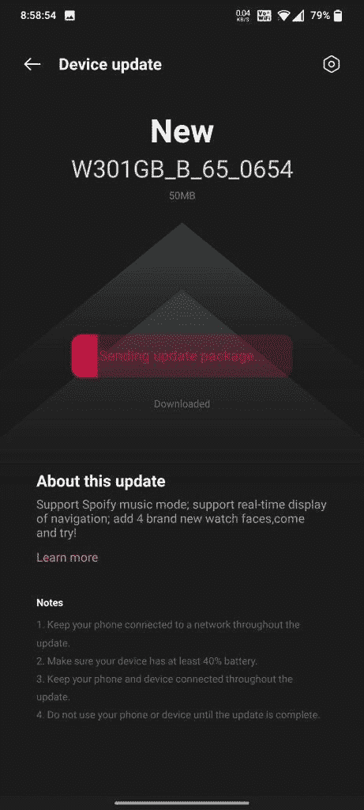

# 最新的一加手表更新增加了新的手表面孔和 Spotify 音乐模式

> 原文：<https://www.xda-developers.com/oneplus-watch-update-adds-spotify-music-mode-new-watch-faces/>

# 新的一加手表更新增加了 Spotify 音乐模式，新的手表面孔等

一加刚刚发布了一加手表的新软件更新，增加了四个新的手表表面，Spotify 音乐模式等等。

 <picture></picture> 

binary comment

一加对智能手表的首次尝试并没有达到该公司所希望的热情水平。虽然一加手表因其优质的设计和持久的电池而受到称赞，但它因其粗糙的软件体验、有限的第三方应用支持和不准确的健身跟踪功能而受到了很多批评。一加已经推出了几个软件更新来解决这些问题。一加手表的最后一次重大更新是在 7 月份，其中[提高了 GPS](https://www.xda-developers.com/oneplus-watch-update-ui-optimizations-positioning-improvements/) 的速度和精度，并优化了一些 UI 元素。现在，一加刚刚发布了一加手表的新软件更新，进一步完善了软件体验，并为智能手表添加了新功能。

[B.65 更新](https://forums.oneplus.com/threads/oneplus-watch-software-update-b-62-change-log.1467656/page-9#post-23624199)，固件版本 W301GB_B_65_0654，带来了一系列改进和功能，包括 Spotify 音乐模式、新的手表面孔、优化的睡眠跟踪等等。

**[一加手表评论:充满希望的智能手表首次尝试](https://www.xda-developers.com/oneplus-watch-first-update-details/)**

除了上述改进，更新还增加了对在手表上显示实时导航的支持，以及从手表设置中调整振动强度的能力。

 <picture></picture> 

Screenshot credit: OnePlus forum user *danishhazari*

B.65 更新的大小为 50MB，包括以下更改:

*   增加
    *   Spotify 音乐模式，同步您的 Spotify 播放列表。
    *   支持实时显示部分导航，举手即可轻松观看导航。
    *   添加 4 个新的手表表面，享受你的新风格！
    *   支持手机报警提醒联动。
*   最佳化
    *   优化睡眠算法，让睡眠检测更智能。
    *   振动强度可以在手表设置中调整，以体验更强的振动提醒。

**[一加观看 XDA 论坛](https://forum.xda-developers.com/t/oneplus-watch.4252579/)**

B.65 更新已经开始推出，一加手表用户可以期待在未来几天收到 OTA。要检查更新，请打开智能手机上的一加健康应用程序，然后前往管理>设备设置>设备更新。

* * *

*感谢 XDA 资深会员 [Some_Random_Username](https://forum.xda-developers.com/m/some_random_username.8234677/) 的提示！*